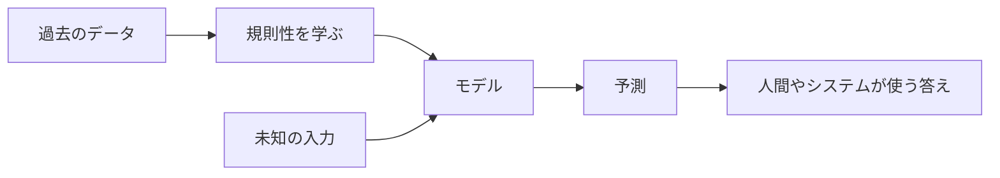

## 第1章　機械学習とは何か

**この章でわかること**

- 機械学習が「データから規則性を学ぶ」方法であること
- 普通のプログラムと機械学習の違い
- 入力、出力、予測、学習、推論の基本的な意味
- 機械学習、AI、深層学習、生成AIの関係

### 1.1　機械学習の目的

機械学習とは、簡単にいうと「データから規則性を見つけ、その規則性を使って未知の入力に対する答えを出す技術」です。

普通のプログラムでは、人間がルールを書きます。

たとえば、ある商品の送料を計算するプログラムなら、

「購入金額が5,000円以上なら送料無料」  
「それ未満なら送料600円」

というルールを人間が書けばよいです。

これは普通のプログラミングです。ルールが明確で、人間がそのルールを知っている場合には、このやり方が一番わかりやすいです。

しかし、世の中には人間が明確なルールとして書きにくい問題がたくさんあります。

たとえば、写真を見て「これは犬か猫か」を判定する問題を考えます。

人間なら、犬と猫の違いはだいたいわかります。しかし、それをプログラムのルールとして書こうとすると急に難しくなります。

耳が尖っていたら猫でしょうか。  
でも犬にも耳が尖っている種類があります。

鼻が長ければ犬でしょうか。  
でも鼻の短い犬もいます。

体が大きければ犬でしょうか。  
でも大型の猫もいますし、小型犬もいます。

このように、人間が感覚的にはできるのに、明確なルールとして書くのが難しい問題があります。機械学習は、こういう問題に向いています。

機械学習では、人間が「犬とはこういうもの」「猫とはこういうもの」というルールを細かく書く代わりに、大量の犬の画像と猫の画像をコンピュータに与えます。そして、コンピュータがそれらのデータから、犬と猫を区別するための特徴を自動的に学びます。

つまり、機械学習の目的は、人間が直接ルールを書きにくい問題に対して、データから使える規則性を獲得することです。

もう少し抽象的にいうと、機械学習は「入力から出力を得る関数」をデータから作る技術です。

画像を入力して、犬か猫かを出力する。  
メール本文を入力して、スパムかどうかを出力する。  
家の広さや駅からの距離を入力して、価格を出力する。  
文章の途中までを入力して、次に来る単語を出力する。  

こうした「入力から出力を得る仕組み」を、手作業で全部書くのではなく、データを使って作るのが機械学習です。

この流れを図にすると、次のようになります。



### 1.2　「ルールを書く」プログラムと「データから学ぶ」プログラム

普通のプログラムと機械学習の違いは、「何を人間が書くか」にあります。

普通のプログラムでは、人間がルールを書きます。

入力があり、ルールがあり、出力があります。

たとえば、消費税を計算するプログラムなら、

```
入力：税抜価格
ルール：税抜価格に 1.1 を掛ける
出力：税込価格
```

という形になります。

この場合、プログラムの中心は「ルール」です。ルールを人間が理解していて、それをコードに書きます。

一方、機械学習では少し違います。

機械学習では、入力と正解の例をたくさん用意します。

```
入力：過去の家の情報
正解：実際に売れた価格
```

そして、機械学習アルゴリズムは、その入力と正解の関係を学びます。

つまり、普通のプログラムでは、

```
入力 + ルール → 出力
```

でした。

機械学習では、

```
入力 + 正解 → ルールを作る
```

という考え方になります。

ここでいう「ルール」は、必ずしも人間が読んで理解しやすい形ではありません。多くの場合、それは大量の数値、つまりパラメータとして表現されます。

ニューラルネットワークの場合、このパラメータは「重み」と呼ばれる数値です。学習とは、この重みを少しずつ調整して、よい出力が出るようにする作業です。

たとえば、家の価格を予測するモデルを考えます。

入力として、

```
広さ
駅からの距離
築年数
地域
```

などを使います。

出力は、

```
予測価格
```

です。

最初、モデルの予測はかなり適当です。実際には5,000万円の家を、3,000万円と予測するかもしれません。そこで、「実際の価格」と「予測した価格」のズレを計算します。このズレが小さくなるように、モデル内部のパラメータを調整します。

この作業を大量のデータに対して何度も繰り返すことで、だんだん予測がよくなっていきます。

これが「学習する」ということです。

### 1.3　入力、出力、予測

機械学習では、ほとんどの問題を「入力を受け取って、何かを出力する問題」として考えます。

この考え方はとても重要です。Transformer や大規模言語モデルを理解するときにも、最終的にはこの構造に戻ってきます。

たとえば、画像分類なら、

```
入力：画像
出力：画像の種類
```

です。

犬の画像を入力すると、「犬」という出力を返します。猫の画像を入力すると、「猫」という出力を返します。

メールのスパム判定なら、

```
入力：メール本文
出力：スパムかどうか
```

です。

家の価格予測なら、

```
入力：家の情報
出力：価格
```

です。

文章生成なら、

```
入力：ここまでの文章
出力：次に来る単語
```

です。

このように、機械学習では問題を「入力」と「出力」の対応関係として見ることが多いです。

ここで重要なのは、機械学習の出力は「絶対に正しい答え」ではなく、「予測」であるという点です。

機械学習モデルは、与えられた入力に対して、もっともらしい答えを返します。しかし、それは常に正解とは限りません。

犬の画像を猫と間違えることもあります。  
スパムではないメールをスパムと判定することもあります。  
家の価格を実際より高く予測することもあります。  
言語モデルが事実と違う文章を生成することもあります。  

機械学習では、この「間違える可能性がある」という性質を前提に考える必要があります。

普通のプログラムでは、ルールが正しければ同じ入力に対して常に正しい出力が得られます。もちろんバグがあれば間違いますが、原理的にはルール通りに動きます。

一方、機械学習モデルは、データから学んだ傾向に基づいて予測します。したがって、未知の入力に対してどれくらいうまく予測できるかが重要になります。

この「未知の入力に対してうまく予測できる能力」を、後の章で「汎化性能」と呼びます。

### 1.4　モデルとは何か

機械学習でいう「モデル」とは、入力を受け取って出力を返す仕組みです。

もっと単純にいえば、モデルは関数です。

```
出力 = モデル(入力)
```

という形で考えることができます。

たとえば、家の価格を予測するモデルなら、

```
価格 = モデル(広さ, 駅からの距離, 築年数, 地域)
```

です。

画像を分類するモデルなら、

```
種類 = モデル(画像)
```

です。

文章の続きを予測するモデルなら、

```
次の単語 = モデル(ここまでの文章)
```

です。

ここでいう関数は、プログラミング言語の関数と似ています。入力を受け取り、出力を返します。

ただし、普通の関数との大きな違いがあります。

普通の関数では、内部の処理を人間が書きます。

```
税込価格 = 税抜価格 * 1.1
```

のように、人間がルールを直接書きます。

しかし、機械学習のモデルでは、内部の処理の一部、または大部分が、データによって決まります。

ニューラルネットワークの場合、モデルの中には大量の重みがあります。この重みの値は、人間が一つ一つ決めるのではありません。学習によって決まります。

つまり、モデルとは「データから調整される関数」だと考えるとわかりやすいです。

この見方は、Transformer を理解するときにも非常に重要です。

Transformer も、結局は巨大な関数です。

入力としてトークン列を受け取り、出力として次のトークンの確率分布を返します。

```
次トークンの確率分布 = Transformer(ここまでのトークン列)
```

ChatGPT のような言語モデルも、基本的にはこのような関数として見ることができます。

もちろん内部構造は非常に複雑です。しかし、機械学習の基本としては、まず「モデルは入力を出力に変換する関数である」と理解しておけばよいです。

### 1.5　学習とは何か

機械学習における「学習」とは、モデルの出力が正解に近づくように、モデル内部のパラメータを調整することです。

たとえば、家の価格を予測するモデルを考えます。

最初、モデルは適当な予測をします。

```
実際の価格：5,000万円
モデルの予測：3,000万円
```

この場合、2,000万円ずれています。

このズレを小さくするように、モデル内部の数値を少し変えます。

次に、別の家について予測します。

```
実際の価格：7,000万円
モデルの予測：8,000万円
```

今度は1,000万円高く予測しています。

またズレを計算し、そのズレが小さくなるようにモデルを調整します。

このような作業を大量のデータに対して何度も繰り返すことで、モデルはだんだんよい予測を出せるようになります。

ここで重要なのは、モデルは「正解を丸暗記する」ことが目的ではないということです。

もちろん、学習データに対して正しく答えられることは必要です。しかし、それだけでは不十分です。

本当に重要なのは、まだ見たことのないデータに対してもうまく予測できることです。

たとえば、過去の家の価格データを使って学習したモデルがあるとします。そのモデルが、過去のデータに対してだけ正しい価格を出せても、これから売り出される新しい家の価格をまったく予測できないなら、役に立ちません。

つまり、学習の目的は、学習データそのものを覚えることではなく、学習データの背後にある規則性を捉えることです。

この違いは非常に重要です。

学習データに対してだけ強くなりすぎて、未知のデータに弱くなることを「過学習」といいます。これは機械学習で頻繁に出てくる問題です。

### 1.6　推論とは何か

機械学習では、「学習」と「推論」を区別します。

学習とは、正解付きのデータを使って、モデルのパラメータを調整することです。

一方、推論とは、学習済みのモデルを使って、新しい入力に対する出力を得ることです。

たとえば、犬と猫を分類するモデルを作る場合を考えます。

学習の段階では、大量の犬の画像と猫の画像を使います。

```
犬の画像 → 正解：犬
猫の画像 → 正解：猫
犬の画像 → 正解：犬
猫の画像 → 正解：猫
```

これらのデータを使って、モデル内部のパラメータを調整します。

学習が終わったら、今度は新しい画像を入力します。

```
新しい画像 → モデル → 犬か猫かの予測
```

このときは、正解をモデルに教えません。モデルが自分で予測します。

これが推論です。

言語モデルの場合も同じです。

学習時には、大量の文章を使って「この文脈の次にはどのトークンが来るか」を学習します。

推論時には、ユーザーが入力した文章を受け取り、その続きとしてもっともらしいトークンを生成します。

```
入力：今日はとても
出力候補：暑い、寒い、楽しい、忙しい、眠い...
```

モデルは、それぞれの候補に確率をつけます。そして、その確率に基づいて次のトークンを選びます。

選んだトークンを入力に追加し、さらに次のトークンを予測します。これを繰り返すことで文章が生成されます。

つまり、生成AIにおける文章生成も、基本的には推論です。

学習はモデルを作る段階。  
推論は作ったモデルを使う段階。  

この区別を押さえておくと、機械学習システム全体の理解がしやすくなります。

### 1.7　機械学習でできること、できないこと

機械学習は強力ですが、何でもできる魔法ではありません。

機械学習が得意なのは、データの中に何らかの規則性があり、その規則性を使えば未知の入力に対して有用な予測ができる問題です。

たとえば、画像認識は機械学習が得意な分野です。犬の画像には犬らしい特徴があり、猫の画像には猫らしい特徴があります。大量の画像を使えば、その違いをモデルが学習できます。

音声認識も得意です。音の波形と文字列の間には対応関係があります。大量の音声データと文字起こしデータを使えば、音声を文字に変換するモデルを作れます。

翻訳も得意です。ある言語の文と別の言語の文の間には対応関係があります。大量の対訳データを使えば、翻訳モデルを作れます。

一方、機械学習が苦手なこともあります。

まず、データが少ない問題は苦手です。データから学ぶ技術なので、十分なデータがなければ学習できません。

次に、データに規則性がない問題も苦手です。完全にランダムなものは、どれだけ高度なモデルを使っても予測できません。

また、学習データと本番環境のデータが大きく違う場合も苦手です。

たとえば、昼間の明るい犬の画像だけで学習したモデルは、夜の暗い画像や、雪の中の画像ではうまく判定できないかもしれません。学習時に見たデータと、本番で出てくるデータが違うからです。

さらに、機械学習モデルは「理由」を人間にわかりやすく説明するのが苦手な場合があります。

特にニューラルネットワークでは、モデル内部に大量の数値があり、それらが複雑に組み合わさって出力を決めます。そのため、「なぜその判断をしたのか」を人間が完全に理解するのは難しいことがあります。

大規模言語モデルでも同じです。もっともらしい文章を生成できますが、その内容が常に正しいとは限りません。存在しない情報を、それらしく生成することもあります。

したがって、機械学習を使うときには、「予測である」「間違える可能性がある」「学習データに依存する」という前提を忘れてはいけません。

### 1.8　機械学習とAI、深層学習、生成AIの関係

最後に、機械学習と関連する言葉の関係を整理しておきます。

まず、「AI」という言葉があります。AI は Artificial Intelligence、つまり人工知能のことです。

AI は非常に広い言葉です。人間の知的な振る舞いをコンピュータで実現しようとする技術全般を指します。

その中に、機械学習があります。

機械学習は、AI を実現するための方法の一つです。人間がルールをすべて書くのではなく、データから学ぶことで知的な振る舞いを実現します。

さらに、機械学習の中に深層学習があります。

深層学習は、ニューラルネットワークを多層に重ねたモデルを使う機械学習の一分野です。画像認識、音声認識、自然言語処理などで非常に高い性能を出してきました。

そして、生成AIは、文章、画像、音声、動画、プログラムなどを生成するAIです。現在の生成AIの多くは、深層学習を使っています。

関係をざっくり書くと、こうなります。

```
AI
└── 機械学習
    └── 深層学習
        └── 生成AIの多く
```

もちろん、すべてのAIが機械学習というわけではありません。古典的なAIには、人間がルールや知識を明示的に書く方式もあります。

また、すべての機械学習が深層学習というわけでもありません。線形回帰、ロジスティック回帰、決定木、ランダムフォレスト、サポートベクターマシンなど、深層学習以外の機械学習手法もたくさんあります。

ただし、Transformer や大規模言語モデルを理解するためには、特に「機械学習」「深層学習」「自然言語処理」の流れを押さえる必要があります。

Transformer は深層学習モデルです。
大規模言語モデルは Transformer をベースにしたものが多いです。
そして、それらはすべて、基本的には「入力から出力を予測するモデルを、データから学習する」という機械学習の考え方の上にあります。

### 1.9　本章のまとめ

**Transformer への接続**

Transformer も、基本的には入力から出力を予測する機械学習モデルです。

言語モデルとして使う場合、入力はここまでのトークン列で、出力は次に来るトークンの確率分布です。つまり、Transformer も「データから規則性を学び、未知の入力に対して予測する」という機械学習の基本構造の上にあります。

**ミニ演習**

- スパム判定、家の価格予測、次トークン予測について、それぞれの入力と出力を書き出してみましょう。
- 普通のルールベースプログラムで解きやすい問題と、機械学習で解きやすい問題を1つずつ考えてみましょう。
- 「学習」と「推論」の違いを、自分の言葉で1文ずつ説明してみましょう。

この章では、機械学習とは何かを大まかに見ました。

機械学習は、人間がルールを直接書くのではなく、データから入力と出力の関係を学ぶ技術です。

普通のプログラムでは、

```
入力 + ルール → 出力
```

でした。

機械学習では、

```
入力 + 正解 → ルールを作る
```

という考え方をします。

ここで作られる「ルール」は、多くの場合、人間が読みやすい if 文の集まりではありません。ニューラルネットワークでは、大量の重みとして表現されます。

機械学習モデルは、入力を受け取り、出力を返す関数です。学習とは、その関数の内部パラメータを調整して、正解に近い出力を出せるようにすることです。

そして、学習済みのモデルを使って新しい入力に対する答えを出すことを推論と呼びます。

この章で一番重要な考え方は、次の一文です。

機械学習とは、データを使って、入力から出力を予測する関数を作る技術である。

Transformer も、大規模言語モデルも、最終的にはこの考え方の延長にあります。

文章を入力する。  
モデルが内部で計算する。  
次に来るトークンの確率を出す。  
その予測が正解に近づくように、大量の文章データで学習する。

この基本構造を理解しておくと、この後に出てくる「教師あり学習」「損失関数」「勾配降下法」「ニューラルネットワーク」「Transformer」も、すべて同じ流れの中で理解しやすくなります。
