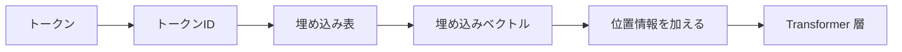

## 第10章　特徴量と表現

### 10.1　特徴量とは何か

機械学習では、モデルに入力する情報のことを「特徴量」と呼びます。

英語では feature と呼ばれます。

特徴量とは、モデルが予測を行うための手がかりです。

たとえば、家の価格を予測する問題を考えます。

このとき、次のような情報を入力として使うことができます。

```text
広さ
築年数
駅からの距離
地域
部屋数
階数
日当たり
```

これらが特徴量です。

モデルは、これらの特徴量を使って価格を予測します。

```text
入力特徴量 → モデル → 予測価格
```

スパムメール判定なら、特徴量は次のようなものになります。

```text
本文に含まれる単語
件名に含まれる単語
URLの数
送信元アドレス
添付ファイルの有無
過去に同じ送信元から来たメールの履歴
```

画像分類なら、画像のピクセル値が入力になります。

```text
画像の各ピクセルの明るさ
赤・緑・青の色成分
```

音声認識なら、音声波形や周波数成分が特徴量になります。

```text
音の波形
周波数成分
時間ごとの音の変化
```

つまり、特徴量とは、予測に使う入力情報です。

機械学習モデルは、入力された特徴量をもとに予測します。

ここで重要なのは、モデルは入力に含まれていない情報を直接使うことはできない、という点です。

たとえば、家の価格予測で「地域」を入力に入れていなければ、モデルは地域による価格差を直接学べません。

スパム判定で「送信元アドレス」を入力に入れていなければ、送信元の信頼性を使った判断はできません。

つまり、特徴量の選び方は、モデルの性能に大きく影響します。

特徴量は、モデルが世界を見るための入り口です。


### 10.2　特徴量は予測の材料である

特徴量は、モデルが判断するための材料です。

料理でいえば、特徴量は食材に近いものです。

よい食材がなければ、どれだけ腕のよい料理人でも限界があります。

同じように、よい特徴量がなければ、どれだけ高度なモデルでも良い予測をするのは難しくなります。

たとえば、家の価格を予測するモデルを考えます。

入力特徴量が「広さ」だけだったとします。

```text
入力：広さ
出力：価格
```

広い家ほど価格が高くなりやすい、という傾向は学べるかもしれません。

しかし、実際の価格は広さだけでは決まりません。

東京都心の50平米と、地方の50平米では価格が大きく違います。

駅徒歩3分の物件と、駅徒歩30分の物件でも価格は変わります。

築浅の物件と築40年の物件でも価格は変わります。

したがって、「広さ」だけでは十分ではありません。

次のような特徴量を追加すると、モデルはより多くの情報を使えます。

```text
広さ
地域
駅からの距離
築年数
部屋数
階数
日当たり
```

これにより、モデルは価格に関係する複数の要因を考慮できます。

もちろん、特徴量を増やせば必ずよくなるわけではありません。

関係のない特徴量やノイズの多い特徴量を入れると、モデルが混乱したり、過学習しやすくなったりすることもあります。

しかし、予測に必要な情報が入力に含まれていなければ、モデルはその情報を使えません。

機械学習では、「モデルの能力」だけでなく、「どの情報を入力として与えるか」が非常に重要です。

### 10.3　人間が設計する特徴量

深層学習が広く使われる以前の機械学習では、人間が特徴量を設計することが非常に重要でした。

この作業を「特徴量エンジニアリング」と呼びます。

英語では feature engineering です。

特徴量エンジニアリングとは、データから予測に役立つ情報を取り出し、モデルが扱いやすい形に変換する作業です。

たとえば、ECサイトでユーザーが商品を購入するかどうかを予測したいとします。

元のデータには、次のような情報があるかもしれません。

```text
ユーザーID
商品ID
閲覧履歴
購入履歴
カート投入履歴
アクセス時刻
商品カテゴリ
価格
```

このままでも使える情報はあります。

しかし、人間が工夫して、次のような特徴量を作ることができます。

```text
過去30日間の購入回数
過去7日間の閲覧回数
同じカテゴリの商品を過去に買った回数
最後に購入してからの日数
カートに入れたが購入しなかった回数
商品の価格がユーザーの平均購入価格より高いか
```

こうした特徴量は、元のデータから作られたものです。

予測に役立ちそうな情報を、人間が考えて設計しています。

スパム判定でも同じです。

メール本文そのものだけでなく、次のような特徴量を作ることができます。

```text
URLの数
大文字の割合
特定のキーワードの有無
送信元ドメインの過去のスパム率
添付ファイルの有無
本文の長さ
```

これらは、人間が「スパム判定に役立つかもしれない」と考えて作る特徴量です。

特徴量エンジニアリングは、機械学習の実務で非常に重要でした。

今でも、表形式データや業務データでは重要です。

深層学習によって、特徴量の多くをモデルが自動的に学習できるようになりましたが、それでも入力データの設計や前処理は重要です。

モデルが強力になっても、何を入力するかという設計はなくなりません。

### 10.4　特徴量のスケーリング

特徴量には、値のスケールがあります。

たとえば、家の価格予測で次のような特徴量を使うとします。

```text
広さ：80
築年数：10
駅からの距離：8
価格：8000
```

ここで、広さは平米、築年数は年、駅距離は分、価格は万円かもしれません。

別の問題では、次のような特徴量があるかもしれません。

```text
年齢：35
年収：8000000
身長：170
購入回数：3
```

このように、特徴量ごとに値の大きさが大きく違うことがあります。

機械学習では、特徴量のスケールが大きく違うと、学習がうまくいきにくくなる場合があります。

特に、勾配降下法を使うモデルでは、特徴量のスケールが学習の安定性に影響します。

たとえば、ある特徴量は0から1の範囲なのに、別の特徴量は0から1,000,000の範囲だとします。

すると、大きなスケールの特徴量が計算に強く影響しすぎることがあります。

そこで、特徴量のスケーリングを行います。

代表的な方法に、標準化があります。

標準化では、特徴量の平均を0、標準偏差を1に近づけます。

```text
標準化後の値 = (元の値 - 平均) / 標準偏差
```

これにより、特徴量のスケールをそろえます。

もう一つの方法に、正規化があります。

正規化では、値を0から1の範囲に収めることがあります。

```text
正規化後の値 = (元の値 - 最小値) / (最大値 - 最小値)
```

スケーリングは、すべてのモデルで必須というわけではありません。

決定木系のモデルでは、特徴量のスケールの影響は比較的小さいことがあります。

一方、線形モデル、ロジスティック回帰、ニューラルネットワークでは、スケーリングが重要になることが多いです。

深層学習では、入力のスケーリングだけでなく、モデル内部の値を安定させるために正規化の技術も使われます。

Transformer で出てくる Layer Normalization も、内部表現のスケールを安定させるための重要な仕組みです。

### 10.5　カテゴリ値の扱い

機械学習モデルは、基本的には数値を扱います。

しかし、現実のデータにはカテゴリ値がよく出てきます。

カテゴリ値とは、数値そのものではなく、種類を表す値です。

たとえば、家の価格予測では、地域がカテゴリ値になります。

```text
東京都
神奈川県
埼玉県
千葉県
```

商品データなら、商品カテゴリがカテゴリ値です。

```text
食品
衣類
家電
本
ゲーム
```

ユーザー属性なら、会員ランクなどもカテゴリ値です。

```text
無料会員
シルバー会員
ゴールド会員
プラチナ会員
```

これらは、そのままでは多くの機械学習モデルに入力できません。

モデルが扱えるように、数値に変換する必要があります。

単純にカテゴリに番号を振る方法があります。

```text
東京都 → 1
神奈川県 → 2
埼玉県 → 3
千葉県 → 4
```

しかし、この方法には注意が必要です。

番号を振ると、モデルが数値の大小に意味があると誤解する可能性があります。

たとえば、

```text
東京都 = 1
千葉県 = 4
```

とした場合、千葉県は東京都の4倍、という意味はありません。

カテゴリ間に自然な順序がない場合、単純な番号化は問題を生むことがあります。

そこでよく使われるのが one-hot 表現です。

one-hot 表現では、各カテゴリを別々の列として表します。

たとえば、地域が4種類あるなら、次のようにします。

```text
東京都   → [1, 0, 0, 0]
神奈川県 → [0, 1, 0, 0]
埼玉県   → [0, 0, 1, 0]
千葉県   → [0, 0, 0, 1]
```

これなら、カテゴリ間に余計な大小関係を持ち込みません。

カテゴリ値をどう数値化するかは、機械学習で非常に重要です。

自然言語処理でも、単語やトークンはカテゴリの一種です。

「猫」「犬」「走る」「食べる」といったトークンを、そのままモデルに入れることはできません。

まずトークンIDに変換し、さらにベクトル表現に変換します。

この話は、後の「埋め込み」に直接つながります。

### 10.6　one-hot 表現

one-hot 表現とは、カテゴリを0と1のベクトルで表す方法です。

カテゴリの数だけ次元を用意し、該当するカテゴリの位置だけを1にします。

たとえば、動物のカテゴリが次の4つだとします。

```text
犬
猫
鳥
馬
```

このとき、one-hot 表現は次のようになります。

```text
犬 → [1, 0, 0, 0]
猫 → [0, 1, 0, 0]
鳥 → [0, 0, 1, 0]
馬 → [0, 0, 0, 1]
```

one-hot 表現の利点は、カテゴリ間に余計な順序関係を入れないことです。

たとえば、犬を1、猫を2、鳥を3、馬を4と番号で表すと、モデルは「馬は犬より大きい値である」と解釈してしまうかもしれません。

しかし、one-hot 表現なら、各カテゴリは独立した位置で表されます。

```text
犬と猫は別カテゴリ
猫と鳥も別カテゴリ
数値の大小関係はない
```

分類問題の正解ラベルも、one-hot 表現で表すことがあります。

たとえば、犬・猫・鳥の3クラス分類で、正解が猫なら、

```text
正解：猫
one-hot 表現：[0, 1, 0]
```

です。

モデルの出力が次のような確率分布だったとします。

```text
犬：0.10
猫：0.80
鳥：0.10
```

これはベクトルで書くと、

```text
[0.10, 0.80, 0.10]
```

です。

このモデル出力と、正解の one-hot 表現を比較して、交差エントロピー損失を計算します。

ただし、one-hot 表現には欠点もあります。

カテゴリ数が非常に多い場合、ベクトルが非常に大きくなります。

たとえば、語彙が50,000トークンある言語モデルでは、one-hot ベクトルは50,000次元になります。

しかも、そのうち1つだけが1で、残りはすべて0です。

これは非常に疎な表現です。

また、one-hot 表現では、カテゴリ同士の意味的な近さを表せません。

「犬」と「猫」はどちらも動物で近い概念ですが、one-hot 表現では完全に別のカテゴリとして扱われます。

この問題を解決するために、埋め込みベクトルが使われます。

### 10.7　埋め込みベクトル

埋め込みベクトルとは、カテゴリやトークンを、意味を持つ連続的なベクトルとして表す方法です。

英語では embedding と呼ばれます。

one-hot 表現では、カテゴリは0と1だけの大きなベクトルで表されます。

たとえば、

```text
犬 → [1, 0, 0, 0]
猫 → [0, 1, 0, 0]
鳥 → [0, 0, 1, 0]
馬 → [0, 0, 0, 1]
```

この表現では、「犬」と「猫」が意味的に近いことを表せません。

すべてのカテゴリが、互いに同じくらい別物として扱われます。

一方、埋め込みベクトルでは、各カテゴリを低次元または中程度の次元の実数ベクトルで表します。

たとえば、非常に単純化すると次のようなイメージです。

```text
犬 → [0.8, 0.2, 0.6]
猫 → [0.7, 0.3, 0.5]
車 → [0.1, 0.9, 0.2]
```

この場合、「犬」と「猫」のベクトルは近く、「車」は少し離れているかもしれません。

実際の埋め込みベクトルは、人間が各次元の意味を直接決めるわけではありません。

学習によって決まります。

自然言語処理では、単語やトークンを埋め込みベクトルに変換します。

```text
トークンID
↓
埋め込み層
↓
埋め込みベクトル
```

たとえば、「猫」というトークンがID 1532だとします。

モデルは、ID 1532に対応するベクトルを持っています。

```text
猫 → [0.12, -0.45, 0.88, ...]
```

このベクトルは、学習によって調整されます。

言語モデルでは、似た文脈で使われるトークンは、似たようなベクトル表現を持つようになる傾向があります。

たとえば、「犬」と「猫」は、どちらも動物であり、似た文脈に現れることが多いため、ベクトル空間上で近くなるかもしれません。

埋め込みベクトルは、one-hot 表現よりも豊かな表現です。

カテゴリの意味的な近さや関係を、ベクトルの位置関係として表せるからです。

Transformer でも、最初にトークンIDを埋め込みベクトルに変換します。

この埋め込みが、後続の Attention や Feed Forward Network に入力されます。

Transformer では、トークンIDがそのまま Attention に入るのではなく、まずベクトル表現に変換されます。



#### PyTorchで確認してみる

one-hot 表現と埋め込みベクトルの違いを、PyTorch で見ると次のようになります。

```python
import torch
from torch import nn
import torch.nn.functional as F

token_to_id = {"dog": 0, "cat": 1, "car": 2, "bird": 3}
token_ids = torch.tensor([token_to_id["dog"], token_to_id["cat"]])

one_hot = F.one_hot(token_ids, num_classes=len(token_to_id)).float()

embedding = nn.Embedding(num_embeddings=len(token_to_id), embedding_dim=3)
vectors = embedding(token_ids)

print("one-hot:")
print(one_hot)
print("embedding vectors:")
print(vectors)
print("embedding shape:", vectors.shape)
```

one-hot 表現は語彙数と同じ長さになります。

一方、埋め込みベクトルでは、語彙数とは別に、モデルが扱いやすい次元数を決められます。

### 10.8　特徴量の組み合わせ

現実の予測問題では、特徴量が単独で効くとは限りません。

複数の特徴量の組み合わせが重要になることがあります。

たとえば、家の価格予測を考えます。

「広さ」は重要な特徴量です。

「地域」も重要な特徴量です。

しかし、広さの影響は地域によって変わるかもしれません。

東京都心では、1平米増えることの価格への影響が非常に大きいかもしれません。

一方、地方では、同じ1平米の差が価格に与える影響は比較的小さいかもしれません。

つまり、

```text
広さの影響は地域によって変わる
```

ということです。

これは、特徴量同士の相互作用です。

別の例として、ECサイトの購入予測を考えます。

商品の価格が高いかどうかは、ユーザーによって意味が違います。

普段から高額商品を買うユーザーにとっては、1万円の商品は普通かもしれません。

しかし、普段は1,000円程度の商品を買うユーザーにとっては、1万円の商品は高く感じるかもしれません。

この場合、

```text
商品の価格
ユーザーの普段の購入価格
```

の組み合わせが重要です。

古典的な機械学習では、人間がこうした組み合わせ特徴量を作ることがありました。

```text
価格 / ユーザーの平均購入価格
広さ × 地域
曜日 × 時間帯
```

このように、複数の特徴量を組み合わせることで、モデルが学びやすくなることがあります。

深層学習では、こうした特徴量の組み合わせをモデル内部で学習できる場合があります。

ニューラルネットワークは、層を重ねることで、単純な特徴量から複雑な表現を作ることができます。

Transformer でも、Attention によってトークン同士の関係を扱います。

あるトークンの意味は、その周囲のトークンとの関係によって変わります。

たとえば、「銀行」という単語は、文脈によって意味が変わります。

```text
銀行でお金を下ろす
川の bank に座る
```

このように、特徴量やトークンは単独ではなく、文脈や組み合わせの中で意味を持つことがあります。

### 10.9　よい特徴量とは何か

よい特徴量とは、予測したい出力に関係があり、未知のデータにも通用する情報です。

たとえば、家の価格予測では、広さ、地域、築年数、駅距離などはよい特徴量になりやすいです。

これらは価格に関係しやすく、本番でも取得できる情報だからです。

一方、関係のない特徴量を入れても、モデルの性能は上がらないかもしれません。

たとえば、家の価格を予測するのに、物件IDの末尾の数字が特徴量として入っていたとします。

もし物件IDがランダムに付けられているなら、本来は価格と関係ありません。

しかし、訓練データの中でたまたま特定のIDに高額物件が多いと、モデルがその偶然の関係を学んでしまうかもしれません。

これは過学習につながります。

よい特徴量には、いくつかの条件があります。

```text
予測対象と関係がある
本番でも取得できる
データ漏洩を含まない
ノイズが少ない
未知データにも通用する
モデルが扱いやすい形になっている
```

特に重要なのが、本番でも取得できることです。

たとえば、病気の予測モデルで、最終診断名を特徴量に入れてしまえば、高い精度が出るかもしれません。

しかし、予測したい時点では最終診断名はまだわからないはずです。

これはデータ漏洩です。

そのような特徴量は、評価では高性能に見えても、本番では使えません。

また、特徴量は多ければ多いほどよいわけではありません。

関係のない特徴量が多いと、モデルがノイズを拾いやすくなります。

計算量も増えます。

解釈もしにくくなります。

よい特徴量を選ぶには、データの性質と問題の目的を理解する必要があります。

機械学習は自動化の技術ですが、特徴量の設計には人間の問題理解が大きく関わります。

### 10.10　深層学習における特徴量の自動獲得

深層学習の大きな特徴は、特徴量をモデルが自動的に学習できることです。

古典的な機械学習では、人間が特徴量を設計することが非常に重要でした。

画像認識なら、人間が画像からエッジ、色、形、模様などの特徴を取り出す方法を設計していました。

音声認識なら、音声から周波数成分などを取り出す前処理が重要でした。

自然言語処理なら、単語の出現回数、品詞、辞書情報、文法情報などを特徴量として作ることがありました。

しかし、深層学習では、モデルがデータから有用な表現を学習します。

画像認識のニューラルネットワークでは、初期の層が線やエッジのような単純な特徴を捉え、深い層が目、鼻、顔、物体の形のようなより抽象的な特徴を捉えることがあります。

```text
低い層：
線、エッジ、色の変化

中間の層：
模様、部分的な形

深い層：
顔、動物、物体の概念
```

自然言語処理でも同じです。

Transformer は、単語やトークンの意味だけでなく、文脈の中での関係を学習します。

「銀行」という単語も、文脈によって異なる表現になります。

```text
銀行でお金を下ろす
川の bank に座る
```

同じ単語でも、周囲の単語によって意味が変わります。

Transformer は、Self-Attention によって、文中の他のトークンを参照しながら、各トークンの文脈依存の表現を作ります。

これが、単純な one-hot 表現や固定的な単語ベクトルよりも強力な理由です。

ただし、深層学習が特徴量を自動的に学習できるからといって、入力データの設計が不要になるわけではありません。

どのデータを与えるか。  
どの形式で与えるか。  
どの範囲を入力に含めるか。  
ノイズや漏洩をどう防ぐか。

これらは依然として重要です。

### 10.11　表現学習

表現学習とは、データを予測に役立つ形に変換する表現を、モデルが学習することです。

英語では representation learning と呼ばれます。

ここでいう表現とは、入力データを内部的にどう表すか、ということです。

たとえば、画像はピクセルの集まりです。

しかし、ピクセル値そのものは、人間が考える「犬」「猫」「顔」「車」といった概念とはかなり違います。

ニューラルネットワークは、ピクセル値から始めて、層を重ねながら、より抽象的な表現を作ります。

```text
ピクセル
↓
線やエッジ
↓
模様や部品
↓
物体の形
↓
犬や猫のような概念
```

これが表現学習です。

自然言語でも同じです。

文章はトークン列として入力されます。

最初は、各トークンはIDや埋め込みベクトルで表されます。

しかし、Transformer の層を通ることで、各トークンの表現は文脈を反映したものになります。

たとえば、「彼」というトークンの表現は、前の文脈によって変わります。

```text
太郎は走った。彼は速かった。
```

この場合、「彼」は太郎を指している可能性があります。

一方、

```text
花子は太郎を呼んだ。彼は振り向いた。
```

この場合も「彼」は太郎かもしれませんが、文脈を見ないと判断できません。

Transformer は、文中の他のトークンとの関係を使って、各トークンの表現を更新します。

このように、表現学習では、入力をそのまま使うのではなく、予測に役立つ内部表現へ変換します。

大規模言語モデルが強力なのは、大量のテキストから非常に豊かな表現を学習しているからです。

### 10.12　特徴量と表現の違い

「特徴量」と「表現」は似た言葉ですが、少しニュアンスが違います。

特徴量は、モデルに入力する具体的な情報を指すことが多いです。

たとえば、家の価格予測なら、

```text
広さ
築年数
駅距離
地域
```

が特徴量です。

スパム判定なら、

```text
本文中の単語
URLの数
送信元ドメイン
```

が特徴量です。

一方、表現は、モデル内部でデータがどのような形で表されているかを指すことが多いです。

たとえば、単語「猫」は最初はトークンIDかもしれません。

```text
猫 → 1532
```

それが埋め込み層を通ると、ベクトルになります。

```text
猫 → [0.12, -0.45, 0.88, ...]
```

さらに Transformer の層を通ると、文脈を反映した表現になります。

```text
文脈中の「猫」の表現
```

このように、特徴量は入力として与える材料、表現はモデル内部で作られる意味のある形、と考えるとわかりやすいです。

ただし、厳密に完全に分かれるわけではありません。

人間が作った特徴量も、データの表現の一種です。

埋め込みベクトルも、トークンの特徴表現と見ることができます。

重要なのは、機械学習モデルはデータを何らかの形で表し、その表現を使って予測するということです。

深層学習では、この表現をモデル自身が学習します。

Transformer では、各層がトークン表現を少しずつ更新し、文脈に応じた表現を作ります。

これが、後で学ぶ Self-Attention の重要な役割です。

### 10.13　Transformer における特徴量と表現

Transformer では、入力はトークン列です。

たとえば、次の文を考えます。

```text
吾輩は猫である
```

これをまずトークンに分けます。

```text
吾輩 / は / 猫 / で / ある
```

次に、それぞれのトークンをトークンIDに変換します。

```text
吾輩 → 4210
は → 102
猫 → 1532
で → 305
ある → 918
```

このトークンIDは、そのままでは意味を持つベクトルではありません。

そこで、埋め込み層を使って、各トークンIDを埋め込みベクトルに変換します。

```text
トークンID
↓
埋め込みベクトル
```

この時点では、各トークンは個別のベクトルとして表されています。

しかし、文の意味を理解するには、トークン単体では不十分です。

文脈が必要です。

たとえば、「は」という助詞の意味は、前後の語との関係で決まります。

「猫」という語も、文中でどのような役割を持つかは文脈によります。

Transformer では、Self-Attention によって、各トークンが他のトークンを参照します。

```text
各トークンの表現
↓
Self-Attention
↓
文脈を反映した表現
```

たとえば、「猫」の表現は、「吾輩」「は」「で」「ある」との関係を考慮して更新されます。

Transformer の層を重ねると、各トークンの表現はさらに抽象的になっていきます。

最初の層では、近くの単語や基本的な文法関係を捉えるかもしれません。

深い層では、より広い文脈、意味、参照関係、文体などを捉えるかもしれません。

最終的に、モデルはそれらの表現を使って次のトークンを予測します。

```text
入力トークン列
↓
埋め込み
↓
Transformer 層
↓
文脈表現
↓
次トークンの確率分布
```

つまり、Transformer は、単なるトークンIDの列を、文脈を反映した豊かな表現へ変換するモデルです。

### 10.14　特徴量設計から表現学習へ

機械学習の歴史を見ると、大きな流れとして「人間が特徴量を設計する」方法から、「モデルが表現を学習する」方法へ進んできました。

古典的な機械学習では、人間が問題を理解し、予測に役立つ特徴量を作ることが重要でした。

画像認識では、エッジや局所特徴を人間が設計しました。

音声認識では、音声を周波数成分に変換する特徴量が使われました。

自然言語処理では、単語の出現頻度、品詞、構文情報、辞書情報などが使われました。

これらは有効でしたが、人間が設計できる特徴量には限界があります。

画像の中の複雑なパターン。  
音声の微妙な変化。  
言語の文脈依存の意味。  
比喩や曖昧性。  
長距離の依存関係。

こうしたものを、人間がすべて特徴量として設計するのは非常に難しいです。

深層学習は、この問題に対して、データから表現を学ぶというアプローチを取りました。

モデルが、入力データから予測に役立つ内部表現を自動的に作るのです。

Transformer は、自然言語処理における表現学習の非常に強力なモデルです。

単語やトークンの意味を、固定的に扱うのではなく、文脈に応じて変化する表現として扱います。

```text
同じトークンでも、
文脈が違えば表現が変わる
```

これが、Transformer が言語を扱う上で強力な理由の一つです。

ただし、特徴量設計が完全になくなったわけではありません。

現代でも、次のような設計は重要です。

```text
どのデータを学習に使うか
どの単位でトークン化するか
どの情報を入力に含めるか
どの情報を除外するか
どの形式でモデルに渡すか
```

つまり、深層学習では、細かい特徴量設計の多くをモデルに任せる一方で、データ設計や入力設計の重要性は残っています。

### 10.15　本章のまとめ

この章では、特徴量と表現について学びました。

特徴量とは、モデルに入力する情報です。

```text
入力特徴量 → モデル → 予測
```

家の価格予測なら、広さ、築年数、駅距離、地域などが特徴量になります。

スパム判定なら、本文中の単語、URLの数、送信元情報などが特徴量になります。

特徴量は、モデルが予測を行うための材料です。

よい特徴量は、予測対象に関係があり、本番でも取得でき、未知のデータにも通用する情報です。

カテゴリ値は、そのままではモデルに入力しにくいため、one-hot 表現や埋め込みベクトルに変換します。

```text
one-hot 表現：
カテゴリを0と1のベクトルで表す

埋め込みベクトル：
カテゴリやトークンを連続的なベクトルで表す
```

深層学習では、モデルがデータから有用な表現を自動的に学習します。

これを表現学習と呼びます。

画像では、低い層が線やエッジを捉え、深い層が物体の形や概念を捉えることがあります。

自然言語では、Transformer がトークン列を文脈を反映した表現に変換します。

この章で一番重要な考え方は、次の一文です。

**機械学習モデルは、入力された特徴量をもとに予測し、深層学習ではその特徴量から予測に役立つ内部表現を学習する。**

Transformer を理解する上でも、この考え方は非常に重要です。

Transformer は、トークンIDの列を受け取り、それを埋め込みベクトルに変換し、Self-Attention によって文脈を反映した表現へ更新していきます。

そして、その表現を使って次のトークンを予測します。

つまり、Transformer は単に単語を処理しているのではなく、文脈に応じた表現を作りながら予測しているのです。
