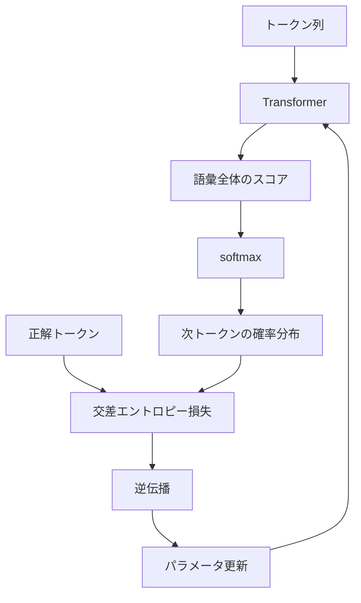
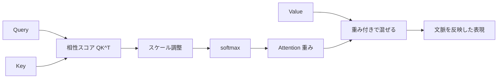

## 第14章　Transformer を読むために必要な機械学習知識

### 14.1　Transformer も機械学習モデルである

ここまで、機械学習の基本を順番に見てきました。

入力と出力。  
モデルとパラメータ。  
損失関数。  
勾配降下法。  
訓練データ、検証データ、テストデータ。  
過学習と汎化。  
分類と回帰。  
特徴量と表現。  
確率として見る機械学習。  
ニューラルネットワーク。  
機械学習システム全体の流れ。

これらはすべて、Transformer を理解するための土台になります。

Transformer は一見すると、かなり特殊なモデルに見えます。

Attention、Query、Key、Value、Multi-Head Attention、Positional Encoding、Layer Normalization、Residual Connection など、多くの部品が出てきます。

しかし、根本にあるのは、ここまで学んだ機械学習の基本です。

Transformer も、入力を受け取り、出力を返すモデルです。

```text
入力
↓
Transformer
↓
出力
```

言語モデルとして使う場合、入力はトークン列です。

```text
入力：ここまでのトークン列
```

出力は、次に来るトークンの確率分布です。

```text
出力：語彙全体に対する確率分布
```

たとえば、

```text
入力：吾輩は
```

に対して、モデルは次のような確率を出します。

```text
猫：0.35
犬：0.08
人間：0.04
学生：0.03
...
```

学習時には、正解トークンに高い確率を出せるように、損失を小さくします。

正解が「猫」なら、「猫」に高い確率を出すように重みを更新します。

つまり、Transformer も、基本的には次の流れで学習します。

```text
入力を入れる
↓
予測を出す
↓
正解と比較する
↓
損失を計算する
↓
逆伝播で勾配を計算する
↓
パラメータを更新する
```

この流れは、これまで学んできた機械学習そのものです。

Transformer も、機械学習の基本要素に分解して見ると理解しやすくなります。



### 14.2　次の単語を予測するというタスク

大規模言語モデルの基本的な学習タスクは、次のトークンを予測することです。

ここでは、わかりやすくするために「次の単語」と言ってもよいですが、実際には単語ではなくトークン単位で扱います。

たとえば、次の文章があります。

```text
吾輩は猫である
```

この文章から、次のような学習データを作ることができます。

```text
入力：吾輩は
正解：猫

入力：吾輩は猫
正解：で

入力：吾輩は猫で
正解：ある
```

つまり、文章の途中までを入力し、その次に実際に現れたトークンを正解とします。

これは教師あり学習に似ています。

入力と正解のペアがあるからです。

```text
入力 → 正解
```

ただし、人間が一つ一つラベルを付ける必要はありません。

文章そのものから、自動的に入力と正解のペアを作れます。

このような学習は、自己教師あり学習と呼ばれることがあります。

名前は少し違いますが、基本構造は教師あり学習に近いです。

```text
入力がある
正解がある
予測と正解を比較する
損失を小さくする
```

次トークン予測は、非常に単純なタスクに見えるかもしれません。

しかし、大量のテキストでこのタスクを学習すると、モデルは多くのことを身につけます。

文法。  
語彙。  
意味。  
文脈。  
言い回し。  
知識。  
推論のパターン。  
文章のスタイル。  
コードの構造。

なぜなら、次のトークンをうまく予測するには、文脈を理解し、世界についての知識を使い、文の構造を捉える必要があるからです。

たとえば、

```text
フランスの首都は
```

の次に「パリ」が来やすいと予測するには、地理的知識が必要です。

```text
if x > 0:
```

の次を予測するには、プログラムの構文を知っている必要があります。

```text
彼は雨に濡れていたので、傘を
```

の次を予測するには、文脈や常識が関係します。

つまり、次トークン予測という単純な形の中に、多くの言語理解の要素が含まれています。

#### PyTorchで確認してみる

次トークン予測では、同じトークン列を1つずらして、入力と正解を作ります。

```python
import torch

vocab = {"wagahai": 0, "wa": 1, "neko": 2, "de": 3, "aru": 4}
token_ids = torch.tensor([
    vocab["wagahai"],
    vocab["wa"],
    vocab["neko"],
    vocab["de"],
    vocab["aru"],
])

input_ids = token_ids[:-1]
target_ids = token_ids[1:]

print("input ids:", input_ids)
print("target ids:", target_ids)
```

`input_ids` の各位置に対して、`target_ids` の同じ位置が「次に来るべきトークン」になります。

大規模言語モデルの学習でも、このずらした入力と正解の考え方が基本になります。

### 14.3　トークンを入力、次トークンを正解と見る

Transformer を読むためには、文章がどのように入力になるのかを理解する必要があります。

コンピュータは、文章をそのまま理解するわけではありません。

まず、文章をトークンに分けます。

たとえば、

```text
吾輩は猫である
```

を単純化して、次のように分けるとします。

```text
吾輩 / は / 猫 / で / ある
```

実際のトークナイザでは、単語単位とは限りません。

単語の一部、文字、サブワードなどに分かれることがあります。

次に、各トークンを数値IDに変換します。

```text
吾輩 → 4210
は → 102
猫 → 1532
で → 305
ある → 918
```

この数値IDの列が、モデルへの入力の元になります。

```text
[4210, 102, 1532, 305, 918]
```

ただし、トークンIDそのものは単なる番号です。

番号の大小に意味はありません。

```text
猫 = 1532
犬 = 1820
```

だからといって、犬が猫より大きいという意味ではありません。

そこで、トークンIDを埋め込みベクトルに変換します。

```text
トークンID
↓
埋め込みベクトル
```

各トークンは、モデル内部ではベクトルとして扱われます。

```text
猫 → [0.12, -0.45, 0.88, ...]
```

このベクトル列が Transformer に入力されます。

学習時には、ある位置までのトークンを使って、次のトークンを予測します。

```text
入力トークン列：吾輩 / は
正解トークン：猫
```

モデルは、語彙全体に対して確率を出します。

```text
猫：0.35
犬：0.08
人間：0.04
...
```

この中で、正解トークン「猫」の確率が高くなるように学習します。

つまり、Transformer の言語モデル学習は、次のように見られます。

```text
トークン列を入力する
↓
次トークンの確率分布を出す
↓
実際の次トークンと比較する
↓
損失を計算する
↓
パラメータを更新する
```

### 14.4　出力は語彙全体に対する確率分布

言語モデルの出力は、次に来るトークンそのものではありません。

正確には、語彙全体に対する確率分布です。

語彙とは、モデルが扱えるトークンの集合です。

たとえば、語彙サイズが50,000だとします。

この場合、モデルは次トークン候補として50,000個のトークンを持っています。

入力が、

```text
今日はとても
```

だったとします。

モデルは、50,000個のトークンそれぞれに対してスコアを出します。

```text
暑い：スコア 8.2
寒い：スコア 7.5
楽しい：スコア 5.1
で：スコア 2.0
猫：スコア -1.3
...
```

このスコアは、まだ確率ではありません。

そこで softmax を使って、スコアを確率分布に変換します。

```text
暑い：0.30
寒い：0.18
楽しい：0.07
忙しい：0.05
...
```

すべての確率を足すと1になります。

```text
全トークンの確率の合計 = 1
```

この確率分布をもとに、次のトークンを選びます。

一番確率の高いトークンを選ぶこともできます。

確率分布に従ってランダムに選ぶこともできます。

temperature や top-p などの生成設定は、この選び方に関係します。

ここで重要なのは、モデルの出力は「一つの答え」ではなく、「候補全体に対する確率分布」だということです。

```text
モデルの出力：
次トークン候補全体の確率分布
```

これは分類問題と同じ構造です。

画像分類では、犬、猫、鳥などのカテゴリに対する確率を出しました。

言語モデルでは、語彙中のすべてのトークンに対する確率を出します。

つまり、次トークン予測は、巨大な多クラス分類問題として理解できます。

### 14.5　softmax と交差エントロピー

Transformer の学習では、softmax と交差エントロピーが重要です。

まず、モデルは語彙中の各トークンに対してスコアを出します。

このスコアを logits と呼ぶことがあります。

```text
logits：
猫：4.2
犬：2.7
人間：1.1
で：0.9
...
```

logits は確率ではありません。

値はマイナスにもなりますし、合計が1になるわけでもありません。

そこで softmax を使います。

```text
logits
↓
softmax
↓
確率分布
```

softmax によって、各トークンの確率が得られます。

```text
猫：0.35
犬：0.08
人間：0.04
で：0.03
...
```

次に、正解トークンと比較します。

正解が「猫」だったとします。

このとき、モデルが「猫」に高い確率を出していれば良い予測です。

```text
猫：0.35
```

もし「猫」に低い確率しか出していなければ、悪い予測です。

```text
猫：0.001
```

この良し悪しを数値化するのが交差エントロピー損失です。

正解トークンに対する確率を `p` とすると、損失はおおよそ次のように書けます。

```text
損失 = -log(p)
```

`p` が大きいほど、損失は小さくなります。

```text
正解トークンの確率が高い
↓
損失が小さい
```

`p` が小さいほど、損失は大きくなります。

```text
正解トークンの確率が低い
↓
損失が大きい
```

つまり、交差エントロピー損失を小さくすることは、正解トークンに高い確率を割り当てることを意味します。

これは、最大尤度推定の考え方ともつながっています。

観測されたテキスト、つまり実際に現れたトークン列が、モデルにとってもっともらしくなるように学習しているのです。

### 14.6　勾配降下法で重みを更新する

損失を計算したら、その損失を小さくするようにモデルのパラメータを更新します。

Transformer には大量のパラメータがあります。

たとえば、次のようなものです。

```text
トークン埋め込みの重み
Self-Attention の重み行列
Query を作る重み行列
Key を作る重み行列
Value を作る重み行列
Feed Forward Network の重み
出力層の重み
Layer Normalization のパラメータ
```

これらの値は、最初から意味のある値ではありません。

学習によって調整されます。

学習の流れは、ニューラルネットワークと同じです。

まず、順伝播を行います。

```text
入力トークン列
↓
埋め込み
↓
Transformer 層
↓
出力層
↓
softmax
↓
次トークンの確率分布
↓
損失
```

次に、逆伝播を行います。

```text
損失
↑
出力層
↑
Transformer 層
↑
埋め込み
```

逆伝播によって、各パラメータが損失にどれくらい影響したか、つまり勾配を計算します。

その後、最適化アルゴリズムでパラメータを更新します。

基本形は、次の通りです。

```text
新しいパラメータ = 現在のパラメータ - 学習率 × 勾配
```

実際の Transformer の学習では、単純な勾配降下法ではなく、Adam や AdamW のような最適化アルゴリズムが使われることが多いです。

しかし、基本は同じです。

```text
損失を小さくする方向へ
パラメータを少しずつ動かす
```

この更新を、膨大な量のテキストに対して繰り返します。

その結果、Transformer は次トークン予測がうまくなるように、内部の重みを調整していきます。

### 14.7　巨大な関数としてのニューラルネットワーク

Transformer は、巨大な関数として見ることができます。

関数とは、入力を受け取り、出力を返すものです。

```text
出力 = 関数(入力)
```

Transformer も同じです。

```text
次トークンの確率分布 = Transformer(トークン列)
```

ここでの入力は、トークン列です。

```text
吾輩 / は
```

出力は、語彙全体に対する確率分布です。

```text
猫：0.35
犬：0.08
人間：0.04
...
```

この関数の中には、非常に多くのパラメータがあります。

小さなモデルなら数百万から数億。

大きな言語モデルでは、数十億、数百億、あるいはそれ以上のパラメータがあります。

この膨大なパラメータによって、入力から出力への非常に複雑な変換を表現します。

ただし、基本構造はこれまでと同じです。

```text
入力
↓
重みを使った計算
↓
非線形変換
↓
層の積み重ね
↓
出力
```

Transformer の特徴は、Self-Attention によってトークン同士の関係を扱えることです。

単純な全結合ネットワークでは、入力の各要素の関係を明示的に扱うのが難しい場合があります。

Transformer では、各トークンが他のトークンを参照しながら、自分の表現を更新します。

```text
各トークン
↓
他のトークンを見る
↓
文脈を反映した表現になる
```

この仕組みによって、文中の離れた単語同士の関係も扱いやすくなります。

たとえば、

```text
太郎は花子に本を渡した。彼女はそれを読んだ。
```

という文では、「彼女」が花子を指し、「それ」が本を指していると考えられます。

このような関係を扱うには、文中の離れた位置にあるトークン同士の関係を見る必要があります。

Transformer は、そのための仕組みとして Self-Attention を持っています。

### 14.8　機械学習の基本から Transformer への接続

ここまでの章で学んだ内容は、すべて Transformer につながっています。

まず、教師あり学習の考え方です。

Transformer の言語モデル学習では、入力トークン列と正解トークンのペアを使います。

```text
入力：吾輩は
正解：猫
```

これは、入力と正解の対応を学ぶという意味で、教師あり学習の基本と同じ構造です。

次に、モデルとパラメータです。

Transformer は、入力トークン列を次トークンの確率分布に変換するモデルです。

内部には大量の重み行列があります。

```text
Q を作る重み
K を作る重み
V を作る重み
Feed Forward Network の重み
出力層の重み
```

これらが学習されるパラメータです。

次に、損失関数です。

Transformer の言語モデル学習では、正解トークンに対する交差エントロピー損失を使います。

```text
正解トークンの確率が高い
↓
損失が小さい

正解トークンの確率が低い
↓
損失が大きい
```

次に、勾配降下法です。

損失を小さくするために、逆伝播で勾配を計算し、パラメータを更新します。

```text
損失
↓
逆伝播
↓
勾配
↓
パラメータ更新
```

次に、特徴量と表現です。

Transformer は、トークンIDを埋め込みベクトルに変換し、各層で文脈を反映した表現へ更新します。

```text
トークンID
↓
埋め込み
↓
Transformer 層
↓
文脈表現
```

次に、確率です。

Transformer は、次トークン候補全体に対する確率分布を出します。

```text
P(次のトークン | これまでのトークン列)
```

つまり、文脈を条件とした条件付き確率を学習しています。

このように、Transformer は特別な魔法ではありません。

ここまで学んだ機械学習の基本を、大規模なニューラルネットワークとして実現したものです。

### 14.9　Attention 論文を読むときに必要な前提

`Attention Is All You Need` を読むときには、いくつかの前提知識が必要です。

まず、ニューラルネットワークの基本です。

```text
ベクトル
行列
重み
バイアス
層
活性化関数
順伝播
逆伝播
損失関数
```

これらがわからないと、Transformer の各部品が何をしているのか見えにくくなります。

次に、自然言語処理の基本です。

```text
トークン
語彙
埋め込み
系列データ
言語モデル
機械翻訳
```

元論文の Transformer は、主に機械翻訳を対象にしています。

そのため、入力文を読み、出力文を生成する Encoder-Decoder 構造が出てきます。

次に、Attention の基本です。

Transformer は、RNN や LSTM を使わず、Attention を中心に構成されています。

そのため、なぜ Attention が必要だったのかを理解するには、以前の系列モデルの課題も少し知っておくとよいです。

```text
RNN は逐次処理なので並列化しにくい
長い依存関係を扱いにくい
Attention は必要な位置を参照できる
```

さらに、確率と損失関数の理解も必要です。

論文では、モデルの出力が確率分布として扱われ、正解とのズレを損失として学習します。

つまり、softmax、交差エントロピー、最尤推定の直感があると読みやすくなります。

また、Transformer の構成要素として、次の言葉が出てきます。

```text
Scaled Dot-Product Attention
Multi-Head Attention
Positional Encoding
Feed Forward Network
Residual Connection
Layer Normalization
Dropout
```

これらは最初から全部理解する必要はありません。

最初に押さえるべきなのは、Transformer の中心が Self-Attention であることです。

Self-Attention は、各トークンが文中の他のトークンを参照しながら、自分の表現を更新する仕組みです。

### 14.10　元論文の Transformer と現代の LLM の違い

`Attention Is All You Need` の Transformer と、現代の大規模言語モデルは、同じ Transformer 系の技術ですが、構成が少し違います。

元論文の Transformer は、主に機械翻訳のためのモデルです。

機械翻訳では、入力文と出力文があります。

たとえば、

```text
入力：I love cats.
出力：私は猫が好きです。
```

このようなタスクでは、入力文を読む部分と、出力文を生成する部分が必要です。

そのため、元論文の Transformer は Encoder-Decoder 構造を持っています。

```text
入力文
↓
Encoder
↓
Decoder
↓
出力文
```

Encoder は入力文を読み、文脈表現を作ります。

Decoder は、その表現を参照しながら、出力文を1トークンずつ生成します。

一方、GPT 系の大規模言語モデルは、主に Decoder-only Transformer です。

```text
入力トークン列
↓
Decoder-only Transformer
↓
次トークンの確率分布
```

GPT 系モデルは、ここまでの文脈を見て、次のトークンを予測します。

BERT 系モデルは、主に Encoder-only Transformer です。

```text
入力文
↓
Encoder-only Transformer
↓
文全体の表現
```

BERT は、文章分類や固有表現抽出、検索、文理解などに強い構造です。

整理すると、次のようになります。

```text
Encoder-Decoder：
機械翻訳などに使われる
入力系列を読み、出力系列を生成する

Encoder-only：
文章理解に向く
文全体の表現を作る

Decoder-only：
文章生成に向く
次トークンを順に予測する
```

`Attention Is All You Need` を読むときには、元論文が Encoder-Decoder 型であることを理解しておくと混乱しにくくなります。

現代のチャット型LLMは、主に Decoder-only の発展形として理解するとよいです。

### 14.11　数式を読むための最小限の見方

Transformer の論文には数式が出てきます。

最初に見るべき最重要の式は、Scaled Dot-Product Attention の式です。

```text
Attention(Q, K, V) = softmax(QK^T / sqrt(d_k)) V
```

この式は、最初は難しく見えます。

しかし、意味は次のように分けて考えられます。

```text
Q：
Query
自分が何を探しているか

K：
Key
各トークンが持つ目印

V：
Value
実際に取り出す中身
```

まず、Query と Key の相性を計算します。

```text
QK^T
```

これは、各 Query が各 Key とどれくらい合っているかを表すスコアです。

次に、スコアを `sqrt(d_k)` で割ります。

```text
QK^T / sqrt(d_k)
```

これは、値が大きくなりすぎないようにスケールを調整するためです。

次に softmax をかけます。

```text
softmax(QK^T / sqrt(d_k))
```

これにより、どのトークンをどれくらい見るかという重みになります。

最後に、その重みを Value に掛けます。

```text
softmax(...) V
```

これにより、参照すべきトークンの情報を重み付きで混ぜたベクトルが得られます。

つまり、この式の意味は次のように言えます。

```text
各トークンについて、
他のトークンとの関連度を計算し、
関連度に応じて情報を集める
```

数式全体を一気に理解しようとする必要はありません。

まずは、次の対応を押さえるだけで十分です。

```text
QK^T：
どのトークンを見るかのスコアを計算する

softmax：
スコアを重みに変換する

V：
実際に集める情報

softmax(...) V：
重みに応じて情報を混ぜる
```

Transformer の中心は、この Attention の計算です。

式の各部分を処理の流れにすると、次のようになります。



#### PyTorchで確認してみる

Scaled Dot-Product Attention は、PyTorch では次のように書けます。

```python
import math
import torch
import torch.nn.functional as F

torch.manual_seed(0)

batch_size = 1
seq_len = 4
d_model = 8

x = torch.randn(batch_size, seq_len, d_model)
Wq = torch.randn(d_model, d_model)
Wk = torch.randn(d_model, d_model)
Wv = torch.randn(d_model, d_model)

Q = x @ Wq
K = x @ Wk
V = x @ Wv

scores = Q @ K.transpose(-2, -1)
scores = scores / math.sqrt(d_model)
weights = F.softmax(scores, dim=-1)
output = weights @ V

print("attention weights shape:", weights.shape)
print("output shape:", output.shape)
```

`weights` の形は `[batch_size, seq_len, seq_len]` です。

これは、各トークンが他の各トークンをどれくらい見るかを表します。

### 14.12　Attention を直感で理解する

Attention は、「入力のどこを見るべきか」を決める仕組みです。

文章を読むとき、人間も常にすべての単語を同じ重みで見ているわけではありません。

ある単語の意味を理解するために、文中の特定の単語に注目します。

たとえば、次の文を考えます。

```text
太郎は花子に本を渡した。彼女はそれを読んだ。
```

「彼女」が誰を指しているかを理解するには、「花子」を見る必要があります。

「それ」が何を指しているかを理解するには、「本」を見る必要があります。

つまり、あるトークンの意味を更新するには、文中の別のトークンを参照する必要があります。

Self-Attention は、この参照を計算で行います。

各トークンが、他のトークンに対して「どれくらい見るべきか」という重みを計算します。

```text
彼女 → 花子を強く見る
それ → 本を強く見る
```

実際には、モデルが人間と同じように明示的に「指示語を解決している」とは限りません。

しかし、Self-Attention の仕組みとしては、各位置が他の位置の情報を重み付きで取り込めます。

この仕組みによって、Transformer は離れた単語同士の関係を扱いやすくなります。

RNN のように左から右へ順番に情報を伝えるのではなく、各トークンが直接他のトークンを参照できます。

これが、Transformer の大きな強みの一つです。

### 14.13　機械学習の基本を押さえると論文が読みやすくなる

`Attention Is All You Need` は、Transformer の構造を提案した論文です。

しかし、論文は機械学習の基本を一から説明してくれるものではありません。

当然の前提として、ニューラルネットワークや最適化、自然言語処理の知識が置かれています。

そのため、基礎知識なしで読むと、非常に難しく感じます。

これは自然なことです。

論文を読むためには、まず前提を固める必要があります。

ここまでの章で学んだ内容は、そのための準備です。

```text
モデルとは何か
パラメータとは何か
損失関数とは何か
勾配降下法とは何か
分類問題とは何か
softmax とは何か
交差エントロピーとは何か
埋め込みとは何か
ニューラルネットワークとは何か
表現学習とは何か
```

これらがわかってくると、Transformer の論文で出てくる言葉が少しずつ意味を持ち始めます。

たとえば、論文中に `softmax` が出てきたとき、それが「スコアを確率的な重みに変換するもの」だとわかります。

`Multi-Head Attention` が出てきたとき、それが「Attention を複数の観点で並列に行うもの」だと理解しやすくなります。

`Layer Normalization` が出てきたとき、それが「深いニューラルネットワークの学習を安定させるための正規化」だと見えます。

`Residual Connection` が出てきたとき、それが「層を深くしても学習しやすくするための接続」だと見えます。

このように、基礎を押さえると、論文の各部品が孤立した謎の単語ではなく、ニューラルネットワークを構成する意味のある部品として見えてきます。

### 14.14　最初に論文で読むべき場所

`Attention Is All You Need` を読むとき、最初から最後まで順番に精読しようとすると難しいかもしれません。

最初は、読む場所を絞るのがおすすめです。

まず Abstract を読みます。

Abstract では、論文全体の主張が短くまとめられています。

ここでは、細部を理解する必要はありません。

「RNN や CNN を使わず、Attention だけで系列変換モデルを作った」という主張を押さえれば十分です。

次に Introduction を読みます。

Introduction では、なぜ Transformer が必要だったのかが説明されます。

特に重要なのは、従来の RNN 系モデルには逐次処理の制約があり、並列化しにくかったという点です。

Transformer は、Attention を中心にすることで、より並列化しやすい構造を実現しました。

次に Figure 1 を見ます。

Figure 1 は Transformer の全体構造を示す図です。

最初は細部まで理解できなくてもかまいません。

次の部品があることを確認します。

```text
Encoder
Decoder
Multi-Head Attention
Feed Forward
Add & Norm
Positional Encoding
```

次に Section 3 を読みます。

Section 3 はモデル構造の説明です。

ここが Transformer の中心です。

ただし、最初に全部を理解する必要はありません。

まずは、次の順番で見るとよいです。

```text
3.1 Encoder and Decoder Stacks
3.2 Attention
3.3 Position-wise Feed-Forward Networks
3.4 Embeddings and Softmax
3.5 Positional Encoding
```

特に 3.2 の Attention が最重要です。

ただし、数式で詰まったら、いったん飛ばして図や説明に戻ってよいです。

論文は一度で理解するものではありません。

基礎を学びながら、何度も戻って読むものです。

### 14.15　本章のまとめ

この章では、Transformer を読むために必要な機械学習知識を整理しました。

Transformer も、基本的には機械学習モデルです。

入力を受け取り、出力を返します。

```text
入力トークン列
↓
Transformer
↓
次トークンの確率分布
```

言語モデルでは、文章の途中までを入力し、次のトークンを予測します。

```text
入力：吾輩は
正解：猫
```

モデルは語彙全体に対する確率分布を出します。

```text
猫：0.35
犬：0.08
人間：0.04
...
```

正解トークンに高い確率を出せるように、交差エントロピー損失を小さくします。

そして、逆伝播と最適化アルゴリズムによって、Transformer 内部の大量のパラメータを更新します。

Transformer を理解するためには、次の基礎が重要です。

```text
入力と出力
モデルとパラメータ
損失関数
勾配降下法
softmax
交差エントロピー
埋め込みベクトル
ニューラルネットワーク
表現学習
確率分布
```

`Attention Is All You Need` の中心は、Self-Attention です。

Self-Attention は、各トークンが文中の他のトークンを参照し、文脈を反映した表現を作る仕組みです。

最重要の式は次のものです。

```text
Attention(Q, K, V) = softmax(QK^T / sqrt(d_k)) V
```

この式は、直感的には次の意味です。

```text
Query と Key の相性を計算する
↓
softmax で重みにする
↓
その重みに応じて Value を混ぜる
```

この章で一番重要な考え方は、次の一文です。

**Transformer は、トークン列を入力し、Self-Attention によって文脈を反映した表現を作り、次トークンの確率分布を予測するニューラルネットワークである。**

ここまでの機械学習の基本を押さえておくと、Transformer の論文はかなり読みやすくなります。

最初から完全に理解する必要はありません。

まずは、Transformer も「入力、モデル、出力、損失、パラメータ更新」という機械学習の基本構造の上にある、と見えることが大切です。
