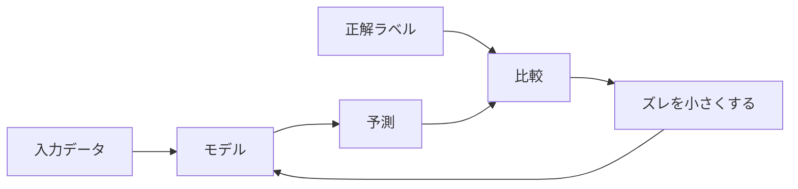

## 第2章　教師あり学習の基本

### 2.1　教師あり学習とは何か

機械学習にはいくつかの種類があります。その中で、もっとも基本的で理解しやすいのが「教師あり学習」です。

教師あり学習とは、入力と正解のペアを使って、入力から正解を予測するモデルを学習する方法です。

たとえば、犬と猫の画像を分類するモデルを作りたいとします。このとき、画像だけを大量に集めても、それぞれが犬なのか猫なのかがわからなければ、モデルは何を学べばよいのかわかりません。

そこで、次のようなデータを用意します。

```
画像1 → 犬
画像2 → 猫
画像3 → 犬
画像4 → 猫
```

この「犬」「猫」が正解です。

教師あり学習では、モデルに入力を与え、モデルが出した予測と正解を比較します。予測が間違っていれば、その間違いが小さくなるようにモデルを調整します。これを大量のデータに対して繰り返すことで、モデルは少しずつ正しい出力を出せるようになります。

ここでいう「教師」とは、人間の先生のような存在ではありません。モデルに対して「この入力の正解はこれである」と教える正解データのことです。

つまり、教師あり学習とは、正解付きのデータを使って学習する方法です。

たとえば、次のような問題は教師あり学習として扱えます。

メール本文を入力して、スパムかどうかを予測する。  
画像を入力して、写っているものの種類を予測する。  
家の情報を入力して、価格を予測する。  
文章を入力して、次に来る単語を予測する。  
音声を入力して、話されている内容を文字に変換する。

これらはすべて、入力と正解の対応関係を学ぶ問題です。

この章では、教師あり学習の基本的な考え方を学びます。

教師あり学習の中心には、入力、正解、予測、ズレの比較があります。



### 2.2　訓練データと正解ラベル

教師あり学習では、学習に使うデータのことを「訓練データ」と呼びます。

訓練データは、入力と正解のペアからできています。

たとえば、スパムメール判定なら、次のようなデータです。

```
入力：メール本文
正解：スパム / スパムではない
```

画像分類なら、次のようになります。

```
入力：画像
正解：犬 / 猫 / 車 / 花 / 人物 ...
```

家の価格予測なら、次のようになります。

```
入力：広さ、築年数、駅からの距離、地域など
正解：実際の販売価格
```

この正解のことを「ラベル」と呼ぶことがあります。

特に分類問題では、正解カテゴリのことを「ラベル」と呼びます。

たとえば、犬の画像に対して「犬」というラベルが付いている。猫の画像に対して「猫」というラベルが付いている。メールに対して「スパム」というラベルが付いている。

このように、データに正解を付ける作業を「ラベリング」または「アノテーション」と呼びます。

教師あり学習では、このラベルの品質が非常に重要です。

たとえば、犬の画像なのに間違って「猫」というラベルが付いていたら、モデルは間違った情報を学習してしまいます。スパムではないメールに「スパム」というラベルが付いていたら、正常なメールをスパムと判定しやすいモデルになってしまうかもしれません。

つまり、教師あり学習では、モデルの性能はデータの質に強く依存します。

たくさんのデータがあることも大事ですが、それ以上に、正しいラベルが付いていることが重要です。

### 2.3　分類問題と回帰問題

教師あり学習の代表的な問題には、「分類」と「回帰」があります。

分類とは、入力をいくつかのカテゴリのどれかに分ける問題です。

たとえば、犬か猫かを判定する問題は分類です。

```
入力：画像
出力：犬 / 猫
```

メールがスパムかどうかを判定する問題も分類です。

```
入力：メール本文
出力：スパム / スパムではない
```

ニュース記事のジャンルを判定する問題も分類です。

```
入力：記事本文
出力：政治 / 経済 / スポーツ / エンタメ / 技術 ...
```

分類では、出力はカテゴリです。

一方、回帰とは、数値を予測する問題です。

たとえば、家の価格を予測する問題は回帰です。

```
入力：家の情報
出力：価格
```

気温を予測する問題も回帰です。

```
入力：日時、場所、気象情報
出力：明日の気温
```

商品の売上を予測する問題も回帰です。

```
入力：過去の売上、曜日、天気、広告費
出力：売上金額
```

分類と回帰の違いは、出力がカテゴリか連続値かです。

分類では、「犬」「猫」「スパム」「正常」などのラベルを予測します。  
回帰では、「5,000万円」「23.5度」「売上120万円」などの数値を予測します。

この違いは、あとで出てくる損失関数や評価指標にも関係します。分類と回帰では、間違い方の測り方が違うからです。

### 2.4　例：メールをスパム判定する

ここで、教師あり学習の具体例として、メールのスパム判定を考えてみます。

目的は、メール本文を入力して、そのメールがスパムかどうかを予測するモデルを作ることです。

まず、過去のメールを大量に集めます。そして、それぞれのメールに正解ラベルを付けます。

```
メール1 → スパム
メール2 → スパムではない
メール3 → スパム
メール4 → スパムではない
```

モデルは、メール本文を入力として受け取ります。

ただし、コンピュータは文章そのものをそのまま理解できるわけではありません。そのため、実際には文章を数値に変換します。たとえば、どの単語が含まれているか、どのような表現が使われているか、といった情報を数値として表します。

モデルは、その数値化された入力をもとに、スパムである確率を出します。

```
このメールがスパムである確率：0.92
```

この場合、かなりスパムらしいと判断していることになります。

別のメールでは、次のように出るかもしれません。

```
このメールがスパムである確率：0.03
```

この場合、スパムではなさそうだと判断できます。

学習中は、この予測と正解ラベルを比較します。

たとえば、実際にはスパムであるメールに対して、モデルが「スパム確率 0.10」と出したら、大きく間違っています。この場合、モデル内部のパラメータを調整して、次からはこのようなメールに対して、より高いスパム確率を出せるようにします。

逆に、スパムではないメールに対して「スパム確率 0.95」と出した場合も、大きな間違いです。この場合は、似たようなメールに対してスパム確率を低く出せるように調整します。

この作業を大量のメールで繰り返すことで、モデルはスパムらしい表現や、通常のメールらしい表現を学習していきます。

ただし、ここで注意が必要です。

モデルは「スパムとは何か」を人間のように理解しているわけではありません。あくまで、過去のデータの中にあるパターンを学んでいます。

そのため、学習データにない新しいタイプのスパムには弱い場合があります。また、通常のメールでも、スパムに似た表現が含まれていると誤判定することがあります。

機械学習モデルは便利ですが、常に間違える可能性がある。この前提は忘れてはいけません。

### 2.5　例：家の価格を予測する

次に、回帰問題の例として、家の価格予測を考えます。

目的は、家の情報を入力して、その家がいくらぐらいで売れそうかを予測することです。

入力としては、たとえば次のような情報を使います。

```
広さ
築年数
駅からの距離
最寄り駅
地域
部屋数
階数
日当たり
```

正解は、実際の販売価格です。

```
家1 → 5,200万円
家2 → 7,800万円
家3 → 4,100万円
```

モデルは、これらの入力と正解の関係を学びます。

たとえば、一般的には広い家ほど価格が高くなりやすい。駅に近い家ほど価格が高くなりやすい。築年数が古い家ほど価格が下がりやすい。人気のある地域では価格が高くなりやすい。

こうした傾向をデータから学びます。

もちろん、現実の価格は単純ではありません。

同じ広さでも、地域が違えば価格は大きく変わります。同じ駅距離でも、駅の人気によって価格は変わります。築年数が古くても、リノベーションされていれば価格が高いこともあります。

つまり、家の価格は複数の要因が組み合わさって決まります。

機械学習モデルは、こうした複雑な関係をデータから学習しようとします。

学習中は、モデルが予測した価格と、実際の価格を比較します。

```
実際の価格：5,200万円
予測価格：4,700万円
誤差：500万円
```

この誤差が小さくなるように、モデルのパラメータを調整します。

この作業を大量の物件データに対して繰り返すことで、モデルはより現実に近い価格を予測できるようになります。

ただし、ここでも重要なのは、モデルの出力はあくまで予測だということです。

不動産価格には、景気、金利、地域の開発計画、売主の事情、買主の好みなど、データに入っていない要因も影響します。そのため、モデルが出す価格は絶対ではありません。

機械学習は、過去のデータから見た「もっともらしい値」を出す技術です。

### 2.6　入力特徴量とは何か

機械学習では、モデルに与える入力情報のことを「特徴量」と呼びます。

特徴量とは、予測に使う手がかりです。

家の価格予測なら、次のようなものが特徴量です。

```
広さ
築年数
駅からの距離
地域
部屋数
```

スパム判定なら、次のようなものが特徴量になります。

```
本文に含まれる単語
件名に含まれる表現
URLの数
送信元アドレス
添付ファイルの有無
```

画像分類なら、画像の各ピクセルの値が特徴量になります。ただし、深層学習では、画像の低レベルな特徴から高レベルな特徴まで、モデル自身が段階的に表現を作っていきます。

特徴量は、モデルが予測するための材料です。

よい特徴量があれば、単純なモデルでもよい予測ができることがあります。逆に、重要な特徴量が欠けていると、どれだけ高度なモデルを使っても限界があります。

たとえば、家の価格を予測するのに「広さ」しか入力しないとします。

広い家ほど高い、という傾向は学べるかもしれません。しかし、地域や駅距離や築年数がわからないので、精度には限界があります。

東京都心の50平米と、地方の50平米では価格が大きく違います。駅徒歩3分の物件と、駅徒歩30分の物件でも違います。築浅と築40年でも違います。

つまり、予測に重要な情報が入力に含まれていなければ、モデルはその情報を使えません。

機械学習では、どの特徴量を使うかが非常に重要です。

古典的な機械学習では、人間が特徴量を設計することが多くありました。これを「特徴量エンジニアリング」と呼びます。

一方、深層学習では、特徴量そのものをモデルが自動的に学習する部分が大きくなりました。

たとえば画像認識では、人間が「耳の形」「鼻の長さ」「毛の色」といった特徴を明示的に設計しなくても、ニューラルネットワークが画像から有用な特徴表現を学習します。

自然言語処理でも、単語やトークンをベクトルとして表現し、そのベクトルを学習します。これが後で出てくる「埋め込み」や「表現学習」につながります。

### 2.7　正解とのズレを小さくするという考え方

教師あり学習の中心にある考え方は、とても単純です。

モデルの予測と正解のズレを小さくする。

これだけです。

たとえば、家の価格予測では、モデルが4,700万円と予測し、実際の価格が5,200万円だったとします。この場合、500万円のズレがあります。

```
予測：4,700万円
正解：5,200万円
ズレ：500万円
```

このズレを小さくしたい。

スパム判定では、実際にはスパムなのに、モデルが「スパムである確率 0.10」と出したとします。この場合、モデルはかなり間違っています。

```
予測：スパム確率 0.10
正解：スパム
```

このズレも小さくしたい。

分類問題でも回帰問題でも、基本は同じです。

モデルが出した答えと、正解の差を測る。  
その差が小さくなるように、モデルを調整する。  
これを大量のデータで繰り返す。

この「ズレ」を数値として表すものが、後で学ぶ「損失関数」です。

損失関数は、モデルがどれくらい間違っているかを表す関数です。

学習とは、損失関数の値を小さくすることだと考えられます。

この見方を持っておくと、機械学習の多くの話がかなり見通しやすくなります。

画像分類も、スパム判定も、家の価格予測も、言語モデルも、基本的には「予測と正解のズレを小さくする」ことで学習します。

Transformer も同じです。

たとえば、言語モデルでは、ある文脈に対して次に来るトークンを予測します。

```
入力：吾輩は
正解：猫
```

モデルが「猫」に高い確率を出せばよい予測です。逆に、「犬」や「車」や「昨日」に高い確率を出してしまうと、正解とのズレが大きくなります。

このズレを小さくするように、モデル内部の大量の重みを調整します。

この意味で、大規模言語モデルも教師あり学習の考え方と深くつながっています。

### 2.8　「学習できる」とはどういうことか

ここで、少し根本的な問いを考えます。

モデルが「学習できる」とは、どういうことでしょうか。

それは、入力と出力の間に、何らかの規則性があるということです。

たとえば、家の価格には規則性があります。広さ、地域、築年数、駅距離などが価格に影響します。もちろん完全に決まるわけではありませんが、傾向はあります。だから学習できます。

メールのスパム判定にも規則性があります。スパムメールには、よく出てくる表現や構造があります。怪しいURL、過剰な宣伝文句、不自然な日本語、特定の送信パターンなどがあるかもしれません。だから学習できます。

画像分類にも規則性があります。犬には犬らしい形や質感があり、猫には猫らしい形や質感があります。だから学習できます。

一方、入力と出力の間にまったく規則性がなければ、学習はできません。

たとえば、完全にランダムに決められたラベルを予測する問題を考えます。

```
画像1 → A
画像2 → B
画像3 → A
画像4 → C
```

もしこのラベルが画像の内容と関係なく、サイコロで適当に決められているなら、モデルは本質的な規則を学べません。

学習データを丸暗記することはできるかもしれません。しかし、未知のデータに対しては予測できません。

つまり、機械学習が成立するためには、データの背後に規則性が必要です。

ただし、その規則性は人間にとって明確である必要はありません。

人間が言葉で説明できない規則性でも、データの中に存在していれば、モデルが利用できる可能性があります。

たとえば、画像認識では、人間が「犬らしさ」を完全なルールとして書くのは困難です。しかし、犬の画像には統計的な共通性があります。ニューラルネットワークは、その共通性を学習できます。

自然言語も同じです。人間は文法や意味を完全なルールとして書き切ることはできません。しかし、大量の文章には、単語の並び方、文法、意味、文脈、言い回しの規則性があります。言語モデルは、その規則性を学習します。

このように、機械学習でいう「学習できる」とは、データの背後にある規則性を、モデルがパラメータとして取り込めるということです。

### 2.9　教師あり学習の流れ

ここまでの内容を踏まえると、教師あり学習の流れは次のようになります。

まず、解きたい問題を決めます。

たとえば、メールをスパム判定したい。家の価格を予測したい。画像を分類したい。文章の次の単語を予測したい。

次に、入力と正解のペアを集めます。

```
入力 → 正解
入力 → 正解
入力 → 正解
```

次に、モデルを用意します。

最初のモデルは、まだ何も学習していません。ニューラルネットワークなら、重みはランダムに初期化されていることが多いです。

次に、モデルに入力を与え、予測を出します。

```
入力 → モデル → 予測
```

次に、予測と正解を比較します。

```
予測 vs 正解
```

この比較によって、どれくらい間違っているかを数値化します。これが損失です。

次に、その損失が小さくなるように、モデルのパラメータを更新します。

この一連の処理を、大量のデータに対して何度も繰り返します。

すると、モデルは少しずつ、正解に近い予測を出せるようになります。

簡単にまとめると、こうです。

```
1. 入力と正解のデータを用意する
2. モデルに入力を入れる
3. モデルが予測を出す
4. 予測と正解のズレを測る
5. ズレが小さくなるようにモデルを調整する
6. これを何度も繰り返す
```

この流れは、機械学習全体の中心です。

Transformer を学習するときも、本質的には同じ流れです。

入力としてトークン列を入れる。  
モデルが次のトークンの確率分布を出す。  
正解トークンと比較する。  
損失を計算する。  
損失が小さくなるように重みを更新する。  
これを巨大なテキストデータで何度も繰り返す。

モデルの構造が複雑になっても、基本の流れは変わりません。

### 2.10　教師あり学習と生成AIの関係

生成AI、特に大規模言語モデルは、一見すると教師あり学習とは違うものに見えるかもしれません。

なぜなら、言語モデルは「犬」「猫」のような明示的なラベルを予測しているわけではなく、文章を生成しているからです。

しかし、言語モデルの基本的な学習は、教師あり学習に近い形で理解できます。

たとえば、次の文章があるとします。

```
吾輩は猫である。
```

この文章を、次のような入力と正解のペアに分解できます。

```
入力：吾輩は
正解：猫

入力：吾輩は猫
正解：で

入力：吾輩は猫で
正解：ある
```

つまり、文章そのものから「ここまでの文脈を入力し、次のトークンを正解とする」データを大量に作ることができます。

この方法では、人間が一つ一つラベルを付ける必要はありません。文章の次に実際に現れているトークンが、そのまま正解になります。

このような学習を「自己教師あり学習」と呼ぶことがあります。

名前は少し違いますが、考え方としては教師あり学習に非常に近いです。

入力があり、正解があり、予測と正解のズレを小さくする。

この構造は同じです。

大規模言語モデルは、大量の文章からこのような学習データを作り、次のトークンを予測する能力を高めます。その結果、文章の続きを自然に生成できるようになります。

重要なのは、言語モデルは最初から「会話をするAI」として学習しているわけではない、ということです。

まずは、大量のテキストから「次に来るトークンを予測する」能力を学びます。その後、人間の指示に従いやすくするための追加学習が行われます。

この追加学習には、指示と回答のペアを使う教師あり学習や、人間の好みに合わせるための強化学習的な手法などが使われます。

しかし、根本にはやはり、「入力から出力を予測し、正解とのズレを小さくする」という機械学習の基本があります。

### 2.11　本章のまとめ

この章では、教師あり学習の基本を見ました。

教師あり学習とは、入力と正解のペアを使って、入力から正解を予測するモデルを学習する方法です。

分類問題では、カテゴリを予測します。

```
画像 → 犬 / 猫
メール → スパム / 正常
```

回帰問題では、数値を予測します。

```
家の情報 → 価格
気象情報 → 気温
```

教師あり学習では、モデルが出した予測と正解を比較し、そのズレを小さくするようにモデルを調整します。

このズレを数値化するものが損失関数であり、損失を小さくする作業が学習です。

また、機械学習がうまく働くためには、入力と出力の間に何らかの規則性が必要です。規則性がまったくないデータからは、本質的な学習はできません。

この章で一番重要な考え方は、次の一文です。

教師あり学習とは、入力と正解のペアを使って、予測と正解のズレが小さくなるようにモデルを調整する方法である。

Transformer や大規模言語モデルも、この考え方の延長にあります。

言語モデルの場合、文章の途中までを入力し、次のトークンを正解として学習します。モデルは次のトークンの確率を予測し、正解とのズレが小さくなるように重みを更新します。

したがって、教師あり学習を理解することは、Transformer を理解するための最初の大きな土台になります。
