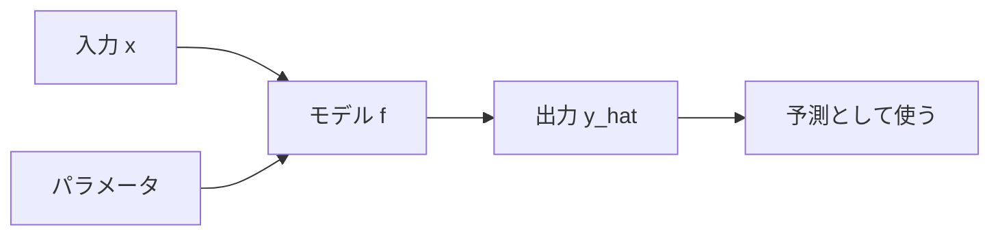

## 第3章　モデルとパラメータ

**この章でわかること**

- モデルを入力から出力を返す関数として見る考え方
- パラメータ、重み、バイアスの意味
- パラメータとハイパーパラメータの違い
- Transformer の中にも大量の学習される重みがあること

### 3.1　モデルは「関数」である

機械学習でいう「モデル」とは、入力を受け取って、何らかの出力を返す仕組みです。

もっとも基本的には、モデルは「関数」として考えることができます。

```
出力 = モデル(入力)
```

たとえば、家の価格を予測するモデルなら、次のように考えられます。

```
価格 = モデル(家の情報)
```

犬と猫を分類するモデルなら、次のようになります。

```
犬か猫か = モデル(画像)
```

スパムメール判定なら、次のようになります。

```
スパムかどうか = モデル(メール本文)
```

言語モデルなら、次のようになります。

```
次に来る単語 = モデル(ここまでの文章)
```

このように、機械学習では多くの問題を「入力を出力に変換する関数」として捉えます。

ここでいう関数は、プログラミング言語の関数に似ています。

たとえば、普通のプログラムで税込価格を計算する関数を書くなら、次のようになります。

```
税込価格 = 税抜価格 * 1.1
```

この関数は、入力として税抜価格を受け取り、出力として税込価格を返します。

機械学習のモデルも、入力を受け取り、出力を返すという意味では同じです。

ただし、大きな違いがあります。

普通のプログラムでは、関数の中身を人間が直接書きます。

一方、機械学習のモデルでは、関数の中身の一部、あるいは大部分が、データから決まります。

たとえば、家の価格を予測する場合、

```
価格 = 広さ × 係数1 + 駅距離 × 係数2 + 築年数 × 係数3 + ...
```

のような形を考えることができます。

このとき、「広さをどれくらい重視するか」「駅距離をどれくらい重視するか」「築年数をどれくらい重視するか」という係数は、人間が手で決めるのではなく、データから学習します。

つまり、機械学習のモデルとは、データによって形や中身が調整される関数です。

この見方は非常に重要です。

Transformer も、大規模言語モデルも、基本的には巨大な関数です。

入力としてトークン列を受け取り、出力として次のトークンの確率分布を返す関数です。

```
次トークンの確率分布 = Transformer(トークン列)
```

もちろん、その中身は非常に複雑です。Attention、Feed Forward Network、Layer Normalization、残差接続など、たくさんの部品があります。

しかし、基本に戻れば、モデルは「入力を出力に変換する関数」である。この理解が土台になります。

モデルを関数として見ると、全体像は次のようになります。



### 3.2　入力を受け取り、出力を返す

モデルを関数として見るとき、まず重要なのは「入力」と「出力」です。

モデルは、何かを入力として受け取ります。そして、それに対応する出力を返します。

家の価格予測では、入力は家に関する情報です。

```
広さ：80平米
築年数：10年
駅からの距離：徒歩8分
地域：東京都世田谷区
部屋数：3LDK
```

このような情報をモデルに入れると、モデルは価格を予測します。

```
予測価格：8,200万円
```

スパムメール判定では、入力はメール本文です。

```
今すぐクリックすると特別な賞品がもらえます
```

このような文章をモデルに入れると、モデルはスパムである確率を出します。

```
スパムである確率：0.97
```

画像分類では、入力は画像です。ただし、コンピュータにとって画像は、ピクセル値の集まりです。つまり、数値の配列です。

文章も同じです。人間にとって文章は文字や単語ですが、機械学習モデルに入力するためには、最終的には数値に変換する必要があります。

この点は大事です。

機械学習モデルが直接扱うのは、基本的には数値です。

画像も数値にする。  
文章も数値にする。  
音声も数値にする。  
カテゴリも数値にする。  

ニューラルネットワークは、数値を受け取り、数値を出力する計算の塊です。

そのため、モデルの入力と出力を考えるときには、人間にとっての意味と、コンピュータ内部での数値表現を区別する必要があります。

たとえば、言語モデルで「今日はいい天気です」という文章を入力するとします。

人間には文章として見えますが、モデルに入るときには、まずトークンという単位に分けられます。

```
今日は / いい / 天気 / です
```

さらに、それぞれのトークンは数値IDに変換されます。

```
今日は → 1532
いい → 842
天気 → 2191
です → 305
```

さらに、その数値IDはベクトルに変換されます。

このように、モデルの入力は最終的には数値ベクトルになります。

モデルはその数値を計算し、出力も数値として返します。

言語モデルの場合、出力は「語彙全体に対する確率分布」です。

たとえば、入力が、

```
今日はいい
```

だったとします。

モデルは、次に来るトークンについて、次のような確率を出します。

```
天気：0.42
日：0.18
感じ：0.07
ですね：0.05
...
```

つまり、モデルは「次のトークンは何か」を一つだけ直接答えているというより、「各候補がどれくらいありそうか」を数値で出しています。

このように、機械学習モデルは、入力を受け取り、内部で数値計算を行い、出力を返します。

その出力は、分類のラベルかもしれません。価格のような数値かもしれません。次トークンの確率分布かもしれません。

しかし、基本構造は同じです。

```
入力 → モデル → 出力
```

### 3.3　パラメータとは何か

機械学習で非常に重要なのが「パラメータ」です。

パラメータとは、モデル内部にある、学習によって調整される数値です。

たとえば、非常に単純な家の価格予測モデルを考えます。

価格が広さだけで決まると仮定すると、次のような式にできます。

```
価格 = 広さ × 重み + バイアス
```

ここで「重み」と「バイアス」がパラメータです。

たとえば、

```
価格 = 広さ × 100万円 + 500万円
```

という式なら、重みは「100万円」、バイアスは「500万円」です。

このモデルに、広さ50平米の家を入力すると、

```
価格 = 50 × 100万円 + 500万円
     = 5,500万円
```

となります。

しかし、この重みやバイアスが最初から正しいとは限りません。

もし実際のデータを見ると、広さ1平米あたり80万円くらいの地域かもしれません。あるいは、1平米あたり150万円くらいの地域かもしれません。

そこで、データを使って、この重みとバイアスを調整します。

これが学習です。

より一般的には、モデルは次のように書けます。

```
出力 = f(入力, パラメータ)
```

つまり、モデルの出力は、入力だけでなく、パラメータによって変わります。

同じ入力でも、パラメータが違えば出力は変わります。

たとえば、同じ80平米の家でも、

```
価格 = 広さ × 80万円 + 300万円
```

というモデルなら、

```
80 × 80万円 + 300万円 = 6,700万円
```

になります。

一方、

```
価格 = 広さ × 120万円 + 500万円
```

というモデルなら、

```
80 × 120万円 + 500万円 = 1億100万円
```

になります。

同じ入力でも、パラメータが違うと出力が大きく変わります。

だから、機械学習では「よいパラメータを見つける」ことが重要になります。

ニューラルネットワークでは、パラメータは大量の重み行列やバイアスとして存在します。

小さなニューラルネットワークでも数千、数万のパラメータを持つことがあります。大規模言語モデルでは、数十億、数百億、あるいはそれ以上のパラメータを持つことがあります。

この「パラメータ数」は、モデルの規模を表す指標としてよく使われます。

たとえば「70Bパラメータのモデル」といえば、約700億個の調整可能な数値を持つモデルという意味です。

重要なのは、これらのパラメータを人間が一つ一つ設計しているわけではないということです。

人間が設計するのは、モデルの構造です。

どのような層を重ねるか。  
どのような計算をするか。  
どれくらいの大きさにするか。

一方、具体的なパラメータの値は、データを使った学習によって決まります。

#### PyTorchで確認してみる

PyTorch では、`nn.Linear` の中に重みとバイアスがパラメータとして入っています。

```python
import torch
from torch import nn

model = nn.Linear(in_features=1, out_features=1)

with torch.no_grad():
    model.weight.fill_(100.0)
    model.bias.fill_(500.0)

x = torch.tensor([[80.0]])
y_hat = model(x)

print("weight:", model.weight)
print("bias:", model.bias)
print("prediction:", y_hat.item())
print("num parameters:", sum(p.numel() for p in model.parameters()))
```

この例では、入力が `80`、重みが `100`、バイアスが `500` なので、予測は `8500` になります。

ここで表示される `weight` と `bias` が、学習によって調整されるパラメータです。

### 3.4　パラメータを調整するとは何か

学習とは、モデルのパラメータを調整することです。

では、パラメータを調整するとは、具体的にどういうことでしょうか。

単純な例で考えます。

家の価格を次の式で予測するとします。

```
価格 = 広さ × 重み + バイアス
```

最初、重みとバイアスを適当に決めます。

```
重み = 50万円
バイアス = 0万円
```

このモデルで、広さ80平米の家を予測すると、

```
価格 = 80 × 50万円 + 0万円
     = 4,000万円
```

となります。

しかし、実際の価格が8,000万円だったとします。

```
予測価格：4,000万円
実際価格：8,000万円
```

かなり安く予測してしまっています。

この場合、広さに対する重みが小さすぎるのかもしれません。そこで、重みを少し大きくします。

```
重み = 70万円
バイアス = 0万円
```

すると、

```
価格 = 80 × 70万円
     = 5,600万円
```

になります。

まだ低いですが、少し近づきました。

さらに重みを大きくします。

```
重み = 100万円
バイアス = 0万円
```

すると、

```
価格 = 80 × 100万円
     = 8,000万円
```

になります。

このデータに対しては、ぴったり合いました。

ただし、実際にはデータは一つではありません。たくさんの家があります。

```
50平米 → 5,000万円
80平米 → 8,000万円
100平米 → 9,000万円
```

すべてのデータに完全に合う重みは存在しないかもしれません。現実の価格は広さだけでは決まらないからです。

そこで、全体としてなるべくズレが小さくなるように、重みとバイアスを調整します。

この「全体としてなるべくよくする」という考え方が重要です。

機械学習では、ひとつのデータにだけぴったり合わせるのではなく、多くのデータに対して平均的にうまく予測できるようにパラメータを調整します。

ニューラルネットワークでも同じです。

最初、重みはほぼランダムに近い値から始まります。そのため、モデルの予測はかなり適当です。

入力を入れる。  
予測を出す。  
正解と比べる。  
どれくらい間違っているかを計算する。  
間違いが少し小さくなる方向に、重みを少し変える。

これを何度も繰り返します。

この「少しずつ変える」というところが大事です。

普通は、パラメータを一気に正解へ飛ばすことはできません。パラメータが膨大にあり、それぞれが複雑に関係しているからです。

そのため、機械学習では、損失が小さくなる方向へ少しずつパラメータを更新していきます。

この更新方法の代表が、後の章で扱う「勾配降下法」です。

### 3.5　手作業で決めるルールと、学習で決まる重み

普通のプログラムと機械学習の違いを、もう少し掘り下げてみます。

普通のプログラムでは、人間がルールを決めます。

たとえば、あるECサイトで送料を決めるなら、

```
購入金額が5,000円以上なら送料無料
それ以外なら送料600円
```

というルールを人間が考えて、そのままコードにします。

これは、ルールが明確な場合には非常に強い方法です。

税金の計算、在庫数の更新、ゲーム内のHP計算、ユーザー権限の判定などは、多くの場合、人間がルールを書くべきです。

一方で、ルールを人間が明確に書けない問題があります。

画像を見て犬か猫かを判断する。  
文章がポジティブかネガティブかを判断する。  
ユーザーが次にクリックしそうな商品を予測する。  
音声を文字に変換する。  
自然な翻訳文を生成する。  

こうした問題では、人間が if 文でルールを書き切るのは困難です。

たとえば犬猫分類を if 文で書こうとすると、すぐに破綻します。

```
耳が尖っていたら猫？  
鼻が長ければ犬？  
体が小さければ猫？  
毛がふわふわなら猫？  
```

どのルールにも例外があります。

そこで、機械学習では、明示的なルールの代わりに、データから重みを学習します。

たとえば画像分類モデルでは、画像の中のさまざまなパターンに反応する重みが学習されます。

最初の層では、線や角や色の変化のような単純な特徴を捉えるかもしれません。深い層では、目、耳、顔、体の形のような、より抽象的な特徴を捉えるかもしれません。

人間が「この線がこうなら犬」とルールを書くのではなく、モデルが大量の画像から、分類に役立つ特徴を内部表現として獲得していきます。

自然言語処理でも同じです。

昔は、人間が文法ルールや辞書を細かく作るアプローチが多くありました。しかし、言語は例外が多く、文脈依存で、曖昧です。

現代の言語モデルでは、単語や文脈の関係を大量のテキストから学習します。

このとき学習されるのも、やはり膨大な数のパラメータです。

つまり、機械学習とは、「人間がルールをすべて書く」のではなく、「ルールに相当するものをパラメータとしてデータから学習する」方法だと見ることができます。

ただし、これは人間の役割がなくなるという意味ではありません。

人間は、問題設定、データ設計、モデル構造、評価方法、運用方法を設計します。

何を入力にするか。  
何を正解にするか。  
どのようなモデルを使うか。  
何をもって良い予測とするか。  
どのような失敗が許されないか。  

これらは人間が考える必要があります。

機械学習は、すべてを自動化するものではありません。人間が設計した枠組みの中で、データからパラメータを調整する技術です。

### 3.6　単純な直線モデル

モデルとパラメータを理解するために、もっとも単純なモデルの一つである「直線モデル」を見てみます。

たとえば、家の広さから価格を予測するとします。

横軸に広さ、縦軸に価格を取ると、データは平面上の点として表せます。

```
広さ 50平米 → 価格 5,000万円
広さ 70平米 → 価格 6,800万円
広さ 90平米 → 価格 8,300万円
```

このとき、広さが大きいほど価格も高くなる傾向があるなら、データ全体を一本の直線で近似できるかもしれません。

直線は、次の式で表せます。

```
y = ax + b
```

ここで、

```
x = 入力
y = 出力
a = 傾き
b = 切片
```

です。

家の価格予測なら、

```
価格 = a × 広さ + b
```

となります。

このとき、a と b がパラメータです。

a は「広さが1単位増えたときに、価格がどれくらい増えるか」を表します。

b は「広さが0だったときの基準値」のようなものです。現実には広さ0の家は意味がありませんが、数式上は直線の位置を調整する役割を持ちます。

この直線モデルでは、学習とは、データにもっともよく合う a と b を見つけることです。

たとえば、a が小さすぎると、広い家の価格を低く見積もってしまうかもしれません。

a が大きすぎると、広い家の価格を高く見積もりすぎるかもしれません。

b が大きすぎると、全体的に価格を高く予測してしまいます。

b が小さすぎると、全体的に価格を低く予測してしまいます。

つまり、a は直線の傾きを決め、b は直線の上下位置を決めます。

機械学習では、この a と b をデータから決めます。

直線モデルは非常に単純ですが、重要な概念をたくさん含んでいます。

入力がある。  
出力がある。  
パラメータがある。  
予測がある。  
正解とのズレがある。  
ズレが小さくなるようにパラメータを調整する。

この構造は、ニューラルネットワークでも Transformer でも変わりません。

違うのは、関数の形がはるかに複雑になり、パラメータの数が膨大になることです。

### 3.7　重みとバイアス

機械学習やニューラルネットワークでは、「重み」と「バイアス」という言葉がよく出てきます。

これは、先ほどの直線モデルでいう a と b に対応します。

```
y = ax + b
```

この式で、a が重み、b がバイアスです。

機械学習では、次のように書くことが多いです。

```
y = wx + b
```

ここで、

```
w = weight = 重み
b = bias = バイアス
```

です。

重みは、入力をどれくらい強く出力に反映するかを決めます。

たとえば、家の価格を予測するモデルで、入力が「広さ」だけなら、

```
価格 = 広さ × 重み + バイアス
```

です。

重みが大きければ、広さの影響が大きくなります。重みが小さければ、広さの影響は小さくなります。

入力が複数ある場合は、それぞれの入力に重みが付きます。

```
価格 =
  広さ × 重み1
+ 駅距離 × 重み2
+ 築年数 × 重み3
+ バイアス
```

この場合、重み1は広さの影響、重み2は駅距離の影響、重み3は築年数の影響を表します。

たとえば、広さが価格に強く関係するなら、広さの重みは大きくなるでしょう。駅から遠いほど価格が下がるなら、駅距離の重みはマイナスになるかもしれません。築年数が古いほど価格が下がるなら、築年数の重みもマイナスになるかもしれません。

バイアスは、全体の基準値を調整する項です。

バイアスがあることで、入力がすべて0のときにも出力を0以外にできます。また、モデル全体の出力を上げたり下げたりする役割も持ちます。

ニューラルネットワークでも、基本的には同じです。

各層では、入力に重みを掛け、バイアスを足し、さらに活性化関数を通します。

単純化して書くと、次のようになります。

```
出力 = 活性化関数(入力 × 重み + バイアス)
```

ただし、実際には入力も出力も一つの数ではなく、ベクトルや行列です。そのため、重みも一つの数ではなく、重み行列になります。

Transformer でも、内部では大量の重み行列が使われています。

たとえば、Self-Attention の中では、入力ベクトルから Query、Key、Value という別々のベクトルを作ります。このときにも、それぞれ重み行列が使われます。

```
Query = 入力 × Wq
Key   = 入力 × Wk
Value = 入力 × Wv
```

ここで Wq、Wk、Wv は学習されるパラメータです。

つまり、Transformer のような複雑なモデルでも、基本的には「重みを掛ける」「バイアスを足す」「非線形変換する」という計算を大量に組み合わせています。

### 3.8　モデルの表現力

モデルには「表現力」という考え方があります。

ここでいう表現力とは、モデルがどれくらい複雑な関係を表せるか、という意味です。

単純な直線モデルは、直線的な関係しか表せません。

たとえば、

```
価格 = 広さ × 重み + バイアス
```

というモデルは、広さが増えれば価格が一定の割合で増える、という関係を表します。

もし現実のデータがだいたい直線的なら、このモデルで十分かもしれません。

しかし、現実にはもっと複雑な関係があることが多いです。

たとえば、広さが大きくなるほど価格は上がるが、ある程度を超えると上がり方が鈍くなるかもしれません。駅からの距離も、徒歩1分と徒歩5分の差は大きいが、徒歩25分と徒歩30分の差はそれほど大きくないかもしれません。地域によっても傾向は変わります。

こうした複雑な関係を、一本の直線だけで表すのは難しいです。

そこで、より表現力の高いモデルが必要になります。

たとえば、曲線を表せるモデル。  
入力同士の組み合わせを扱えるモデル。  
画像の局所的なパターンを捉えられるモデル。  
文章の文脈を扱えるモデル。

ニューラルネットワークは、層を重ねることで、複雑な関係を表現できるようになります。

単純な線形変換だけでは表せない関係も、非線形な活性化関数を挟みながら層を重ねることで表せるようになります。

Transformer は、特に系列データ、つまり単語列やトークン列の関係を扱う表現力が高いモデルです。

Self-Attention によって、文中のあるトークンが、別の離れたトークンを参照できます。

たとえば、

```
太郎は花子に本を渡した。彼女はそれを読んだ。
```

という文で、「彼女」が花子を指し、「それ」が本を指すと理解するには、離れた単語同士の関係を扱う必要があります。

Transformer は、このような関係を扱いやすい構造を持っています。

ただし、表現力が高ければ常によいわけではありません。

表現力が高いモデルは、複雑な関係を学べる一方で、学習データに過剰に合わせてしまう危険もあります。

これが過学習です。

たとえば、非常に複雑な曲線を使えば、訓練データのすべての点を通るようにモデルを作れるかもしれません。しかし、その曲線が未知のデータにもよく当てはまるとは限りません。

つまり、よいモデルとは、単に表現力が高いモデルではありません。

解きたい問題に対して十分な表現力を持ち、かつ未知のデータにもよく対応できるモデルがよいモデルです。

### 3.9　モデル構造とパラメータの違い

ここで、「モデル構造」と「パラメータ」の違いを整理しておきます。

これは非常に重要です。

モデル構造とは、モデルがどのような計算をするかという設計です。

たとえば、直線モデルなら、

```
y = wx + b
```

という形そのものがモデル構造です。

この構造では、入力 x に重み w を掛け、バイアス b を足します。

一方、パラメータとは、その構造の中に入る具体的な数値です。

```
w = 100
b = 500
```

のような値です。

つまり、

```
y = wx + b
```

という形はモデル構造であり、

```
w = 100
b = 500
```

という値はパラメータです。

ニューラルネットワークでも同じです。

モデル構造は、たとえば次のような設計です。

```
入力層
↓
隠れ層
↓
隠れ層
↓
出力層
```

各層に何個のニューロンがあるか。
どの活性化関数を使うか。
何層重ねるか。
どこに正規化を入れるか。
どこに残差接続を入れるか。

これらはモデル構造です。

一方、各層の重みやバイアスの具体的な値はパラメータです。

Transformer の場合も同じです。

モデル構造としては、たとえば次のような部品があります。

```
Embedding
Positional Encoding
Self-Attention
Feed Forward Network
Layer Normalization
Residual Connection
出力層
```

これらの部品をどのように組み合わせるかが、モデル構造です。

一方、Self-Attention の中で使われる Wq、Wk、Wv などの重み行列や、Feed Forward Network の重み行列はパラメータです。

この違いは、次のように言えます。

人間が主に設計するのはモデル構造。  
データから学習されるのがパラメータ。

もちろん、現代ではモデル構造の一部も自動探索する研究があります。しかし基本的な理解としては、この区別で十分です。

この区別を知っておくと、「Transformer は何を学習しているのか」が見えやすくなります。

Transformer の構造そのものは、人間が設計します。

```
Attention を使う。
Multi-Head にする。
Feed Forward Network を挟む。
LayerNorm を使う。
層を何段も重ねる。
```

しかし、その中の膨大な重みの具体的な値は、データから学習されます。

だから、同じ Transformer 構造でも、学習データやパラメータ数や学習方法が違えば、まったく違う性質のモデルになります。

### 3.10　ハイパーパラメータとは何か

パラメータと似た言葉に「ハイパーパラメータ」があります。

名前が似ているので紛らわしいですが、意味は違います。

パラメータは、学習によってデータから決まる数値です。

たとえば、重みやバイアスです。

一方、ハイパーパラメータは、学習の前に人間が設定する値です。

たとえば、次のようなものがあります。

```
学習率
バッチサイズ
エポック数
隠れ層の数
隠れ層の幅
Attention head の数
Dropout 率
```

これらは、通常の学習によって自動的に決まるわけではありません。人間が事前に決めるか、実験によって選びます。

たとえば、学習率は、パラメータを一回の更新でどれくらい動かすかを決める値です。

学習率が大きすぎると、パラメータが大きく動きすぎて、うまく学習できないことがあります。学習率が小さすぎると、学習が非常に遅くなります。

バッチサイズは、一度に何個のデータを使ってパラメータを更新するかを決める値です。

隠れ層の数や幅は、ニューラルネットワークの大きさを決めます。

Transformer なら、層の数、埋め込みベクトルの次元数、Attention head の数などがハイパーパラメータになります。

ここで大事なのは、パラメータとハイパーパラメータを混同しないことです。

パラメータは、モデルが学習する中身です。  
ハイパーパラメータは、学習やモデル構造を制御する設定です。

たとえば、次のように整理できます。

```
パラメータ：
- 重み
- バイアス
- Attention の重み行列
- Feed Forward Network の重み行列
ハイパーパラメータ：
- 学習率
- バッチサイズ
- 層数
- 隠れ次元数
- head 数
- Dropout 率
```

Transformer の論文を読むと、d_model、d_k、d_v、h、N などの値が出てきます。

これらの多くはハイパーパラメータです。

一方、学習によって変化する重み行列そのものはパラメータです。

この違いを押さえておくと、論文を読むときにかなり楽になります。

### 3.11　なぜ大量のパラメータが必要なのか

大規模言語モデルでは、数十億、数百億、あるいはそれ以上のパラメータが使われます。

なぜそんなに大量のパラメータが必要なのでしょうか。

一言でいえば、非常に複雑な関係を表現するためです。

自然言語は、とても複雑です。

単語の意味。  
文法。  
文脈。  
比喩。  
曖昧性。  
固有名詞。  
専門知識。  
会話の流れ。  
文章のスタイル。  
世界に関する知識。  

これらを扱うには、単純な直線モデルではまったく足りません。

たとえば、

```
彼は銀行に行った。
```

という文があります。

「銀行」は金融機関の意味でしょう。

しかし、

```
川の銀行に座った
```

というような英語の “bank” では、文脈によって意味が変わります。

また、

```
太郎は次郎に本を渡した。彼はそれをすぐに読んだ。
```

という文では、「彼」が太郎なのか次郎なのか、「それ」が本を指すのかを、文脈から判断する必要があります。

さらに、プログラムのコード、法律文書、医学論文、日常会話、詩、小説、ゲームの仕様書では、使われる言葉も構造も違います。

こうした多様なパターンを扱うには、モデルに十分な容量が必要です。

ここでいう容量とは、モデルがどれだけ多くの情報やパターンを内部に表現できるかという意味です。

パラメータが多いほど、一般には表現力が高くなります。

ただし、パラメータが多ければ必ずよいわけではありません。

大量のパラメータを学習するには、大量のデータと計算資源が必要です。また、学習が不安定になることもあります。データが少ないのにパラメータだけ多いと、過学習しやすくなります。

したがって、大きなモデルを作るには、モデルサイズ、データ量、計算量のバランスが重要です。

大規模言語モデルが強力なのは、単にパラメータ数が多いからではありません。

大量のテキストデータ。  
大きな Transformer モデル。  
膨大な計算資源。  
適切な学習方法。  
人間の指示に従わせる追加学習。

これらが組み合わさって、高い能力を発揮しています。

それでも、基本にあるのは同じです。

モデル内部に大量のパラメータがあり、そのパラメータをデータから調整することで、入力から出力への複雑な関数を作っているのです。

### 3.12　モデルは「知識」をどこに持っているのか

機械学習モデル、特に大規模言語モデルについて考えるとき、「モデルは知識をどこに持っているのか」という疑問が出てきます。

人間の場合、知識は記憶として頭の中にあります。

では、モデルの場合はどうでしょうか。

機械学習モデルにおける知識は、主にパラメータの中に分散して保存されています。

たとえば、言語モデルが「東京は日本の首都である」という知識を持っているように見えるとします。

これは、モデル内部のどこかに、

```
東京 = 日本の首都
```

という文字列がそのまま保存されている、という意味ではありません。

むしろ、大量の学習データを通じて、「東京」「日本」「首都」などの語の関係が、パラメータ全体の中に分散して反映されていると考える方が近いです。

つまり、知識は一つの場所に明示的に保存されているのではなく、膨大な重みの組み合わせとして埋め込まれています。

この性質には利点と欠点があります。

利点は、モデルが柔軟に一般化できることです。

たとえば、学習データに完全に同じ文がなくても、似たような文脈や関連する知識から、もっともらしい答えを生成できます。

欠点は、知識の所在がわかりにくいことです。

データベースなら、

```
東京 | 日本 | 首都
```

のように明示的なレコードがあります。

しかし、ニューラルネットワークでは、どのパラメータがどの知識を表しているのかを人間が簡単に特定することはできません。

また、知識がパラメータに埋め込まれているということは、更新も難しいということです。

データベースなら、間違った値を一箇所修正すればよいかもしれません。

しかし、言語モデルが古い情報を覚えている場合、その一つの知識だけを安全に修正するのは簡単ではありません。再学習や追加学習、あるいは外部検索との組み合わせが必要になります。

このことは、大規模言語モデルを使う上で非常に重要です。

モデルは大量の知識を持っているように見えますが、その知識はパラメータに分散しており、常に正確・最新とは限りません。

だから、重要な情報や最新情報が必要な場合には、検索やデータベース、外部ツールと組み合わせる必要があります。

### 3.13　Transformer におけるパラメータ

ここまでの話を、Transformer に少しつなげておきます。

Transformer は非常に複雑に見えますが、内部には多くの「学習される重み」があります。

たとえば、入力トークンはまず埋め込みベクトルに変換されます。

この埋め込みも、学習されるパラメータです。

```
トークンID → 埋め込みベクトル
```

たとえば、「猫」というトークンに対応するベクトル、「犬」というトークンに対応するベクトル、「走る」というトークンに対応するベクトルがあります。

これらのベクトルは、学習を通じて調整されます。

次に、Self-Attention の中では、入力ベクトルから Query、Key、Value を作ります。

```
Q = XWq
K = XWk
V = XWv
```

ここで、Wq、Wk、Wv は重み行列です。これらも学習されるパラメータです。

さらに、Attention の出力を変換する重みもあります。

Feed Forward Network にも重みとバイアスがあります。

出力層にも重みがあります。

つまり、Transformer の中には、多数の重み行列があります。

これらの重み行列の値は、最初から意味のある値ではありません。学習によって、少しずつ有用な値に調整されます。

言語モデルとして学習する場合、目的は次のトークンを予測することです。

```
入力：吾輩は
正解：猫
```

モデルは、語彙全体に対して確率を出します。

```
猫：0.35
犬：0.08
人間：0.04
...
```

もし正解が「猫」なら、「猫」の確率が高くなるように、パラメータが更新されます。

このような更新が、膨大な量のテキストに対して繰り返されます。

その結果、モデルは文法、意味、文脈、知識、スタイルなどを、パラメータの中に取り込んでいきます。

つまり、Transformer の学習とは、Attention や Feed Forward Network の中にある大量の重みを、次トークン予測がうまくなるように調整することです。

この章で学んだ「モデル」「パラメータ」「重み」「バイアス」の考え方は、そのまま Transformer の理解につながります。

### 3.14　本章のまとめ

**Transformer への接続**

Transformer は巨大な関数であり、その内部には多くのパラメータがあります。

Self-Attention の Query、Key、Value を作る重み行列、Feed Forward Network の重み、出力層の重みなどは、すべて学習によって調整されるパラメータです。Transformer が言語パターンを扱えるのは、この大量のパラメータがデータから調整されるからです。

**ミニ演習**

- 第3章の PyTorch コードで、`weight` と `bias` の値を変えて、同じ入力の予測がどう変わるか確認してみましょう。
- 「学習率」「層の数」「重み行列」が、パラメータとハイパーパラメータのどちらに近いか分類してみましょう。
- `nn.Linear(3, 2)` には何個のパラメータがあるか、コードを実行する前に予想してみましょう。

この章では、モデルとパラメータについて学びました。

機械学習のモデルは、入力を受け取り、出力を返す関数として考えることができます。

```
出力 = モデル(入力)
```

ただし、普通のプログラムの関数とは違い、機械学習モデルの中身はデータによって調整されます。

その調整される数値がパラメータです。

直線モデルでは、

```
y = wx + b
```

の w が重み、b がバイアスです。

ニューラルネットワークでは、この重みとバイアスが大量にあります。Transformer では、埋め込み、Self-Attention、Feed Forward Network、出力層などに、多数の重み行列があります。

学習とは、モデルの予測と正解のズレが小さくなるように、これらのパラメータを調整することです。

また、パラメータとハイパーパラメータは区別する必要があります。

パラメータは、学習によってデータから決まる値です。

```
重み
バイアス
埋め込みベクトル
Attention の重み行列
```

一方、ハイパーパラメータは、人間が事前に設定する値です。

```
学習率
バッチサイズ
層数
隠れ次元数
Attention head 数
```

この章で一番重要な考え方は、次の一文です。

モデルとは、入力を出力に変換する関数であり、学習とは、その関数の中にあるパラメータをデータによって調整することである。

Transformer も大規模言語モデルも、この考え方の延長にあります。

どれほど巨大で複雑に見えても、基本的には、入力を受け取り、重みを使って計算し、出力を返すモデルです。そして、その重みは、大量のデータを使って、予測が正解に近づくように調整されています。
