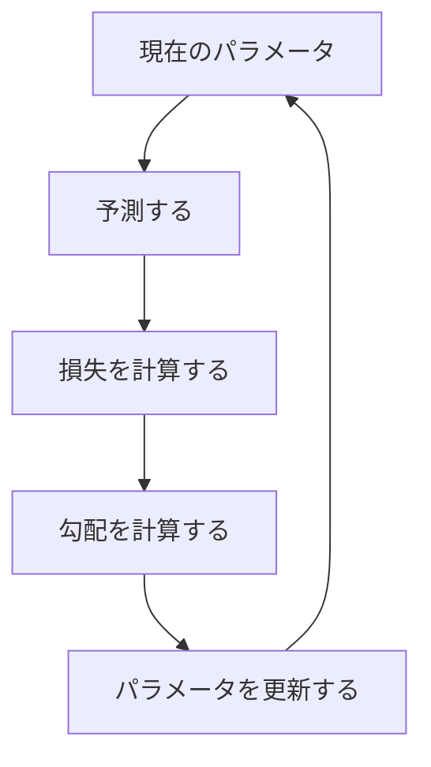
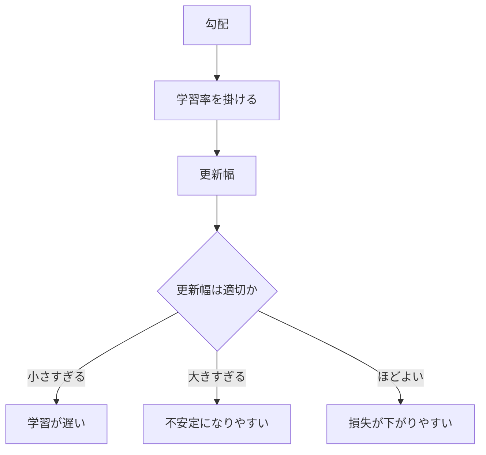

## 第5章　最適化と勾配降下法

### 5.1　どうやって損失を小さくするのか

前章では、損失関数について学びました。

損失関数とは、モデルの予測と正解のズレを数値化する関数でした。

```text
損失 = 損失関数(予測, 正解)
```

機械学習では、この損失を小さくするようにモデルを学習します。

ここで次の疑問が出てきます。

損失を小さくするといっても、具体的にどうやって小さくするのでしょうか。

モデルにはパラメータがあります。

たとえば、単純な直線モデルなら、

```text
y = wx + b
```

という形でした。

ここで、`w` は重み、`b` はバイアスです。

モデルの予測は、この `w` と `b` の値によって変わります。

つまり、損失も `w` と `b` の値によって変わります。

ある `w` と `b` では、予測が正解に近く、損失が小さいかもしれません。  
別の `w` と `b` では、予測が大きく外れて、損失が大きいかもしれません。

学習とは、損失が小さくなるようなパラメータを探すことです。

もう少し言うと、機械学習では、次のような問題を解いています。

```text
損失ができるだけ小さくなるようなパラメータを見つける
```

このように、何かの値をできるだけ小さくしたり、大きくしたりする問題を「最適化」と呼びます。

機械学習における学習は、多くの場合、損失関数を最小化する最適化問題です。

```text
目的：損失を小さくする
方法：パラメータを調整する
```

この章では、損失を小さくするための代表的な方法である「勾配降下法」を学びます。

勾配降下法は、現代のニューラルネットワークや Transformer の学習でも基本になっている考え方です。

最適化は、予測して、損失を測り、パラメータを少しずつ直すループとして見ると理解しやすくなります。



### 5.2　最適化とは何か

最適化とは、ある目的にとって最もよい値を探すことです。

たとえば、山登りの逆を考えてみます。

目の前に山や谷がある地形が広がっています。目的は、一番低い谷底にたどり着くことです。

このとき、高さが「損失」だと考えます。

高い場所は損失が大きい。  
低い場所は損失が小さい。

機械学習では、パラメータの値によって損失が変わります。

つまり、パラメータの空間の中に、損失の地形があると考えることができます。

```text
パラメータの値 → 損失の高さ
```

よいパラメータは、損失が低い場所にあります。

悪いパラメータは、損失が高い場所にあります。

最適化とは、この地形の中で、なるべく低い場所を探すことです。

単純なモデルなら、損失の地形も比較的わかりやすいことがあります。

しかし、ニューラルネットワークでは、パラメータが非常に多くなります。

大規模言語モデルでは、数十億、数百億、あるいはそれ以上のパラメータがあります。

この場合、損失の地形は、人間が直接見ることのできない超高次元の地形になります。

それでも、考え方は同じです。

モデルのパラメータを少し変える。  
損失がどう変わるかを見る。  
損失が下がる方向へパラメータを動かす。  
これを繰り返す。

この「損失が下がる方向へ少しずつ動かす」という考え方が、勾配降下法です。

### 5.3　微分の直感

勾配降下法を理解するには、微分の直感が必要です。

ただし、ここでは厳密な数学としてではなく、「何を知るための道具なのか」を理解すれば十分です。

微分とは、ある値を少し変えたときに、結果がどれくらい変わるかを調べるものです。

たとえば、車で走っているとします。

ある時刻における位置があります。時間が少し進むと、位置も少し変わります。

このとき、「時間を少し変えたとき、位置がどれくらい変わるか」が速度です。

速度は、位置を時間で微分したものだと考えられます。

機械学習では、次のように考えます。

```text
パラメータを少し変えたとき、損失がどれくらい変わるか
```

これを知りたいのです。

たとえば、ある重み `w` があります。

この `w` を少し大きくしたら、損失が下がるのか。  
それとも上がるのか。  
どれくらい大きく変わるのか。

これがわかれば、パラメータをどちらに動かせばよいかがわかります。

もし `w` を少し大きくすると損失が下がるなら、`w` を大きくする方向に動かせばよいです。

逆に、`w` を少し大きくすると損失が上がるなら、`w` を小さくする方向に動かせばよいです。

このように、微分は「損失を下げるには、パラメータをどちらに動かせばよいか」を知るために使います。

### 5.4　傾きとは何か

微分の直感を、より具体的に「傾き」として考えてみます。

横軸にパラメータ `w`、縦軸に損失を取ります。

```text
横軸：w の値
縦軸：損失
```

このとき、ある位置でグラフが右上がりになっているとします。

右へ行くほど損失が増える、ということです。

この場合、`w` を大きくすると損失が増えます。だから、損失を下げたいなら、`w` を小さくする方向に動かすべきです。

逆に、グラフが右下がりになっているとします。

右へ行くほど損失が減る、ということです。

この場合、`w` を大きくすると損失が減ります。だから、損失を下げたいなら、`w` を大きくする方向に動かすべきです。

この「右上がり」「右下がり」を数値で表したものが傾きです。

傾きが正なら、右へ行くと損失が増えます。  
傾きが負なら、右へ行くと損失が減ります。  
傾きがゼロなら、その地点では平らです。

勾配降下法では、この傾きを使って、損失が下がる方向にパラメータを動かします。

重要なのは、損失を下げるには「傾きと逆方向」に動くということです。

傾きが正なら、右へ行くと損失が上がるので、左へ動きます。  
傾きが負なら、右へ行くと損失が下がるので、右へ動きます。

つまり、常に傾きの反対方向へ動けば、損失を下げる方向に進めます。

これが勾配降下法の基本です。

### 5.5　勾配とは何か

ここまでは、パラメータが1つだけの場合を考えました。

しかし、実際の機械学習モデルには、パラメータがたくさんあります。

直線モデルでも、入力が複数あれば、重みも複数になります。

```text
価格 =
  広さ × w1
+ 駅距離 × w2
+ 築年数 × w3
+ b
```

この場合、パラメータは `w1`, `w2`, `w3`, `b` の4つです。

ニューラルネットワークでは、パラメータはさらに多くなります。重み行列やバイアスが大量にあります。

このようにパラメータが複数ある場合、それぞれのパラメータについて、「少し変えたら損失がどう変わるか」を知る必要があります。

```text
w1 を少し変えたら、損失はどう変わるか
w2 を少し変えたら、損失はどう変わるか
w3 を少し変えたら、損失はどう変わるか
b  を少し変えたら、損失はどう変わるか
```

これらをまとめたものが「勾配」です。

勾配とは、すべてのパラメータについての傾きを集めたものです。

```text
勾配 =
[
  w1 に関する傾き,
  w2 に関する傾き,
  w3 に関する傾き,
  b  に関する傾き
]
```

勾配は、損失が最も急に増える方向を表します。

逆に言えば、勾配の反対方向は、損失が最も急に減る方向です。

だから、損失を小さくしたいときには、パラメータを勾配の反対方向に動かします。

この考え方が、勾配降下法です。

### 5.6　勾配降下法

勾配降下法とは、損失が小さくなるように、パラメータを勾配の反対方向へ少しずつ動かす方法です。

式としては、基本的に次の形になります。

```text
新しいパラメータ = 現在のパラメータ - 学習率 × 勾配
```

ここで重要なのは、マイナスが付いていることです。

勾配は、損失が増える方向を表します。

損失を減らしたいので、その反対方向へ進みます。

だから、

```text
現在のパラメータ - 勾配
```

という形になります。

ただし、勾配をそのまま引くと、動きすぎるかもしれません。

そこで、「学習率」という値を掛けます。

```text
学習率 × 勾配
```

学習率は、一回の更新でどれくらい大きくパラメータを動かすかを決める値です。

たとえば、現在の重みが `w = 10` だとします。

勾配が `2` で、学習率が `0.1` なら、

```text
新しい w = 10 - 0.1 × 2
          = 9.8
```

となります。

勾配が正なので、`w` を小さくする方向に動かしています。

もし勾配が `-3` なら、

```text
新しい w = 10 - 0.1 × (-3)
          = 10.3
```

となります。

勾配が負なので、`w` を大きくする方向に動かしています。

このように、勾配降下法では、勾配の符号と大きさを使って、損失が下がる方向へパラメータを更新します。

この処理を何度も繰り返すことで、損失がだんだん小さくなることを期待します。

#### PyTorchで確認してみる

次のコードでは、`y = 2x` に近づくように、1つの重み `w` を勾配降下法で更新します。

```python
import torch

x = torch.tensor([1.0, 2.0, 3.0])
y = torch.tensor([2.0, 4.0, 6.0])

w = torch.tensor([0.0], requires_grad=True)
optimizer = torch.optim.SGD([w], lr=0.1)

for step in range(5):
    y_hat = w * x
    loss = ((y_hat - y) ** 2).mean()

    optimizer.zero_grad()
    loss.backward()
    optimizer.step()

    print(step, "w:", w.item(), "loss:", loss.item())
```

`loss.backward()` で勾配を計算し、`optimizer.step()` でパラメータを更新しています。

この流れは、ニューラルネットワークや Transformer の学習でも基本的に同じです。

### 5.7　学習率

学習率は、勾配降下法において非常に重要なハイパーパラメータです。

学習率は、パラメータを一回の更新でどれくらい動かすかを決めます。

```text
新しいパラメータ = 現在のパラメータ - 学習率 × 勾配
```

学習率が大きいと、パラメータは大きく動きます。

学習率が小さいと、パラメータは少しずつしか動きません。

ここで、谷底へ向かって坂を下るイメージを考えます。

学習率がちょうどよければ、谷底に向かって安定して下っていけます。

しかし、学習率が大きすぎると、一歩が大きすぎて谷底を飛び越えてしまうことがあります。

谷の右側から左側へ飛び越え、次は左側から右側へ飛び越える。これを繰り返して、なかなか谷底に落ち着かないことがあります。

場合によっては、損失がどんどん大きくなって、学習が壊れることもあります。

逆に、学習率が小さすぎると、一歩が小さすぎて、なかなか進みません。

谷底には向かっているけれど、非常に時間がかかります。

つまり、学習率にはバランスが必要です。

大きすぎると不安定になる。  
小さすぎると学習が遅い。

現代の深層学習では、学習率を一定にするだけでなく、学習の途中で変化させることもよくあります。

最初は少し大きめにして、学習が進むにつれて小さくする。  
最初だけ徐々に上げて、その後に下げる。

このような工夫を学習率スケジュールと呼びます。

Transformer の学習でも、学習率の設定は非常に重要です。

モデルが大きくなるほど、学習率の選び方は学習の安定性に大きく影響します。

学習率は、勾配をどれくらい強く更新に反映するかを決めるつまみです。



### 5.8　学習率が大きすぎる場合、小さすぎる場合

学習率の影響をもう少し詳しく見てみます。

まず、学習率が大きすぎる場合です。

損失の地形に谷があるとします。目的は谷底に向かうことです。

しかし、一歩が大きすぎると、谷底を通り過ぎて反対側の斜面まで行ってしまいます。

次の更新では、また逆方向に大きく動きます。

この結果、パラメータが谷の周辺を大きく行ったり来たりして、損失が安定して下がりません。

さらに悪い場合、谷からどんどん離れてしまい、損失が発散します。

```text
学習率が大きすぎる
↓
更新幅が大きすぎる
↓
損失が下がらない
↓
場合によっては発散する
```

発散とは、損失がどんどん大きくなり、学習がうまくいかなくなることです。

一方、学習率が小さすぎる場合は、更新幅が小さすぎます。

一歩一歩は正しい方向に進んでいるかもしれません。しかし、進み方が非常に遅くなります。

```text
学習率が小さすぎる
↓
更新幅が小さすぎる
↓
損失は下がるが遅い
↓
学習に時間がかかる
```

また、非常に小さな学習率では、損失の地形の平らな場所でほとんど進まなくなることもあります。

したがって、学習率は大きすぎても小さすぎても困ります。

実際の機械学習では、学習率を変えて実験し、損失の下がり方を見ながら調整します。

訓練損失がまったく下がらない。  
損失が激しく上下する。  
途中で急に損失が大きくなる。  
学習が異常に遅い。

こうした症状がある場合、学習率が原因であることがあります。

### 5.9　局所最小と大域最小

最適化では、「局所最小」と「大域最小」という言葉が出てきます。

大域最小とは、全体の中で最も損失が小さい場所です。

損失の地形でいえば、一番低い谷底です。

一方、局所最小とは、その周辺だけを見ると一番低い場所だけれど、全体で見るともっと低い場所が他にある、という場所です。

地形でたとえると、小さな谷底です。

近くを見ればそこが谷底に見えますが、遠くにはもっと深い谷があるかもしれません。

勾配降下法は、基本的には今いる場所から坂を下っていく方法です。

そのため、近くの谷底にたどり着くことはできますが、それが全体で一番低い谷底とは限りません。

単純な問題では、大域最小を見つけやすい場合もあります。

しかし、ニューラルネットワークのような複雑なモデルでは、損失の地形は非常に複雑です。

局所最小、平らな場所、細長い谷、鞍点などが多数存在します。

鞍点とは、ある方向には谷底のように見えるが、別の方向にはまだ下れる場所です。

高次元の最適化では、局所最小よりも鞍点や平坦な領域の方が問題になることもあります。

ただし、初心者の段階では、まず次の理解で十分です。

勾配降下法は、損失が下がる方向へ進む。  
しかし、必ずしも全体で最もよい場所に到達するとは限らない。  
それでも、実用上十分によい場所に到達できればよい。

機械学習では、数学的に完全な最小値を見つけることよりも、未知のデータに対してよく予測できるモデルを得ることが重要です。

### 5.10　確率的勾配降下法

ここまで説明した勾配降下法では、損失を計算するために、すべての訓練データを使うようなイメージでした。

しかし、実際の機械学習では、訓練データが非常に大きいことがあります。

たとえば、画像が数百万枚ある。  
文章データが数百GBある。  
言語モデルでは、さらに巨大なテキストコーパスを使う。

このような場合、パラメータを一回更新するたびに、すべてのデータで損失を計算するのは非常に重いです。

そこで使われるのが、確率的勾配降下法です。

英語では Stochastic Gradient Descent と呼ばれ、SGD と略されます。

確率的勾配降下法では、すべてのデータではなく、一部のデータを使って勾配を計算します。

たとえば、訓練データが100万件あるとします。

その中から一部のデータを取り出して、損失を計算し、勾配を求めます。

```text
100万件すべてではなく、
その一部を使って更新する
```

極端な場合、1件のデータだけを使って更新することもあります。

ただし、現代の深層学習では、1件ずつではなく、複数件をまとめたミニバッチを使うことが一般的です。

確率的勾配降下法では、毎回使うデータが違うため、勾配は少しノイズを含みます。

つまり、正確な全体の勾配ではなく、「だいたいこちらに行けばよさそう」という推定になります。

このノイズは一見悪いものに見えます。

しかし、実際には利点もあります。

毎回すべてのデータを使わないので、計算が軽くなります。  
ノイズによって、狭い局所最小から抜けやすくなることもあります。  
大規模データでの学習が現実的になります。

そのため、確率的勾配降下法は、深層学習の基本的な学習方法として広く使われています。

### 5.11　ミニバッチ学習

ミニバッチ学習とは、訓練データの一部をまとめて使い、その平均損失に基づいてパラメータを更新する方法です。

たとえば、訓練データが100万件あるとします。

その中から64件を取り出します。

この64件に対してモデルの予測を出し、それぞれの損失を計算します。

```text
データ1の損失
データ2の損失
...
データ64の損失
```

そして、それらの平均を取ります。

```text
ミニバッチの損失 = 64件の損失の平均
```

このミニバッチの損失を使って勾配を計算し、パラメータを更新します。

次に、別の64件を取り出して、同じことをします。

このように、訓練データを小さなまとまりに分けて、少しずつ学習を進めます。

ミニバッチのサイズをバッチサイズと呼びます。

```text
バッチサイズ = 一度の更新に使うデータ数
```

バッチサイズが小さいと、一回の計算は軽くなります。ただし、勾配のノイズは大きくなります。

バッチサイズが大きいと、勾配は安定します。ただし、一回の計算は重くなり、メモリも多く使います。

深層学習では、GPU などの計算機を効率よく使うためにも、ミニバッチ学習が重要です。

複数のデータをまとめて行列計算として処理することで、計算を高速化できます。

Transformer の学習でも、ミニバッチは基本です。

複数の文章、あるいは複数のトークン列をまとめて入力し、それぞれの次トークン予測の損失を計算し、その平均に基づいてパラメータを更新します。

### 5.12　エポックとステップ

機械学習の学習過程では、「エポック」と「ステップ」という言葉がよく出てきます。

ステップとは、パラメータを一回更新することです。

ミニバッチを一つ取り出し、そのミニバッチで損失を計算し、勾配を求め、パラメータを更新する。

これが1ステップです。

```text
1ミニバッチで1回更新する = 1ステップ
```

一方、エポックとは、訓練データ全体を一通り使うことです。

たとえば、訓練データが10,000件あり、バッチサイズが100だとします。

この場合、100件ずつ使うので、訓練データ全体を一通り使うには100ステップ必要です。

```text
訓練データ数：10,000
バッチサイズ：100
1エポック：100ステップ
```

1エポック学習したというのは、訓練データ全体を一度学習に使ったという意味です。

通常、モデルは1エポックだけでは十分に学習できません。

同じ訓練データを何度も使って、何エポックも学習します。

ただし、大規模言語モデルでは、データ量が非常に大きいため、「何エポック回すか」というより、「何トークン学習したか」「何ステップ学習したか」で管理されることも多いです。

ここで重要なのは、学習は一回で終わるものではないということです。

モデルは、ミニバッチごとに少しずつパラメータを更新します。

```text
ミニバッチを読む
↓
損失を計算する
↓
勾配を計算する
↓
パラメータを更新する
↓
次のミニバッチを読む
```

この繰り返しによって、モデルはだんだんよい予測を出せるようになります。

### 5.13　逆伝播の入り口

勾配降下法では、パラメータごとの勾配が必要です。

つまり、それぞれの重みやバイアスを少し変えたときに、損失がどう変わるかを知る必要があります。

しかし、ニューラルネットワークには大量のパラメータがあります。

Transformer では、さらに膨大な数の重みがあります。

では、どうやってすべてのパラメータについて勾配を計算するのでしょうか。

ここで出てくるのが「逆伝播」です。

逆伝播は、英語では backpropagation と呼ばれます。

逆伝播とは、モデルの出力側から入力側へ向かって、損失に対する各パラメータの影響を効率よく計算する方法です。

ニューラルネットワークでは、入力から出力に向かって計算が進みます。

```text
入力
↓
層1
↓
層2
↓
層3
↓
出力
↓
損失
```

これを順伝播と呼びます。

順伝播では、入力をモデルに通して予測を出し、損失を計算します。

その後、損失から逆向きに情報を流します。

```text
損失
↑
層3
↑
層2
↑
層1
↑
入力側
```

この逆向きの計算によって、各層の各パラメータが損失にどれくらい影響したかを求めます。

これが逆伝播です。

逆伝播の数学的な中身には、合成関数の微分、つまり連鎖律が使われます。

ただし、最初は厳密な式を覚える必要はありません。

重要なのは、次の流れです。

順伝播で予測と損失を計算する。  
逆伝播で各パラメータの勾配を計算する。  
勾配降下法でパラメータを更新する。

この3つが、ニューラルネットワークの学習の基本です。

### 5.14　最適化アルゴリズムの種類

勾配降下法は基本ですが、実際の深層学習では、より工夫された最適化アルゴリズムがよく使われます。

代表的なものに、Momentum、RMSProp、Adam があります。

まず、Momentum です。

Momentum は、過去の勾配の方向を少し覚えておき、慣性のように使う方法です。

普通の勾配降下法では、毎回その場の勾配だけを見て進みます。

しかし、損失の地形がギザギザしていると、進む方向が毎回ぶれます。

Momentum を使うと、過去の進行方向を考慮するため、細かい揺れを抑えながら進みやすくなります。

次に、RMSProp です。

RMSProp は、パラメータごとに更新幅を調整する方法です。

あるパラメータでは勾配が大きく、別のパラメータでは勾配が小さい場合があります。

すべてのパラメータに同じ学習率を使うと、ある方向では動きすぎ、別の方向では動かなさすぎることがあります。

RMSProp は、勾配の大きさに応じて更新幅を調整します。

そして、Adam です。

Adam は、Momentum と RMSProp の考え方を組み合わせたような方法です。

過去の勾配の平均と、勾配の大きさの情報を使って、パラメータごとの更新を調整します。

現代のニューラルネットワークでは、Adam やその派生である AdamW が非常によく使われます。

Transformer の学習でも、Adam 系の最適化手法がよく使われます。

ただし、最初に理解すべきなのは、あくまで勾配降下法です。

Adam も AdamW も、基本的には「勾配を使って損失が下がる方向にパラメータを動かす」方法の発展形です。

### 5.15　Transformer の学習における最適化

ここまでの話を、Transformer に接続してみます。

Transformer には大量のパラメータがあります。

たとえば、トークン埋め込み、Self-Attention の重み行列、Feed Forward Network の重み、出力層の重みなどです。

これらのパラメータは、最初からよい値を持っているわけではありません。

学習によって調整されます。

言語モデルとして学習する場合、基本的な目的は次のトークンを予測することです。

```text
入力：吾輩は
正解：猫
```

モデルは、語彙全体に対してスコアを出します。

そのスコアを softmax に通して、次トークンの確率分布にします。

```text
猫：0.30
犬：0.08
人間：0.04
...
```

正解が「猫」なら、「猫」に高い確率を出してほしい。

そこで、交差エントロピー損失を計算します。

モデルが「猫」に高い確率を出していれば損失は小さい。  
「猫」に低い確率しか出していなければ損失は大きい。

その損失を使って逆伝播を行い、Transformer 内部のすべての重みについて勾配を計算します。

そして、最適化アルゴリズムによってパラメータを更新します。

```text
1. トークン列を入力する
2. Transformer が次トークンの確率を出す
3. 正解トークンと比較して損失を計算する
4. 逆伝播で勾配を計算する
5. 最適化アルゴリズムで重みを更新する
6. これを大量のデータで繰り返す
```

この流れは、モデルが巨大になっても基本的には変わりません。

Transformer は構造としては複雑です。

しかし、学習の基本は、ここまで見てきた機械学習の流れそのものです。

損失を計算し、勾配を求め、パラメータを少しずつ更新する。

これを膨大なデータと計算量で繰り返すことで、大規模言語モデルは次トークン予測能力を獲得していきます。

### 5.16　勾配降下法の限界

勾配降下法は強力ですが、万能ではありません。

まず、損失の地形が複雑な場合、最適化は難しくなります。

ニューラルネットワークの損失地形は非常に高次元で複雑です。

場所によっては、勾配が非常に小さくなり、学習が進みにくくなることがあります。

これを勾配消失と呼ぶことがあります。

逆に、勾配が非常に大きくなり、パラメータ更新が不安定になることもあります。

これを勾配爆発と呼びます。

特に、深いニューラルネットワークでは、勾配が層を逆向きに伝わる途中で小さくなりすぎたり、大きくなりすぎたりする問題が起こりやすくなります。

この問題に対処するために、さまざまな工夫があります。

たとえば、適切な初期化、正規化、残差接続、勾配クリッピングなどです。

Transformer でも、Layer Normalization や残差接続は学習の安定性に大きく関係しています。

また、損失を小さくすることが、必ずしも人間にとって望ましい振る舞いを意味するとは限りません。

次トークン予測の損失を小さくすれば、文章の続きを予測する能力は上がります。しかし、それだけで常に正確で、安全で、有用な回答をするとは限りません。

つまり、最適化は「与えられた目的関数をよくする」ことに過ぎません。

目的関数の設計が間違っていれば、最適化が成功しても、望ましい結果にはなりません。

この点は、AIを実用システムとして考える上で非常に重要です。

### 5.17　本章のまとめ

この章では、最適化と勾配降下法について学びました。

機械学習の学習は、損失関数を小さくする最適化問題として見ることができます。

モデルにはパラメータがあり、パラメータの値によって予測が変わり、予測が変わることで損失も変わります。

したがって、学習とは、損失が小さくなるようなパラメータを探すことです。

微分は、パラメータを少し変えたときに損失がどう変わるかを知るための道具です。

勾配は、すべてのパラメータについての傾きをまとめたものです。

勾配降下法では、パラメータを勾配の反対方向に少しずつ動かします。

```text
新しいパラメータ = 現在のパラメータ - 学習率 × 勾配
```

学習率は、一回の更新でどれくらいパラメータを動かすかを決める重要なハイパーパラメータです。

学習率が大きすぎると不安定になります。  
学習率が小さすぎると学習が遅くなります。

また、実際の深層学習では、すべてのデータを一度に使うのではなく、ミニバッチを使って少しずつ学習します。

```text
ミニバッチで損失を計算する
↓
逆伝播で勾配を計算する
↓
パラメータを更新する
```

この処理を何度も繰り返すことで、モデルは損失の小さいパラメータへ近づいていきます。

この章で一番重要な考え方は、次の一文です。

**勾配降下法とは、損失を小さくするために、パラメータを勾配の反対方向へ少しずつ動かす方法である。**

Transformer や大規模言語モデルも、基本的にはこの考え方で学習されています。

次トークン予測の損失を計算し、逆伝播で勾配を求め、最適化アルゴリズムで大量の重みを少しずつ更新する。

この繰り返しによって、巨大なモデルは言語のパターンを学習していきます。
