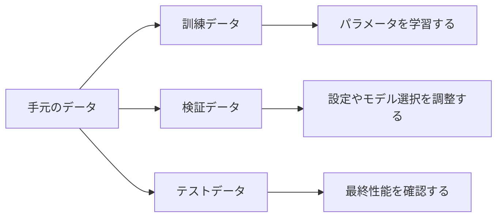

## 第6章　訓練データ、検証データ、テストデータ

**この章でわかること**

- データを訓練、検証、テストに分ける理由
- それぞれのデータが学習や評価で持つ役割
- データ漏洩や検証データへの合わせすぎが危険な理由
- 大規模言語モデルでも評価用データの設計が重要であること

### 6.1　なぜデータを分けるのか

機械学習では、データを使ってモデルを学習します。

教師あり学習であれば、入力と正解のペアをたくさん用意し、モデルの予測が正解に近づくようにパラメータを調整します。

たとえば、家の価格を予測するモデルなら、次のようなデータを使います。

```text
入力：広さ、築年数、駅からの距離、地域
正解：実際の価格
```

画像分類なら、次のようなデータです。

```text
入力：画像
正解：犬、猫、車、花などのラベル
```

言語モデルなら、次のように考えることができます。

```text
入力：ここまでのトークン列
正解：次のトークン
```

ここで大事なのは、モデルの目的は「学習に使ったデータにだけ正しく答えること」ではない、という点です。

本当に重要なのは、まだ見たことのないデータに対しても、よい予測ができることです。

たとえば、家の価格予測モデルを作る場合、過去の物件データだけに正しく答えられても意味がありません。これから売り出される新しい物件の価格を、ある程度うまく予測できる必要があります。

画像分類でも同じです。学習に使った犬や猫の画像だけを正しく分類できても、新しく撮影された画像を分類できなければ役に立ちません。

言語モデルでも、学習データ中の文章だけを覚えているのでは不十分です。未知の文脈に対して、もっともらしい次のトークンを予測できる必要があります。

そのため、機械学習では、手元のデータをいくつかに分けます。

代表的には、次の3つに分けます。

```text
訓練データ
検証データ
テストデータ
```

訓練データは、モデルを学習させるために使うデータです。

検証データは、学習中にモデルの状態を確認したり、ハイパーパラメータを調整したりするために使うデータです。

テストデータは、最終的にモデルの性能を評価するために使うデータです。

このようにデータを分けることで、モデルが本当に未知のデータに対応できるかを確認できます。

3種類のデータは、役割を分けて考えると混乱しにくくなります。



#### PyTorchで確認してみる

手元のデータを、訓練データ、検証データ、テストデータに分ける簡単な例です。

```python
import torch

torch.manual_seed(0)

x = torch.arange(20).reshape(10, 2).float()
y = torch.tensor([0, 1, 0, 1, 0, 1, 0, 1, 0, 1])

indices = torch.randperm(len(x))
train_idx = indices[:6]
val_idx = indices[6:8]
test_idx = indices[8:]

train_x, train_y = x[train_idx], y[train_idx]
val_x, val_y = x[val_idx], y[val_idx]
test_x, test_y = x[test_idx], y[test_idx]

print("train:", train_x.shape, train_y.shape)
print("validation:", val_x.shape, val_y.shape)
print("test:", test_x.shape, test_y.shape)
```

ここでは10件のデータを、6件、2件、2件に分けています。

実際の学習では、訓練データでパラメータを更新し、検証データで設定を調整し、テストデータで最後に性能を確認します。

### 6.2　訓練データ

訓練データとは、モデルのパラメータを更新するために使うデータです。

英語では training data と呼ばれます。

モデルは、訓練データを使って学習します。

たとえば、家の価格予測なら、訓練データには多くの物件情報と実際の価格が含まれています。

```text
物件1：広さ 50平米、築年数 10年、駅徒歩5分 → 価格 5,000万円
物件2：広さ 80平米、築年数 5年、駅徒歩8分 → 価格 8,200万円
物件3：広さ 40平米、築年数 20年、駅徒歩15分 → 価格 3,400万円
```

モデルは、これらのデータを見ながら、予測と正解のズレを小さくするようにパラメータを更新します。

ニューラルネットワークの場合、訓練データをモデルに入力し、予測を出し、損失を計算し、逆伝播で勾配を求め、パラメータを更新します。

```text
訓練データを入力する
↓
モデルが予測する
↓
正解と比べて損失を計算する
↓
勾配を計算する
↓
パラメータを更新する
```

この流れを何度も繰り返すことで、モデルは訓練データに対して、よりよい予測を出せるようになります。

言語モデルの場合も同じです。

大量の文章から、次のような学習データを作ります。

```text
入力：今日はとても
正解：暑い

入力：今日はとても暑い
正解：です
```

モデルは、入力された文脈から次のトークンを予測し、正解トークンに高い確率を出せるように学習します。

ここで注意すべきなのは、訓練データに対する性能だけを見ていても不十分だということです。

モデルは訓練データを直接使ってパラメータを更新します。そのため、訓練データに対しては、だんだん良い結果を出しやすくなります。

しかし、それは必ずしも、未知のデータに強くなったことを意味しません。

訓練データにだけ適応しすぎると、過学習が起きるからです。

### 6.3　検証データ

検証データとは、学習中にモデルの性能を確認するためのデータです。

英語では validation data と呼ばれます。

検証データは、パラメータ更新には直接使いません。

つまり、検証データに対する損失を計算しても、その損失を使ってモデルの重みを更新するわけではありません。

では、何のために使うのでしょうか。

検証データは、モデルが未知のデータにどれくらい対応できているかを、学習中に確認するために使います。

たとえば、訓練データで学習を進めていると、訓練損失は下がっていくことが多いです。

```text
訓練損失：下がっている
```

しかし、検証データに対する損失、つまり検証損失を見ると、途中から下がらなくなることがあります。

```text
訓練損失：下がり続ける
検証損失：途中から上がる
```

このような場合、モデルは訓練データにはどんどん適応しているが、未知のデータに対する性能は悪化している可能性があります。

これは過学習の典型的な兆候です。

検証データは、こうした問題を見つけるために使います。

また、検証データはハイパーパラメータの調整にも使います。

たとえば、次のような設定はハイパーパラメータです。

```text
学習率
バッチサイズ
層の数
隠れ次元数
Dropout率
正則化の強さ
```

これらの設定を変えると、モデルの学習結果が変わります。

ある学習率ではうまく学習できるが、別の学習率では不安定になるかもしれません。

あるモデルサイズではちょうどよく汎化するが、別のモデルサイズでは過学習するかもしれません。

そのため、複数の設定で学習し、検証データで性能を比較します。

```text
設定A → 検証損失 0.45
設定B → 検証損失 0.38
設定C → 検証損失 0.52
```

この場合、検証損失だけを見るなら、設定Bがよさそうです。

このように、検証データは、学習中の判断に使うデータです。

ただし、検証データを使って何度も設定を調整していると、間接的には検証データに合わせていることになります。

そのため、最終評価には別のテストデータを使う必要があります。

### 6.4　テストデータ

テストデータとは、最終的なモデル性能を評価するためのデータです。

英語では test data と呼ばれます。

テストデータは、学習には使いません。

また、ハイパーパラメータの調整にも使うべきではありません。

テストデータは、最後までできるだけ触らずに取っておきます。

なぜなら、テストデータは「本当に未知のデータに対して、どれくらい性能が出るか」を確認するためのものだからです。

たとえば、次のようにデータを分けます。

```text
全データ
├── 訓練データ：学習に使う
├── 検証データ：学習中の調整に使う
└── テストデータ：最終評価に使う
```

モデルを訓練データで学習します。

検証データを見ながら、学習率やモデルサイズなどを調整します。

そして、最終的に選んだモデルを、テストデータで評価します。

このテストデータでの性能が、そのモデルの最終的な評価になります。

もしテストデータを何度も見ながらモデルを調整してしまうと、テストデータはもはや「未知のデータ」ではなくなります。

たとえば、テストデータでの性能が悪かったからモデル構造を変える。  
もう一度テストデータで評価する。  
また悪かったから別の設定にする。  
またテストデータで評価する。

これを繰り返すと、モデルや実験者の判断がテストデータに適応してしまいます。

その結果、テストデータでの性能はよく見えても、本当に新しいデータではそこまで良くない、ということが起きます。

したがって、テストデータは最終確認用として扱うべきです。

機械学習では、「テストデータを汚染しない」ことが非常に重要です。

### 6.5　未知のデータに強いとは何か

機械学習で本当に求めたいのは、未知のデータに対してよい予測をする能力です。

この能力を「汎化性能」と呼びます。

たとえば、犬と猫を分類するモデルを考えます。

訓練データには、たくさんの犬と猫の画像があります。

モデルは、それらを使って学習します。

しかし、実際に使うときには、訓練データに含まれていない新しい画像が入力されます。

```text
新しく撮影された犬の画像
新しく撮影された猫の画像
```

この新しい画像に対して正しく分類できるなら、そのモデルは汎化性能が高いと言えます。

逆に、訓練データに含まれていた画像だけは正しく分類できるが、新しい画像では間違えるなら、汎化性能は低いです。

家の価格予測でも同じです。

過去の物件価格を覚えているだけでは不十分です。

新しく売り出される物件について、価格を予測できる必要があります。

言語モデルでも同じです。

学習データ中の文章をそのまま覚えているだけでは不十分です。

未知の文脈に対して、文法的にも意味的にも自然な続きを予測できる必要があります。

汎化性能が高いモデルは、訓練データの背後にある規則性をうまく捉えています。

一方、汎化性能が低いモデルは、訓練データに表面的に合わせすぎていたり、データのノイズまで覚えてしまっていたりします。

つまり、機械学習で重要なのは、訓練データを丸暗記することではなく、未知のデータにも通用する規則性を学ぶことです。

### 6.6　汎化性能

汎化性能とは、モデルが学習に使っていないデータに対して、どれくらいうまく予測できるかを表す能力です。

機械学習では、この汎化性能が非常に重要です。

訓練データに対する性能は、ある意味では簡単に上げられます。

モデルを大きくし、長く学習させれば、訓練データに対する損失はどんどん下がることがあります。

しかし、それによって未知のデータへの性能が上がるとは限りません。

訓練データに対する損失を訓練損失と呼びます。

検証データに対する損失を検証損失と呼びます。

理想的には、学習が進むにつれて、訓練損失も検証損失も下がっていきます。

```text
よい学習の例：

訓練損失：下がる
検証損失：下がる
```

この場合、モデルは訓練データだけでなく、未知のデータにも通用する規則性を学んでいる可能性があります。

しかし、ある時点から次のようになることがあります。

```text
過学習の例：

訓練損失：下がり続ける
検証損失：上がり始める
```

この場合、モデルは訓練データにはさらに適応しているが、未知のデータには弱くなっていると考えられます。

汎化性能を見るためには、訓練データ以外のデータで評価する必要があります。

そのために、検証データやテストデータを分けておくのです。

汎化性能は、機械学習の実用性を左右します。

どれほど訓練データで良い数字が出ていても、本番環境のデータで性能が出なければ、そのモデルは役に立ちません。

### 6.7　データ漏洩

データ漏洩とは、本来は学習時に使ってはいけない情報が、訓練データや特徴量の中に入ってしまうことです。

英語では data leakage と呼ばれます。

データ漏洩が起きると、評価結果が実際よりも良く見えてしまいます。

たとえば、病気を予測するモデルを考えます。

入力として患者の検査データを使い、出力として病気の有無を予測したいとします。

このとき、入力特徴量の中に「最終診断名」が入ってしまっていたらどうでしょうか。

```text
入力：年齢、血液検査値、体温、最終診断名
出力：病気の有無
```

最終診断名は、予測したい答えそのものに非常に近い情報です。

これが入力に入っていれば、モデルは簡単に高い精度を出せてしまいます。

しかし、実際に予測したい時点では、最終診断名はまだわからないはずです。

このようなモデルは、本番では使えません。

別の例として、未来の情報が入ってしまう場合があります。

株価や売上を予測するモデルで、予測時点より後の情報が特徴量に入ってしまうと、モデルは不自然に高い性能を出します。

```text
今日の売上を予測したいのに、明日の売上情報が入力に入っている
```

これは明らかにおかしいです。

しかし、実際のデータ処理では、こうした漏洩が意図せず起きることがあります。

また、訓練データとテストデータの分け方によっても漏洩が起きます。

たとえば、同じユーザーの非常に似たデータが訓練データとテストデータの両方に入っている場合、テスト性能が過大に評価されることがあります。

言語モデルでも、評価データが学習データに含まれていると、本当の汎化性能を測れません。

モデルが評価問題をすでに見ていた場合、テストで高得点を取っても、それは未知の問題に答えられることを意味しないかもしれません。

データ漏洩は、機械学習の評価を大きく歪めます。

そのため、データを分けるときには、「本番で使える情報だけを入力にしているか」「評価データが学習に混ざっていないか」を慎重に確認する必要があります。

### 6.8　評価の設計

機械学習では、評価の設計が非常に重要です。

なぜなら、評価の仕方を間違えると、モデルの性能を正しく理解できないからです。

まず、評価データは、本番で出てくるデータに近い必要があります。

たとえば、昼間の明るい画像だけで評価している画像分類モデルがあるとします。

しかし、本番では夜間の画像や、雨の日の画像や、暗い室内の画像も入力されるかもしれません。

この場合、昼間の画像だけで高い精度が出ても、本番で使えるとは限りません。

家の価格予測でも同じです。

古い時期のデータだけで評価していると、現在の市場環境では性能が出ないかもしれません。

言語モデルでも、評価データが特定の文体や分野に偏っていれば、他の分野での性能はわかりません。

つまり、評価データは、実際に使いたい状況を反映している必要があります。

次に、評価指標を適切に選ぶ必要があります。

分類問題では、単純な精度だけでは不十分なことがあります。

たとえば、病気の検出で、病気の人が全体の1%しかいないとします。

このとき、すべての人を「病気ではない」と予測するモデルは、99%の精度になります。

```text
全員を「病気ではない」と予測
↓
精度 99%
```

一見高性能に見えます。

しかし、このモデルは病気の人を一人も見つけられません。

このような場合、精度だけを見るのは危険です。

適合率、再現率、F値、ROC-AUC など、問題に応じた評価指標が必要になります。

また、何を重視するかは、用途によって変わります。

病気の見逃しを避けたいなら、再現率が重要かもしれません。  
誤検知を減らしたいなら、適合率が重要かもしれません。  
ランキングの品質を見たいなら、ランキング用の指標が必要かもしれません。

評価指標は、モデルに何を求めるかを反映するものです。

したがって、評価設計は単なる後処理ではありません。

機械学習システム全体の目的設計そのものです。

### 6.9　データの分け方

データを訓練データ、検証データ、テストデータに分ける方法はいくつかあります。

もっとも単純なのは、ランダムに分割する方法です。

たとえば、全データを次のように分けます。

```text
訓練データ：80%
検証データ：10%
テストデータ：10%
```

あるいは、

```text
訓練データ：70%
検証データ：15%
テストデータ：15%
```

のように分けることもあります。

この比率に絶対的な正解はありません。

データ量や問題の性質によって変わります。

データが非常に多い場合は、テストデータが数%でも十分な量になることがあります。

一方、データが少ない場合は、どのように分けるかが難しくなります。

ただし、ランダムに分ければ常に良いわけではありません。

時系列データでは、時間を考慮する必要があります。

たとえば、売上予測で未来の売上を予測したい場合、過去データで学習し、未来データで評価するべきです。

```text
過去のデータ → 訓練
その後のデータ → 検証・テスト
```

もし時系列データをランダムに分割すると、未来の情報に近いデータが訓練側に入り、評価が甘くなることがあります。

ユーザー単位で分けるべき場合もあります。

たとえば、ユーザーの行動を予測するモデルで、同じユーザーのデータが訓練データとテストデータの両方に入っていると、モデルはそのユーザー固有の傾向を覚えてしまうかもしれません。

新しいユーザーへの性能を測りたいなら、ユーザー単位で分割する必要があります。

文書データでも、同じ文書の一部が訓練データに入り、別の一部がテストデータに入ると、評価が甘くなることがあります。

重要なのは、評価したい状況に合わせて分割方法を設計することです。

```text
ランダム分割でよいのか
時間で分けるべきか
ユーザーで分けるべきか
文書単位で分けるべきか
```

この判断を間違えると、モデルの性能を過大評価してしまいます。

### 6.10　データ量が少ない場合

データ量が少ない場合、訓練データ、検証データ、テストデータに分けるのが難しくなります。

たとえば、データが100件しかないとします。

そのうち80件を訓練、10件を検証、10件をテストにすると、検証やテストの結果が非常に不安定になります。

テストデータが10件しかない場合、たまたま簡単なデータが多ければ性能が高く見えます。逆に、たまたま難しいデータが多ければ性能が低く見えます。

このような場合に使われる方法の一つが、交差検証です。

英語では cross validation と呼ばれます。

代表的なのが k分割交差検証です。

たとえば、データを5つに分けます。

```text
データ全体を5分割する
A, B, C, D, E
```

まず、Aを検証用にし、B〜Eを訓練用にします。

次に、Bを検証用にし、A, C, D, Eを訓練用にします。

これを繰り返します。

```text
1回目：Aで検証、B C D Eで訓練
2回目：Bで検証、A C D Eで訓練
3回目：Cで検証、A B D Eで訓練
4回目：Dで検証、A B C Eで訓練
5回目：Eで検証、A B C Dで訓練
```

そして、5回の評価結果を平均します。

これにより、少ないデータを比較的効率よく使って評価できます。

ただし、深層学習や大規模言語モデルのように、学習コストが非常に大きい場合、交差検証は現実的でないこともあります。

また、時系列データでは普通の交差検証をそのまま使うと、未来の情報が訓練に入ってしまう場合があります。

そのため、データ量が少ないときにも、問題の性質に応じた分割方法を選ぶ必要があります。

### 6.11　検証データに合わせすぎる問題

テストデータだけでなく、検証データにも注意が必要です。

検証データは、ハイパーパラメータの調整やモデル選択に使います。

たとえば、いくつかのモデルを試して、検証損失が一番小さいものを選ぶとします。

```text
モデルA：検証損失 0.42
モデルB：検証損失 0.38
モデルC：検証損失 0.45
```

この場合、モデルBを選びます。

これは普通の使い方です。

しかし、何十回、何百回も検証データを見ながらモデルを調整していると、だんだん検証データに合わせすぎることがあります。

検証データはパラメータ更新には直接使っていません。

しかし、人間が検証結果を見てモデル構造やハイパーパラメータを変えているなら、間接的には検証データに適応しています。

その結果、検証データでの性能は良いが、テストデータや本番データではそれほど良くない、ということが起こります。

これを、検証データへの過適合と見ることができます。

そのため、最終評価用のテストデータを別に取っておくことが重要です。

また、実験を大量に繰り返した場合には、テストデータでの一回の評価だけを過信しないことも大切です。

特に、研究やベンチマークでは、評価データに対して過剰に最適化される問題があります。

多くの研究者や開発者が同じベンチマークでモデルを改善し続けると、そのベンチマークに強いモデルが作られます。

しかし、それが実世界のあらゆる状況で強いことを意味するとは限りません。

評価データは、使えば使うほど「見慣れたデータ」になっていきます。

この点は、大規模言語モデルの評価でも重要です。

### 6.12　本番データとのズレ

訓練データ、検証データ、テストデータをきれいに分けても、それだけで十分とは限りません。

なぜなら、本番環境で出てくるデータが、それらのデータと違う可能性があるからです。

たとえば、画像分類モデルを作るとします。

訓練データも検証データもテストデータも、明るい場所で撮影された高画質な画像だったとします。

しかし、本番では、暗い場所、手ブレした画像、低解像度の画像、部分的に隠れた対象などが入力されるかもしれません。

この場合、テストデータで高い性能が出ていても、本番では性能が下がる可能性があります。

これを、データ分布のズレと考えることができます。

英語では distribution shift と呼ばれます。

家の価格予測でも、過去のデータで学習したモデルが、金利上昇や景気変化、地域開発の影響によって、将来の市場では精度を落とすかもしれません。

スパム判定でも、スパムメールの手口が変われば、古いデータで学習したモデルは弱くなるかもしれません。

言語モデルでも、世の中の知識や言葉の使われ方は変化します。

新しい技術、新しい事件、新しい固有名詞、新しい流行語が出てきます。

学習時点のデータだけでは、最新の情報に対応できないことがあります。

したがって、機械学習では、テストデータで一度評価して終わりではありません。

本番環境での性能を監視し、必要に応じて再学習やデータ更新を行う必要があります。

```text
学習時のデータ
↓
テストデータで評価
↓
本番投入
↓
本番データで性能監視
↓
必要なら再学習
```

機械学習システムは、作って終わりではなく、運用しながら保守するものです。

### 6.13　大規模言語モデルにおけるデータ分割

大規模言語モデルでも、訓練データ、検証データ、テストデータの考え方は重要です。

言語モデルは、大量のテキストを使って学習します。

学習時には、文章の一部を入力し、次のトークンを正解として、次トークン予測の損失を小さくします。

```text
入力：機械学習とは
正解：データ
```

このとき、訓練用のテキストと評価用のテキストを分ける必要があります。

もし評価用の文章が訓練データに含まれていたら、モデルはその文章をすでに見ている可能性があります。

その場合、評価で高い性能が出ても、未知の文章に対する能力を測っているとは言えません。

特に、大規模言語モデルでは、学習データが非常に広範囲に及びます。

Webページ、書籍、論文、コード、会話データなど、さまざまなテキストが含まれることがあります。

そのため、評価データが学習データに混入していないかを確認することは非常に重要です。

また、言語モデルの評価にはいくつかの種類があります。

まず、次トークン予測の損失を測る評価があります。

これは、モデルが未知のテキストに対して、どれくらい次のトークンを予測できるかを見るものです。

次に、質問応答、要約、翻訳、推論、コード生成など、具体的なタスクで評価する方法があります。

```text
質問応答
要約
翻訳
数学問題
コード生成
読解
対話
```

さらに、人間が回答品質を評価する場合もあります。

言語モデルでは、単純な損失だけでは、人間にとっての有用性や安全性を十分に測れないことがあります。

そのため、大規模言語モデルでは、複数の評価方法を組み合わせる必要があります。

ただし、どの評価でも基本は同じです。

学習に使っていないデータで、モデルの能力を測る。

これが重要です。

### 6.14　データ分割と「本当に測りたいもの」

データを分けるときに一番大事なのは、「何を測りたいのか」を明確にすることです。

たとえば、あるユーザーの過去行動から、同じユーザーの次の行動を予測したいのか。

それとも、まったく新しいユーザーの行動を予測したいのか。

この2つでは、データの分け方が変わります。

同じユーザーの未来を予測したいなら、ユーザーごとの時系列で分けるのが自然かもしれません。

新しいユーザーへの性能を測りたいなら、ユーザー単位で訓練とテストを分ける必要があります。

文章分類でも同じです。

同じニュースサイトの記事の分類をしたいのか。  
別のニュースサイトの記事にも対応したいのか。  
将来の記事にも対応したいのか。  
別のジャンルの文章にも対応したいのか。

測りたいものによって、評価データの作り方が変わります。

ランダム分割は簡単ですが、それが常に正しいとは限りません。

評価したい状況が「未来への予測」なら、時間で分けるべきです。

評価したい状況が「未知のユーザーへの対応」なら、ユーザーで分けるべきです。

評価したい状況が「未知の文書への対応」なら、文書単位で分けるべきです。

つまり、データ分割は単なる作業ではありません。

モデルに何を期待しているのかを反映する設計です。

### 6.15　本章のまとめ

**Transformer への接続**

Transformer の学習でも、訓練データと評価データの分離は重要です。

大量のテキストで学習したあと、モデルが学習データを覚えただけなのか、未知の文脈にも対応できるのかを確認する必要があります。特に言語モデルでは、評価データに訓練データが混ざると、実力を過大評価してしまいます。

**ミニ演習**

- 第6章の PyTorch コードで、訓練、検証、テストの件数を変えてみましょう。
- 「テストデータを見ながら何度もモデルを調整する」ことがなぜ問題か説明してみましょう。
- 言語モデルの評価データに訓練データと同じ文章が入っていたら、どんな問題が起きるか考えてみましょう。

この章では、訓練データ、検証データ、テストデータについて学びました。

機械学習では、手元のデータをすべて学習に使うのではなく、目的に応じて分けます。

```text
訓練データ：モデルのパラメータを更新するために使う
検証データ：学習中の確認やハイパーパラメータ調整に使う
テストデータ：最終的な性能評価に使う
```

訓練データに対する性能だけを見ても、モデルが本当に役に立つかはわかりません。

重要なのは、学習に使っていない未知のデータに対して、よい予測ができることです。

この能力を汎化性能と呼びます。

また、データ漏洩にも注意が必要です。

本来は予測時に使えない情報が入力に入っていたり、評価データが訓練データに混ざっていたりすると、性能が実際よりも良く見えてしまいます。

評価の設計では、本番で出てくるデータに近い評価データを用意し、目的に合った評価指標を選ぶ必要があります。

データの分け方も重要です。

```text
ランダムに分けるべきか
時間で分けるべきか
ユーザー単位で分けるべきか
文書単位で分けるべきか
```

これは、何を測りたいかによって決まります。

この章で一番重要な考え方は、次の一文です。

**機械学習で本当に評価したいのは、訓練データに対する成績ではなく、未知のデータに対する汎化性能である。**

Transformer や大規模言語モデルでも、この考え方は同じです。

大量のテキストで学習したモデルであっても、評価データが学習データに混ざっていれば、本当の能力は測れません。

未知のデータに対してどれくらい予測できるか。  
本番で出てくる入力にどれくらい対応できるか。  
評価したい能力に合ったデータで測れているか。

この視点が、機械学習モデルを正しく理解し、正しく使うために必要です。
