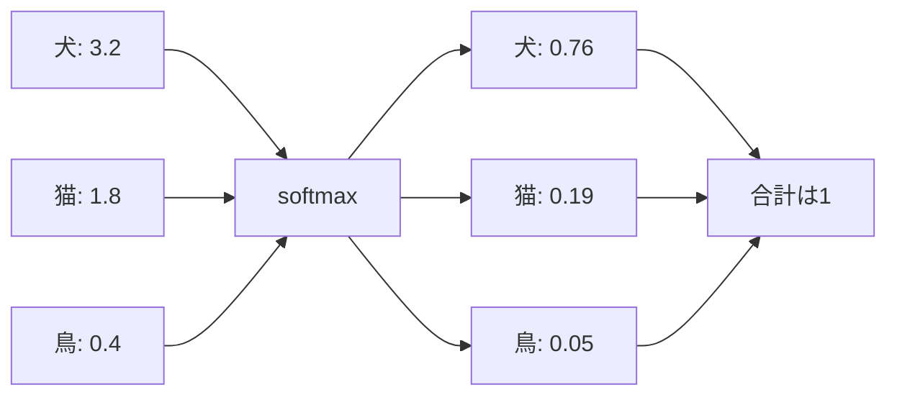

## 第8章　分類問題

### 8.1　分類とは何か

分類とは、入力をいくつかのカテゴリのどれかに分ける問題です。

機械学習の中でも、分類は非常に基本的で重要な問題です。

たとえば、犬と猫の画像を分類する問題を考えます。

```text
入力：画像
出力：犬 / 猫
```

この場合、モデルは画像を受け取り、その画像が犬なのか猫なのかを予測します。

メールのスパム判定も分類問題です。

```text
入力：メール本文
出力：スパム / スパムではない
```

ニュース記事の分類も分類問題です。

```text
入力：記事本文
出力：政治 / 経済 / スポーツ / エンタメ / 技術
```

病気の診断支援も分類問題として扱えます。

```text
入力：検査値、画像、問診情報
出力：病気の可能性あり / なし
```

分類問題では、出力は連続的な数値ではなく、あらかじめ決められたカテゴリです。

家の価格を予測するような問題では、出力は「5,000万円」「8,200万円」のような数値でした。これは回帰問題です。

一方、分類問題では、「犬」「猫」「スパム」「正常」「政治」「スポーツ」のようなラベルを予測します。

分類の基本は、次のように表せます。

```text
入力 → モデル → カテゴリ
```

ただし、機械学習モデルは、多くの場合、いきなりカテゴリ名を直接出すのではありません。

まず、それぞれのカテゴリに対するスコアや確率を出します。

たとえば、犬と猫の分類なら、次のような出力になります。

```text
犬：0.87
猫：0.13
```

この場合、モデルは「犬である可能性が高い」と判断しています。

最終的には、もっとも確率が高いカテゴリを予測結果として選びます。

```text
犬：0.87
猫：0.13
↓
予測：犬
```

分類問題を理解することは、自然言語処理や Transformer の理解にもつながります。

なぜなら、言語モデルの次トークン予測も、見方を変えれば「語彙の中から次に来るトークンを分類する問題」だからです。

分類の基本的な流れは、入力からカテゴリ候補ごとの確率を出し、最終的な予測を選ぶことです。


### 8.2　二値分類

分類問題の中で、もっとも単純なのが二値分類です。

二値分類とは、出力カテゴリが2つだけの分類問題です。

たとえば、スパム判定は二値分類です。

```text
スパム
スパムではない
```

病気の有無を予測する問題も二値分類として扱えます。

```text
病気あり
病気なし
```

画像に犬が写っているかどうかを判定する問題も二値分類です。

```text
犬である
犬ではない
```

二値分類では、モデルは多くの場合、一方のカテゴリである確率を出します。

たとえば、スパム判定なら、

```text
スパムである確率：0.92
```

のように出します。

この値が高ければスパムらしい。  
低ければスパムではなさそう。

このように考えます。

ただし、確率が出たら自動的にカテゴリが決まるわけではありません。

通常は、しきい値を決めます。

たとえば、しきい値を0.5にするとします。

```text
スパム確率が0.5以上 → スパム
スパム確率が0.5未満 → スパムではない
```

この場合、

```text
スパム確率：0.92 → スパム
スパム確率：0.20 → スパムではない
```

となります。

しかし、しきい値は必ず0.5でなければならないわけではありません。

たとえば、スパムメールを多少見逃してもよいが、正常なメールを誤ってスパム扱いするのは避けたい場合、しきい値を高めにするかもしれません。

```text
スパム確率が0.9以上 → スパム
それ未満 → スパムではない
```

逆に、怪しいメールをできるだけ多く検出したいなら、しきい値を低めにするかもしれません。

```text
スパム確率が0.3以上 → スパム
それ未満 → スパムではない
```

このように、二値分類では、モデルが出す確率と、最終判断に使うしきい値を分けて考えることが重要です。

### 8.3　多クラス分類

多クラス分類とは、出力カテゴリが3つ以上ある分類問題です。

たとえば、画像に写っているものを分類する問題を考えます。

```text
犬
猫
鳥
車
花
人
```

このように、候補カテゴリが複数ある場合は、多クラス分類です。

ニュース記事のジャンル分類も多クラス分類です。

```text
政治
経済
スポーツ
エンタメ
技術
国際
```

手書き数字認識も多クラス分類です。

```text
0
1
2
3
4
5
6
7
8
9
```

多クラス分類では、モデルは各カテゴリに対する確率を出します。

たとえば、画像分類で次のような出力が得られたとします。

```text
犬：0.70
猫：0.20
鳥：0.05
車：0.03
花：0.02
```

この場合、最も確率が高いのは犬なので、モデルの予測は犬になります。

```text
予測：犬
```

多クラス分類では、基本的に各カテゴリの確率の合計は1になります。

```text
0.70 + 0.20 + 0.05 + 0.03 + 0.02 = 1.00
```

このような確率分布を作るために、ニューラルネットワークでは softmax がよく使われます。

多クラス分類で重要なのは、「どれか1つに分類する」という前提です。

たとえば、手書き数字なら、1枚の画像は基本的に 0〜9 のどれか1つです。

このような問題には多クラス分類が向いています。

一方、1つの入力に複数のラベルが同時に付く場合は、少し違う扱いになります。

たとえば、画像に「犬」と「人」と「車」が同時に写っている場合があります。

このような場合は、多ラベル分類と呼ばれます。

多クラス分類では「複数カテゴリのうち1つ」を選びます。  
多ラベル分類では「複数カテゴリが同時に当てはまる」ことがあります。

この違いは、モデルの出力や損失関数の設計に関係します。

### 8.4　ロジスティック回帰

二値分類の基本的なモデルに、ロジスティック回帰があります。

名前に「回帰」と入っていますが、ロジスティック回帰は分類に使われます。

ロジスティック回帰は、入力特徴量を使って、あるクラスに属する確率を予測するモデルです。

たとえば、メールがスパムかどうかを予測する場合を考えます。

入力特徴量として、次のような情報を使うとします。

```text
本文中に怪しいURLがあるか
特定の単語が含まれているか
送信元が信頼できるか
件名に不自然な表現があるか
```

ロジスティック回帰では、まずこれらの特徴量に重みを掛けて足し合わせます。

```text
スコア =
  特徴量1 × 重み1
+ 特徴量2 × 重み2
+ 特徴量3 × 重み3
+ バイアス
```

このスコアは、まだ確率ではありません。

スコアはマイナスにもなりますし、1より大きくなることもあります。

そこで、このスコアを 0 から 1 の範囲に変換します。

この変換に使うのがシグモイド関数です。

シグモイド関数は、どんな実数の入力も、0から1の値に変換します。

```text
大きな正の値 → 1に近い値
0 → 0.5
大きな負の値 → 0に近い値
```

つまり、ロジスティック回帰では、次のように考えます。

```text
入力特徴量
↓
重み付き和でスコアを計算
↓
シグモイド関数で確率に変換
↓
しきい値で分類
```

たとえば、スパム確率が次のように出たとします。

```text
スパム確率：0.87
```

しきい値が0.5なら、これはスパムと判定されます。

ロジスティック回帰は単純なモデルですが、分類問題の基本を理解するにはとても重要です。

ニューラルネットワークの分類も、最終的には「スコアを出し、確率に変換し、正解とのズレを小さくする」という考え方に基づいています。

### 8.5　softmax

多クラス分類で非常によく使われる関数が softmax です。

softmax は、複数のスコアを確率分布に変換する関数です。

たとえば、モデルが犬、猫、鳥の3カテゴリに対して、次のようなスコアを出したとします。

```text
犬：3.2
猫：1.8
鳥：0.4
```

このスコアは、まだ確率ではありません。

合計しても1になりません。

```text
3.2 + 1.8 + 0.4 = 5.4
```

また、スコアはマイナスになることもあります。

そこで softmax を使います。

softmax を使うと、これらのスコアが次のような確率に変換されます。

```text
犬：0.76
猫：0.19
鳥：0.05
```

この確率はすべて0以上で、合計は1になります。

```text
0.76 + 0.19 + 0.05 = 1.00
```

softmax の重要な性質は、スコアが高いカテゴリほど高い確率になることです。

ただし、単にスコアを合計で割るだけではありません。

softmax では、スコアの差が確率の差として強調されます。

たとえば、犬のスコアが他より高ければ、犬の確率はかなり高くなります。

分類問題では、モデルはまず各カテゴリのスコアを出します。

その後、softmax で確率分布に変換します。

```text
入力
↓
モデル
↓
カテゴリごとのスコア
↓
softmax
↓
カテゴリごとの確率
```

softmax は、モデルが出したスコアを「合計が1になる確率分布」に変換する場所です。



Transformer や大規模言語モデルでも、softmax は非常に重要です。

言語モデルでは、次に来るトークンを語彙全体の中から予測します。

語彙が50,000トークンあるなら、モデルは50,000個のスコアを出します。

そのスコアを softmax に通して、50,000個のトークンに対する確率分布を作ります。

```text
猫：0.12
犬：0.04
で：0.03
は：0.02
...
```

この確率分布をもとに、次のトークンを選びます。

つまり、言語モデルの出力も、大きな多クラス分類として見ることができます。

### 8.6　確率として出力する

分類モデルが確率を出すことには、重要な意味があります。

単に「犬」と出すだけではなく、

```text
犬：0.70
猫：0.30
```

のように確率を出すことで、モデルの自信の度合いを表せます。

たとえば、次の2つの出力を比べます。

```text
犬：0.99
猫：0.01
```

```text
犬：0.51
猫：0.49
```

どちらも、最終的な予測は犬です。

しかし、意味はかなり違います。

前者は、モデルがかなり強く犬だと判断しています。

後者は、犬と猫でほとんど迷っています。

この違いは、実用上とても重要です。

たとえば、医療診断支援のような用途では、モデルが強い自信を持っている場合と、かなり迷っている場合を区別したいかもしれません。

スパム判定でも、明らかにスパムなメールと、少し怪しいだけのメールを同じように扱うべきではないかもしれません。

確率を出すことで、しきい値を調整したり、人間の確認に回したりできます。

たとえば、

```text
スパム確率 0.95以上 → 自動で迷惑メールへ
スパム確率 0.50〜0.95 → 注意表示
スパム確率 0.50未満 → 通常メール
```

のような運用ができます。

ただし、モデルが出す確率が、必ずしも現実の確率として正確とは限りません。

たとえば、モデルが「90%の確率で正しい」と出していても、本当に同じようなケースで90%正しいとは限りません。

この「モデルの出す確率が、現実の正しさの確率とどれくらい合っているか」を calibration と呼びます。

分類モデルでは、確率を出すことは便利ですが、その確率をどこまで信頼できるかも重要です。

### 8.7　しきい値

二値分類では、モデルが出した確率をもとに、最終的なカテゴリを決めます。

このときに使う境界値を、しきい値と呼びます。

たとえば、スパム判定でモデルが次の値を出すとします。

```text
スパムである確率：0.72
```

しきい値を0.5にしていれば、このメールはスパムと判定されます。

```text
0.72 >= 0.5
↓
スパム
```

しかし、しきい値を0.9にしていれば、スパムとは判定されません。

```text
0.72 < 0.9
↓
スパムではない
```

このように、同じモデルの出力でも、しきい値によって最終判断は変わります。

しきい値を低くすると、より多くのものを陽性と判定します。

```text
しきい値を低くする
↓
検出しやすくなる
↓
ただし誤検出も増えやすい
```

しきい値を高くすると、陽性と判定する条件が厳しくなります。

```text
しきい値を高くする
↓
誤検出は減りやすい
↓
ただし見逃しも増えやすい
```

これは用途によって調整する必要があります。

病気の検査では、見逃しを減らしたい場合があります。

その場合、しきい値を低めにして、疑わしいものを広く拾うかもしれません。

一方、誤って病気だと判定されることの負担が大きい場合は、しきい値を高めにするかもしれません。

スパム判定でも同じです。

正常なメールを迷惑メールに入れてしまうことを強く避けたいなら、しきい値を高くします。

少しでも怪しいメールを隔離したいなら、しきい値を低くします。

つまり、しきい値は、モデルの性質だけでなく、業務上の判断やリスク設計に関係します。

分類モデルを使うときには、モデルが出す確率と、最終判断のしきい値を分けて考えることが大切です。

### 8.8　精度

分類問題でよく使われる評価指標の一つに、精度があります。

英語では accuracy と呼ばれます。

精度とは、全体のうち、どれくらい正しく分類できたかを表す指標です。

```text
精度 = 正解した数 / 全体の数
```

たとえば、100枚の画像を分類して、90枚を正しく分類できたとします。

この場合、精度は90%です。

```text
精度 = 90 / 100 = 0.90
```

精度は直感的でわかりやすい指標です。

犬猫分類のように、犬と猫の数がだいたい同じで、どちらの間違いも同じくらい重要な場合には、精度は有用です。

しかし、精度には注意点があります。

特に、クラスの偏りが大きい場合には、精度だけを見ると危険です。

たとえば、病気の有無を判定する問題を考えます。

病気の人が全体の1%しかいないとします。

このとき、すべての人を「病気ではない」と予測するモデルを作ると、どうなるでしょうか。

100人中99人は病気ではないので、このモデルは99人に対して正解します。

```text
全員を「病気ではない」と予測
↓
100人中99人が正解
↓
精度 99%
```

一見すると非常に高性能に見えます。

しかし、このモデルは病気の人を一人も見つけられません。

つまり、精度99%でも、実用上はまったく役に立たない可能性があります。

このように、データのクラス分布が偏っている場合には、精度だけではモデルの性能を正しく評価できません。

そのため、分類問題では、適合率、再現率、F値、混同行列などの指標も使います。

### 8.9　混同行列

分類モデルの結果を詳しく見るために、混同行列という表を使います。

英語では confusion matrix と呼ばれます。

まず、二値分類で考えます。

たとえば、病気の有無を予測するモデルがあるとします。

実際には病気である人と、病気ではない人がいます。

モデルは、それぞれに対して「病気あり」または「病気なし」と予測します。

このとき、結果は4種類に分けられます。

```text
実際に病気あり、予測も病気あり
実際に病気あり、予測は病気なし
実際に病気なし、予測は病気あり
実際に病気なし、予測も病気なし
```

これを整理すると、次のようになります。

```text
                    予測：病気あり   予測：病気なし

実際：病気あり        真陽性          偽陰性

実際：病気なし        偽陽性          真陰性
```

それぞれの意味は次の通りです。

```text
真陽性：
実際に陽性で、モデルも陽性と予測した

偽陰性：
実際に陽性なのに、モデルは陰性と予測した

偽陽性：
実際には陰性なのに、モデルは陽性と予測した

真陰性：
実際に陰性で、モデルも陰性と予測した
```

病気の検出で考えると、偽陰性は「病気なのに見逃した」という意味です。

偽陽性は「病気ではないのに、病気かもしれないと判定した」という意味です。

どちらの誤りがより問題かは、用途によって変わります。

見逃しが非常に危険な病気なら、偽陰性を減らすことが重要です。

一方、偽陽性によって不要な検査や不安が大きくなる場合は、偽陽性を減らすことも重要です。

混同行列を見ることで、単なる精度だけではわからない誤り方を確認できます。

分類モデルを評価するときには、何件当たったかだけでなく、どのように間違えたかを見ることが重要です。

### 8.10　適合率

適合率は、モデルが陽性と予測したもののうち、実際に陽性だった割合です。

英語では precision と呼ばれます。

式で書くと、次のようになります。

```text
適合率 = 真陽性 / (真陽性 + 偽陽性)
```

たとえば、モデルが100件を「病気あり」と予測したとします。

そのうち80件が本当に病気で、20件は病気ではなかったとします。

この場合、適合率は80%です。

```text
適合率 = 80 / 100 = 0.80
```

適合率が高いということは、モデルが陽性と判定したものが、実際に正しいことが多いという意味です。

つまり、誤検出が少ないということです。

スパム判定で考えると、適合率が高いモデルは、「スパム」と判定したメールの多くが本当にスパムです。

これは、正常なメールを誤ってスパム扱いすることが少ないという意味です。

検索エンジンで考えると、適合率が高いということは、検索結果として出したものの多くがユーザーの求める情報に合っているということです。

適合率を重視する場面では、「陽性と判断するなら、かなり確実であってほしい」という要求があります。

たとえば、誤って陽性と判定するコストが高い場合です。

ただし、適合率だけを高くしようとすると、モデルが非常に慎重になりすぎることがあります。

本当に陽性であるものの一部だけを陽性と予測すれば、適合率は高くなるかもしれません。

しかし、その場合、多くの陽性を見逃す可能性があります。

そこで、再現率も見る必要があります。

### 8.11　再現率

再現率は、実際に陽性であるもののうち、モデルが陽性と見つけられた割合です。

英語では recall と呼ばれます。

式で書くと、次のようになります。

```text
再現率 = 真陽性 / (真陽性 + 偽陰性)
```

たとえば、実際に病気の人が100人いたとします。

モデルがそのうち90人を「病気あり」と予測できたなら、再現率は90%です。

```text
再現率 = 90 / 100 = 0.90
```

再現率が高いということは、見逃しが少ないという意味です。

病気の検出では、再現率が非常に重要になることがあります。

特に、見逃しが重大な結果につながる場合です。

たとえば、危険な病気のスクリーニングでは、多少の偽陽性が増えても、病気の人をできるだけ見逃さないことが重要かもしれません。

スパム判定でも、再現率が高いモデルは、実際のスパムメールを多く捕まえられます。

ただし、再現率だけを高くしようとすると、何でも陽性と判定するモデルになりかねません。

たとえば、すべてのメールをスパムと判定すれば、実際のスパムはすべて捕まえられます。

再現率は100%になります。

しかし、正常なメールもすべてスパム扱いされるので、実用上は困ります。

つまり、再現率だけでは不十分です。

適合率と再現率は、しばしばトレードオフの関係になります。

適合率を上げようとすると、再現率が下がることがあります。  
再現率を上げようとすると、適合率が下がることがあります。

分類モデルを評価するときには、何を重視するかに応じて、適合率と再現率を見分ける必要があります。

### 8.12　F値

F値は、適合率と再現率をまとめて評価する指標です。

英語では F-score または F1-score と呼ばれます。

適合率と再現率は、どちらも重要ですが、片方だけを見ると偏った評価になります。

適合率が高くても、再現率が低ければ、多くの陽性を見逃しているかもしれません。

再現率が高くても、適合率が低ければ、誤検出が多いかもしれません。

そこで、適合率と再現率のバランスを見るために F値を使います。

代表的なのが F1値です。

F1値は、適合率と再現率の調和平均です。

```text
F1 = 2 × 適合率 × 再現率 / (適合率 + 再現率)
```

調和平均という言葉は少し難しく見えますが、直感的には「低い方の値に強く引っ張られる平均」です。

たとえば、適合率が0.90で、再現率が0.90なら、F1値も0.90です。

```text
適合率：0.90
再現率：0.90
F1：0.90
```

しかし、適合率が0.90でも、再現率が0.10なら、F1値は低くなります。

```text
適合率：0.90
再現率：0.10
F1：低い
```

つまり、F1値を高くするには、適合率と再現率の両方がある程度高い必要があります。

F1値は、クラスの偏りがある分類問題でよく使われます。

ただし、F1値が常に最適な指標というわけではありません。

用途によっては、適合率を重視すべき場合もあります。

別の用途では、再現率を重視すべき場合もあります。

F1値は、適合率と再現率をバランスよく見たいときに便利な指標です。

### 8.13　分類モデルの評価

分類モデルを評価するときには、単一の指標だけに頼らないことが重要です。

まず、精度は直感的でわかりやすい指標です。

```text
精度 = 正解数 / 全体数
```

しかし、クラスの偏りがある場合、精度だけでは危険です。

病気の人が1%しかいないデータで、全員を「病気なし」と予測すれば、精度は99%になります。

しかし、このモデルは病気の人を一人も見つけられません。

そこで、混同行列を見ます。

混同行列を見ると、どの種類の間違いがどれだけ起きているかがわかります。

```text
真陽性
偽陽性
偽陰性
真陰性
```

さらに、適合率と再現率を見ます。

適合率は、陽性と予測したものがどれくらい正しかったかを表します。

```text
適合率 = 真陽性 / (真陽性 + 偽陽性)
```

再現率は、実際の陽性をどれくらい見つけられたかを表します。

```text
再現率 = 真陽性 / (真陽性 + 偽陰性)
```

F1値は、適合率と再現率のバランスを見る指標です。

```text
F1 = 2 × 適合率 × 再現率 / (適合率 + 再現率)
```

分類モデルを評価するときには、次の問いを考える必要があります。

```text
全体としてどれくらい当たっているか
どのクラスを間違えやすいか
偽陽性と偽陰性のどちらが多いか
見逃しを減らしたいのか
誤検出を減らしたいのか
しきい値は適切か
本番データでも同じ性能が出そうか
```

評価指標は、モデルの目的に合わせて選ぶ必要があります。

病気のスクリーニング、スパム判定、画像分類、検索、推薦、異常検知では、それぞれ重視すべき指標が違います。

分類問題では、「正解率が高いからよい」と単純には言えません。

どのような間違いが許されるのか。  
どのような間違いが重大なのか。  
どの指標が本来の目的に近いのか。

これを考えることが重要です。

### 8.14　分類と損失関数

分類問題では、学習時に損失関数を使います。

特によく使われるのが交差エントロピーです。

二値分類では、二値交差エントロピーが使われます。

多クラス分類では、softmax と交差エントロピーを組み合わせて使うことが多いです。

分類問題における交差エントロピーは、直感的には「正解クラスにどれくらい高い確率を割り当てたか」を見ています。

たとえば、正解が犬の画像に対して、モデルが次のように出力したとします。

```text
犬：0.90
猫：0.10
```

これはよい予測です。

正解である犬に高い確率を出しているので、損失は小さくなります。

一方、次のような出力なら悪い予測です。

```text
犬：0.10
猫：0.90
```

正解である犬に低い確率しか出していないので、損失は大きくなります。

ここで重要なのは、分類の最終結果だけでなく、確率の大きさが学習に影響することです。

たとえば、正解が犬のとき、

```text
犬：0.51
猫：0.49
```

も、最終分類としては犬です。

しかし、

```text
犬：0.99
猫：0.01
```

の方が、正解クラスにより高い確率を出しているので、損失は小さくなります。

つまり、交差エントロピーを使うと、モデルは単に正解を一番にするだけでなく、正解クラスに高い確率を割り当てるように学習します。

この仕組みは、言語モデルでもそのまま使われます。

次のトークン予測では、語彙中の正解トークンに高い確率を出すように、交差エントロピー損失を小さくします。

### 8.15　言語モデルは巨大な分類問題として見られる

Transformer や大規模言語モデルを理解する上で、分類問題の考え方は非常に重要です。

言語モデルは、文脈を入力として、次に来るトークンを予測します。

たとえば、次のような入力があるとします。

```text
吾輩は
```

正解の次トークンが「猫」だったとします。

このとき、モデルは語彙全体に対して確率を出します。

```text
猫：0.35
犬：0.08
人間：0.04
学生：0.03
...
```

語彙に50,000個のトークンがあるなら、50,000個の候補それぞれに確率を出します。

これは、50,000クラスの分類問題と見ることができます。

```text
入力：ここまでのトークン列
出力：次に来るトークンのカテゴリ
```

もちろん、普通の画像分類とは違う点もあります。

言語モデルでは、入力が文脈であり、出力は語彙中のトークンです。

そして、生成時には、予測したトークンを入力に追加し、次のトークンをまた予測します。

```text
吾輩は
↓
猫
↓
吾輩は猫
↓
で
↓
吾輩は猫で
↓
ある
```

このように、次トークン分類を繰り返すことで文章が生成されます。

つまり、言語生成は、一回の分類で終わるのではなく、分類を連続して行うプロセスと見ることができます。

この見方を持っておくと、Transformer の出力層や softmax、交差エントロピー損失の意味が理解しやすくなります。

大規模言語モデルは複雑に見えますが、学習の基本は次の通りです。

```text
文脈を入力する
↓
次トークンの確率分布を出す
↓
正解トークンと比較する
↓
交差エントロピー損失を計算する
↓
損失が小さくなるように重みを更新する
```

これは、分類問題の基本と同じ構造です。

### 8.16　本章のまとめ

この章では、分類問題について学びました。

分類とは、入力をあらかじめ決められたカテゴリのどれかに分ける問題です。

```text
入力 → モデル → カテゴリ
```

出力カテゴリが2つだけの場合は二値分類です。

```text
スパム / スパムではない
病気あり / 病気なし
犬である / 犬ではない
```

出力カテゴリが3つ以上ある場合は多クラス分類です。

```text
犬 / 猫 / 鳥 / 車 / 花
政治 / 経済 / スポーツ / 技術
0 / 1 / 2 / 3 / ... / 9
```

分類モデルは、多くの場合、各カテゴリに対する確率を出します。

二値分類では、シグモイド関数を使って、陽性クラスの確率を出すことがあります。

多クラス分類では、softmax を使って、複数カテゴリに対する確率分布を作ります。

```text
カテゴリごとのスコア
↓
softmax
↓
カテゴリごとの確率
```

分類問題の評価では、精度だけでなく、混同行列、適合率、再現率、F値を見ることが重要です。

```text
精度：
全体のうち、どれくらい正解したか

適合率：
陽性と予測したもののうち、どれくらい本当に陽性だったか

再現率：
実際に陽性のもののうち、どれくらい見つけられたか

F値：
適合率と再現率のバランス
```

特に、クラスの偏りがある問題では、精度だけを見ると誤解することがあります。

この章で一番重要な考え方は、次の一文です。

**分類問題とは、入力に対してカテゴリごとの確率を予測し、その確率に基づいて最終的なカテゴリを決める問題である。**

Transformer や大規模言語モデルも、この考え方と深くつながっています。

言語モデルは、文脈を入力し、語彙全体の中から次に来るトークンを予測します。

これは、巨大な多クラス分類問題として見ることができます。

そのため、softmax、交差エントロピー、確率分布、分類評価の考え方は、Transformer を理解するための重要な土台になります。
