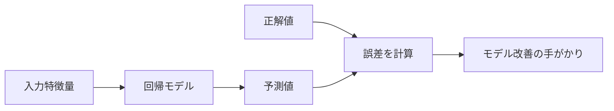

## 第9章　回帰問題

### 9.1　回帰とは何か

回帰とは、入力から連続的な数値を予測する問題です。

分類問題では、出力はカテゴリでした。

```text
犬 / 猫
スパム / スパムではない
政治 / 経済 / スポーツ
```

一方、回帰問題では、出力は数値です。

たとえば、家の価格を予測する問題は回帰です。

```text
入力：広さ、築年数、駅からの距離、地域
出力：価格
```

明日の気温を予測する問題も回帰です。

```text
入力：今日までの気象情報、日時、場所
出力：明日の気温
```

商品の売上を予測する問題も回帰です。

```text
入力：過去の売上、曜日、天気、広告費、キャンペーン情報
出力：明日の売上金額
```

株価、需要、来店者数、配達時間、機械の故障までの時間なども、数値として予測するなら回帰問題として扱えます。

分類と回帰の違いは、出力がカテゴリか数値かです。

```text
分類：
入力 → カテゴリを予測する

回帰：
入力 → 数値を予測する
```

ただし、現実の問題では、分類と回帰の境界が少し曖昧になることもあります。

たとえば、「明日の気温が30度を超えるか」を予測するなら分類です。

```text
入力：気象情報
出力：30度を超える / 超えない
```

一方、「明日の気温そのもの」を予測するなら回帰です。

```text
入力：気象情報
出力：31.4度
```

つまり、何を出力したいかによって、同じ対象でも分類問題にも回帰問題にもなります。

回帰問題では、モデルの出力がどれくらい正解の数値に近いかが重要になります。

分類では「当たったか外れたか」が中心でした。

回帰では、「どれくらいズレたか」が中心になります。

```text
正解：100
予測：98
↓
かなり近い

正解：100
予測：40
↓
大きく外れている
```

この「ズレ」をどう測るかが、回帰問題では重要になります。

回帰問題では、カテゴリを選ぶのではなく、連続的な値を出して正解とのズレを測ります。



### 9.2　連続値を予測する

回帰問題では、連続値を予測します。

連続値とは、ある範囲の中で細かく変化する数値です。

たとえば、気温は連続値です。

```text
22.0度
22.1度
22.15度
22.153度
```

どこまで細かく測るかは別として、気温はなめらかに変化する値として考えられます。

価格も多くの場合、回帰問題では連続値として扱います。

```text
5,000万円
5,010万円
5,123万円
```

実際には価格には最小単位がありますが、機械学習では数値として連続的に扱うことが多いです。

売上、体重、距離、時間、速度、確率、需要量なども、回帰の対象になります。

回帰モデルは、入力を受け取り、数値を返します。

```text
予測値 = モデル(入力)
```

たとえば、家の価格予測なら、次のようになります。

```text
予測価格 = モデル(広さ, 築年数, 駅距離, 地域)
```

モデルの出力は、たとえば次のような数値です。

```text
予測価格：7,850万円
```

ここで、正解価格が8,000万円だったとします。

```text
正解価格：8,000万円
予測価格：7,850万円
誤差：150万円
```

分類問題なら、「正解したかどうか」を見ます。

しかし回帰問題では、予測が完全に一致することはあまり期待しません。

価格や気温のような値では、少しのズレは普通に起こります。

そのため、回帰では「どれくらい近いか」を評価します。

```text
少しズレた → 比較的よい
大きくズレた → 悪い
```

回帰問題では、誤差の大きさが重要です。

### 9.3　線形回帰

回帰問題の基本的なモデルに、線形回帰があります。

線形回帰とは、入力特徴量の重み付き和で数値を予測するモデルです。

もっとも単純な例として、家の広さだけから価格を予測する場合を考えます。

```text
価格 = 広さ × 重み + バイアス
```

数式風に書くと、次のようになります。

```text
y = wx + b
```

ここで、

```text
x：入力
y：予測値
w：重み
b：バイアス
```

です。

たとえば、次のようなモデルがあるとします。

```text
価格 = 広さ × 100万円 + 500万円
```

広さが70平米なら、

```text
価格 = 70 × 100万円 + 500万円
     = 7,500万円
```

となります。

このモデルでは、広さが1平米増えるごとに、価格が100万円上がると考えています。

バイアスの500万円は、全体の基準値を調整する項です。

入力特徴量が複数ある場合は、次のようになります。

```text
価格 =
  広さ × w1
+ 築年数 × w2
+ 駅距離 × w3
+ バイアス
```

ここで、`w1`, `w2`, `w3` はそれぞれの特徴量に対応する重みです。

たとえば、広さが価格を上げる要因なら、広さの重みは正の値になるでしょう。

築年数が古いほど価格が下がるなら、築年数の重みは負の値になるかもしれません。

駅から遠いほど価格が下がるなら、駅距離の重みも負になるかもしれません。

線形回帰では、入力特徴量と出力の関係を直線的な関係として表します。

このモデルは単純ですが、非常に重要です。

なぜなら、機械学習の基本的な考え方が詰まっているからです。

```text
入力がある
重みがある
バイアスがある
予測値が出る
正解との差を測る
差が小さくなるように重みを調整する
```

この流れは、ニューラルネットワークや Transformer でも基本的には同じです。

違うのは、モデルの構造がより複雑になり、パラメータの数が非常に多くなることです。

### 9.4　誤差の測り方

回帰問題では、予測値と正解値のズレを測ります。

このズレを誤差と呼びます。

もっとも単純には、次のように考えられます。

```text
誤差 = 予測値 - 正解値
```

たとえば、家の価格予測で、

```text
予測値：7,500万円
正解値：8,000万円
```

なら、

```text
誤差 = 7,500万円 - 8,000万円
     = -500万円
```

です。

予測が正解より低いので、誤差はマイナスになります。

一方、

```text
予測値：8,500万円
正解値：8,000万円
```

なら、

```text
誤差 = 8,500万円 - 8,000万円
     = 500万円
```

です。

予測が正解より高いので、誤差はプラスになります。

しかし、モデルの悪さを測るときには、誤差の向きよりも大きさが重要です。

```text
-500万円の誤差
+500万円の誤差
```

この2つは、どちらも500万円ズレています。

そこで、誤差の絶対値や二乗を使います。

代表的な測り方は、次の2つです。

```text
絶対誤差 = |予測値 - 正解値|

二乗誤差 = (予測値 - 正解値)^2
```

絶対誤差は、ズレの大きさをそのまま見ます。

二乗誤差は、ズレを二乗します。

二乗誤差では、大きな誤差がより強く罰せられます。

たとえば、誤差が10倍になると、絶対誤差は10倍ですが、二乗誤差は100倍になります。

```text
誤差 10  → 二乗誤差 100
誤差 100 → 二乗誤差 10,000
```

そのため、二乗誤差を使うと、大きく外すことを特に避けるモデルになります。

どの誤差の測り方を使うかは、何を悪い予測とみなすかに関係します。

回帰問題では、誤差の測り方そのものが、モデルの学習方針を決めます。

### 9.5　平均二乗誤差

回帰問題でよく使われる損失関数に、平均二乗誤差があります。

英語では Mean Squared Error と呼ばれ、MSE と略されます。

平均二乗誤差は、各データの二乗誤差を計算し、その平均を取るものです。

たとえば、3件のデータがあるとします。

```text
データ1：
予測値 100
正解値 110
誤差 -10
二乗誤差 100

データ2：
予測値 200
正解値 180
誤差 20
二乗誤差 400

データ3：
予測値 300
正解値 330
誤差 -30
二乗誤差 900
```

このとき、平均二乗誤差は次のようになります。

```text
MSE = (100 + 400 + 900) / 3
    = 466.7
```

MSE が小さいほど、モデルの予測は全体として正解に近いと考えます。

MSE の特徴は、大きな誤差を強く罰することです。

これは多くの場合、便利です。

たとえば、価格予測で少し外すのは許容できても、大きく外すのは困る場合があります。

```text
100万円の誤差：少し困る
5,000万円の誤差：かなり困る
```

MSE は、大きな誤差に強い罰を与えるため、モデルは大外しを減らそうとします。

一方で、MSE には外れ値に弱いという性質があります。

外れ値とは、他のデータから大きく外れた値です。

たとえば、通常の住宅価格データに、極端に高額な豪邸が1件だけ混ざっている場合を考えます。

その豪邸に対する誤差が非常に大きいと、二乗によって損失が大きくなり、モデル全体がそのデータに引っ張られることがあります。

そのため、外れ値が多いデータでは、MSE だけでなく別の指標も検討する必要があります。

### 9.6　平均絶対誤差

平均絶対誤差も、回帰問題でよく使われる指標です。

英語では Mean Absolute Error と呼ばれ、MAE と略されます。

平均絶対誤差は、各データについて絶対誤差を計算し、その平均を取ります。

たとえば、3件のデータがあるとします。

```text
データ1：
予測値 100
正解値 110
絶対誤差 10

データ2：
予測値 200
正解値 180
絶対誤差 20

データ3：
予測値 300
正解値 330
絶対誤差 30
```

このとき、平均絶対誤差は次のようになります。

```text
MAE = (10 + 20 + 30) / 3
    = 20
```

MAE は、平均してどれくらいズレているかを直感的に理解しやすい指標です。

たとえば、家の価格予測で MAE が300万円なら、

```text
平均して300万円くらいズレている
```

と解釈できます。

MSE と MAE の違いは、大きな誤差の扱いです。

MSE は誤差を二乗するため、大きな誤差を強く罰します。

MAE は誤差の絶対値を使うため、大きな誤差への罰は比較的穏やかです。

```text
MSE：
大きな誤差に強く反応する

MAE：
誤差の大きさをそのまま見る
外れ値に比較的強い
```

外れ値が多い場合、MAE の方が安定して評価できることがあります。

ただし、学習のしやすさという点では、MSE の方が扱いやすい場合もあります。

実際の回帰問題では、MSE、MAE、RMSE などを目的に応じて使い分けます。

### 9.7　RMSE

RMSE は Root Mean Squared Error の略で、日本語では平方根平均二乗誤差と呼ばれます。

名前は長いですが、意味は単純です。

平均二乗誤差、つまり MSE の平方根を取ったものです。

```text
RMSE = sqrt(MSE)
```

なぜ平方根を取るのでしょうか。

MSE は誤差を二乗しているため、単位も二乗されます。

たとえば、価格の誤差を万円で測っている場合、MSE の単位は「万円の二乗」のようになってしまいます。

これは直感的に解釈しにくいです。

そこで、平方根を取ることで、元の単位に戻します。

たとえば、価格予測で RMSE が500万円なら、

```text
大きな誤差を強めに反映した上で、
典型的なズレは500万円程度
```

と解釈できます。

RMSE は MSE と同じく、大きな誤差に敏感です。

なぜなら、もともと二乗誤差を平均しているからです。

そのため、外れ値があると RMSE は大きくなりやすいです。

一方で、大きく外すことを特に避けたい場合には、RMSE は有用な指標です。

まとめると、次のようになります。

```text
MAE：
平均的にどれくらいズレるかを直感的に見やすい

MSE：
大きな誤差を強く罰するが、単位が二乗になる

RMSE：
大きな誤差を強く反映しつつ、元の単位で解釈できる
```

回帰問題では、これらの指標を目的に応じて使い分けます。

### 9.8　外れ値の影響

回帰問題では、外れ値の影響に注意する必要があります。

外れ値とは、他のデータから大きく外れた値です。

たとえば、家の価格予測データを考えます。

ほとんどの物件が3,000万円から1億円の範囲にあるとします。

その中に、50億円の特殊な豪邸が1件だけ入っていたら、それは外れ値かもしれません。

もちろん、その物件が誤りとは限りません。

実在する高額物件である可能性もあります。

しかし、多くの一般的な物件の価格を予測したい場合、その1件にモデルが強く引っ張られると困ることがあります。

特に MSE や RMSE は、大きな誤差に敏感です。

外れ値に対して大きく外すと、二乗によって損失が非常に大きくなります。

その結果、モデルは外れ値に合わせようとしすぎるかもしれません。

一方、MAE は誤差を二乗しないため、外れ値の影響は比較的穏やかです。

```text
MSE / RMSE：
外れ値に強く影響されやすい

MAE：
外れ値の影響を受けにくい
```

外れ値に対しては、いくつかの対応があります。

```text
データの誤りとして除外する
別のカテゴリとして扱う
外れ値に強い損失関数を使う
入力特徴量を追加して説明できるようにする
対数変換などでスケールを調整する
```

たとえば、価格データでは、価格をそのまま予測するのではなく、価格の対数を予測することがあります。

価格は非常に大きな範囲を取ることがあるため、対数を取ることでスケールを扱いやすくできます。

ただし、外れ値を単純に削除すればよいとは限りません。

外れ値が本番でも出てくる重要なケースなら、むしろ扱えるようにする必要があります。

大事なのは、その外れ値が何を意味しているのかを考えることです。

```text
データ入力ミスなのか
まれだが重要なケースなのか
別のモデルで扱うべき対象なのか
本番でも予測したい対象なのか
```

回帰問題では、外れ値の扱いがモデルの性能や解釈に大きく影響します。

### 9.9　過小適合と過学習

回帰問題でも、過小適合と過学習が起こります。

過小適合とは、モデルが単純すぎて、訓練データの傾向を十分に捉えられていない状態です。

たとえば、家の価格が広さだけでなく、地域、駅距離、築年数、階数、日当たりなどによって決まるとします。

それなのに、広さだけを使った単純な直線モデルで予測しようとすると、十分な精度が出ないかもしれません。

```text
入力：広さだけ
出力：価格
```

この場合、訓練データに対しても誤差が大きくなります。

```text
訓練誤差：大きい
検証誤差：大きい
```

これは過小適合の可能性があります。

一方、過学習とは、モデルが訓練データに合わせすぎて、未知のデータに弱くなる状態です。

たとえば、非常に複雑なモデルを使って、訓練データの物件価格をほぼ完全に再現できたとします。

しかし、そのモデルが訓練データに含まれる偶然のノイズや特殊事情まで覚えてしまっていたら、新しい物件では大きく外すかもしれません。

この場合、訓練誤差は小さいが、検証誤差は大きくなります。

```text
訓練誤差：小さい
検証誤差：大きい
```

これは過学習の可能性があります。

回帰問題でも、分類問題と同じように、訓練データと検証データを分けて評価する必要があります。

モデルの目的は、訓練データにぴったり合うことではありません。

未知のデータに対して、誤差の小さい予測をすることです。

### 9.10　回帰モデルの評価

回帰モデルを評価するときには、目的に合った評価指標を選ぶ必要があります。

代表的な指標には、MAE、MSE、RMSE があります。

```text
MAE：
平均絶対誤差
平均してどれくらいズレるかを見る

MSE：
平均二乗誤差
大きな誤差を強く罰する

RMSE：
MSE の平方根
大きな誤差を強く反映しつつ、元の単位で解釈できる
```

どれを使うべきかは、用途によって変わります。

たとえば、大きな外れを特に避けたい場合は、MSE や RMSE が向いているかもしれません。

```text
大きな誤差を強く減らしたい
↓
MSE / RMSE が有用
```

一方、外れ値に引っ張られすぎたくない場合は、MAE が向いているかもしれません。

```text
外れ値の影響を抑えたい
↓
MAE が有用
```

また、評価指標は数値だけ見ても意味がわかりにくいことがあります。

たとえば、RMSE が100だとして、それが良いのか悪いのかは、対象によって違います。

気温予測で RMSE が100度なら明らかに悪いです。

しかし、年商を億円単位で予測する問題で RMSE が100万円なら、非常に良いかもしれません。

つまり、評価指標は対象のスケールと一緒に解釈する必要があります。

```text
誤差 10 が大きいか小さいかは、
何を予測しているかによって変わる
```

さらに、平均的な誤差だけでなく、誤差の分布を見ることも重要です。

```text
ほとんどのケースで少しズレるのか
一部のケースで大きく外すのか
特定の条件で外しやすいのか
高い値だけ過小評価するのか
低い値だけ過大評価するのか
```

回帰モデルを実用で使うには、単一の指標だけでなく、誤差の傾向を見ることが大切です。

### 9.11　分類と回帰の違い

ここで、分類と回帰の違いを整理しておきます。

分類は、カテゴリを予測する問題です。

```text
入力：画像
出力：犬 / 猫
```

回帰は、数値を予測する問題です。

```text
入力：家の情報
出力：価格
```

分類では、正解したかどうかを見ます。

もちろん確率や損失も重要ですが、最終的にはカテゴリが合っているかが重要になります。

```text
予測：犬
正解：犬
↓
正解

予測：猫
正解：犬
↓
不正解
```

回帰では、完全に一致するかどうかより、どれくらいズレたかを見ます。

```text
予測：7,900万円
正解：8,000万円
↓
100万円の誤差

予測：4,000万円
正解：8,000万円
↓
4,000万円の誤差
```

分類では、評価指標として精度、適合率、再現率、F値などを使います。

回帰では、MAE、MSE、RMSE などを使います。

```text
分類の評価：
精度
適合率
再現率
F値
混同行列

回帰の評価：
MAE
MSE
RMSE
誤差分布
```

また、分類では softmax やシグモイドを使って確率を出すことが多いです。

回帰では、出力層からそのまま数値を出すことが多いです。

ただし、分類と回帰は完全に別世界ではありません。

数値を区間に分ければ分類問題にできます。

たとえば、家の価格を次のようなカテゴリに分けることができます。

```text
3,000万円未満
3,000万円〜5,000万円
5,000万円〜1億円
1億円以上
```

この場合は分類問題です。

逆に、分類の確率を数値として扱うこともあります。

```text
病気である確率：0.82
```

これは分類モデルの出力ですが、数値として利用できます。

重要なのは、目的に応じて問題の形を設計することです。

### 9.12　回帰とニューラルネットワーク

ニューラルネットワークでも、回帰問題を扱うことができます。

基本的な考え方は同じです。

入力を受け取り、ニューラルネットワークで計算し、最後に数値を出力します。

```text
入力
↓
ニューラルネットワーク
↓
予測値
```

たとえば、家の価格予測なら、入力特徴量をベクトルとして与えます。

```text
[広さ, 築年数, 駅距離, 地域情報, 部屋数]
```

ニューラルネットワークは、この入力を何層もの計算で変換し、最後に1つの数値を出します。

```text
予測価格：8,200万円
```

分類問題では、最後に softmax を使ってカテゴリごとの確率を出すことが多いです。

一方、回帰問題では、最後にそのまま数値を出すことが多いです。

```text
分類：
出力層 → softmax → 確率分布

回帰：
出力層 → 数値
```

もちろん、予測したい数値の範囲が決まっている場合には、出力に制約をかけることもあります。

たとえば、0から1の範囲の値を予測したい場合は、シグモイド関数を使うことがあります。

しかし、一般的な回帰では、出力は自由な実数として扱うことが多いです。

学習時には、予測値と正解値の誤差を計算します。

```text
予測値：8,200万円
正解値：8,000万円
誤差：200万円
```

その誤差をもとに MSE や MAE などの損失を計算し、逆伝播でパラメータを更新します。

つまり、ニューラルネットワークの回帰も、基本は同じです。

```text
予測する
↓
正解と比べる
↓
損失を計算する
↓
勾配を求める
↓
重みを更新する
```

### 9.13　回帰問題と Transformer

Transformer は、主に自然言語処理で有名ですが、回帰問題にも使うことができます。

Transformer の本質は、系列データの中の要素同士の関係を扱うことです。

そのため、入力が系列であり、出力として数値を予測したい場合にも応用できます。

たとえば、時系列データの予測です。

```text
入力：過去の売上推移
出力：明日の売上
```

```text
入力：過去の気温、湿度、気圧の変化
出力：明日の気温
```

```text
入力：過去のセンサー値
出力：機械が故障するまでの時間
```

このような問題では、過去の系列情報から未来の数値を予測します。

Transformer は、系列の中の離れた時点同士の関係を扱えるため、時系列予測にも応用できます。

また、自然言語を入力して数値を予測することもできます。

たとえば、文章レビューから評価点を予測する問題です。

```text
入力：商品のレビュー本文
出力：評価点
```

この場合、出力が星1〜星5のカテゴリなら分類問題として扱えます。

しかし、評価点を連続的なスコアとして扱うなら回帰問題になります。

言語モデルそのものは、通常は次トークン分類として学習されます。

しかし、Transformer の上に回帰用の出力層を付ければ、数値予測にも使えます。

```text
入力テキスト
↓
Transformer
↓
文章全体の表現
↓
回帰用の出力層
↓
数値
```

つまり、Transformer は分類専用のモデルではありません。

入力をベクトル表現に変換する強力なモデルとして使い、その上で分類、回帰、生成など、さまざまなタスクに接続できます。

### 9.14　回帰問題で注意すべきこと

回帰問題では、いくつか注意すべき点があります。

まず、出力値のスケールです。

たとえば、価格を円単位で扱うと、値が非常に大きくなります。

```text
80,000,000円
```

一方、百万円単位で扱えば、

```text
80
```

となります。

数値のスケールが大きすぎると、学習が不安定になることがあります。

そのため、入力特徴量や出力値を適切にスケーリングすることがあります。

次に、外れ値の扱いです。

一部の極端な値が、モデルや評価指標に大きく影響することがあります。

特に MSE や RMSE を使う場合は、外れ値の影響に注意が必要です。

また、誤差の意味を考えることも重要です。

価格予測で100万円の誤差は、3,000万円の物件では大きいかもしれません。

しかし、10億円の物件では比較的小さいかもしれません。

このように、絶対誤差だけでなく、相対誤差を見たい場合もあります。

```text
絶対誤差：
予測と正解の差そのもの

相対誤差：
正解値に対して何％ズレたか
```

さらに、予測したい値が負になってはいけない場合もあります。

たとえば、価格、人数、売上、時間などは通常マイナスになりません。

しかし、普通の回帰モデルはマイナスの値を出すことがあります。

この場合、出力の変換や後処理、モデル設計で制約を考える必要があります。

最後に、平均的な誤差だけで満足しないことが重要です。

全体の MAE が低くても、特定の条件では大きく外しているかもしれません。

```text
高価格帯だけ過小評価する
低価格帯だけ過大評価する
特定地域だけ外しやすい
特定の季節だけ外しやすい
```

回帰モデルでは、誤差の分布や偏りを見ることが実用上とても重要です。

### 9.15　本章のまとめ

この章では、回帰問題について学びました。

回帰とは、入力から連続的な数値を予測する問題です。

```text
入力 → モデル → 数値
```

たとえば、次のような問題が回帰です。

```text
家の情報 → 価格
気象情報 → 気温
過去の売上 → 明日の売上
センサー値 → 故障までの時間
```

分類問題ではカテゴリを予測しますが、回帰問題では数値を予測します。

```text
分類：
犬 / 猫 / 鳥 のようなカテゴリを予測する

回帰：
価格、気温、時間、売上のような数値を予測する
```

回帰問題では、予測値と正解値のズレ、つまり誤差を測ります。

代表的な評価指標には、MAE、MSE、RMSE があります。

```text
MAE：
平均絶対誤差
平均してどれくらいズレるかを見る

MSE：
平均二乗誤差
大きな誤差を強く罰する

RMSE：
MSE の平方根
元の単位で解釈しやすく、大きな誤差にも敏感
```

回帰問題でも、過小適合と過学習が起こります。

```text
過小適合：
訓練データにも十分に合わない

過学習：
訓練データには合うが、未知データに弱い
```

また、外れ値、スケール、相対誤差、誤差の偏りにも注意が必要です。

この章で一番重要な考え方は、次の一文です。

**回帰問題とは、入力から数値を予測し、その予測値が正解値からどれくらいズレているかを小さくする問題である。**

Transformer やニューラルネットワークも、出力層を変えれば回帰問題に使うことができます。

一方、大規模言語モデルの基本的な事前学習は、次トークンを語彙から選ぶ分類問題として見ることが多いです。

分類と回帰の違いを理解しておくと、機械学習モデルが何を予測しているのか、どの損失関数や評価指標を使うべきかが見えやすくなります。
