# 機械学習の基本

「Attention Is All You Need」を読むための前提知識を作るための教科書

## はじめに

この教科書の目的は、機械学習を初めて学ぶ人が、最終的に Transformer の論文「Attention Is All You Need」を読めるようになるための土台を作ることです。

Transformer の論文には、attention、embedding、softmax、cross entropy、training、inference、neural network、sequence、probability distribution など、多くの概念が当然のように登場します。これらをいきなり読むと、数式そのものよりも、「そもそも何をしているのか」が見えにくくなります。

そこで本書では、機械学習の基本を次の流れで学びます。

- 機械学習とは何か
- モデル、パラメータ、損失関数とは何か
- 学習とは損失を小さくすることだという見方
- 分類、回帰、確率、特徴量、汎化の基本
- ニューラルネットワークへの橋渡し
- Transformer を読むために、これらの知識がどうつながるか

本書では、最初から難しい数式を追いかけるよりも、「何を入力し、何を出力し、何を正解として、どう更新しているのか」を大切にします。

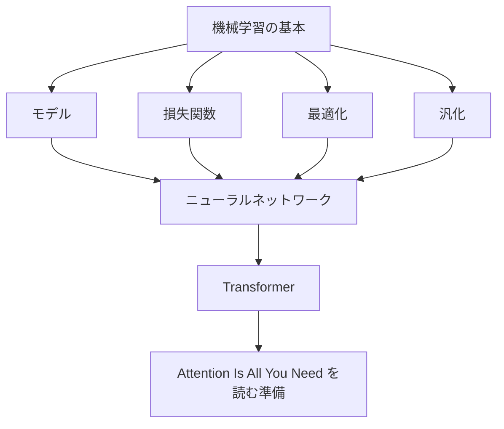

---

## 第1章　機械学習とは何か

### 1.1　機械学習の目的

機械学習の目的は、データから規則性を見つけ、その規則性を使って未知の入力に対して役に立つ出力を返すことです。

たとえば、次のような問題を考えます。

- メールがスパムかどうかを判定する
- 家の広さや場所から価格を予測する
- 画像に写っているものが猫か犬かを分類する
- 文章の次に来る単語を予測する

これらに共通しているのは、「入力」があり、「期待する出力」があることです。機械学習では、多くの例を使って、入力から出力への対応関係を学びます。

Transformer も例外ではありません。言語モデルとして使う場合、入力は単語やトークンの列で、出力は「次に来そうなトークン」の確率分布です。

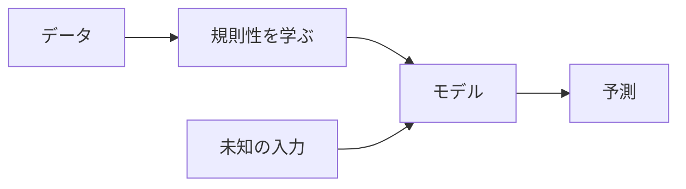

### 1.2　「ルールを書く」プログラムと「データから学ぶ」プログラム

普通のプログラムでは、人間がルールを書きます。

たとえば、気温が 30 度以上なら「暑い」と表示するプログラムは、次のような考え方です。

```text
もし気温 >= 30 なら
    「暑い」と出力する
```

これはルールが明確な問題には向いています。しかし、スパムメール判定のような問題では、明確なルールをすべて人間が書くのは難しいです。

```text
「無料」という単語があればスパム？
送信者が知らない人ならスパム？
リンクが多ければスパム？
```

どれも手がかりにはなりますが、単純なルールだけではうまくいきません。機械学習では、人間が細かいルールを全部書く代わりに、データから判断の仕方を学ばせます。

### 1.3　入力、出力、予測

機械学習では、問題を次の形で考えることが多いです。

```text
入力 x を受け取り、出力 y を予測する
```

たとえば、家の価格予測なら次のようになります。

```text
入力 x: 広さ、駅からの距離、築年数、部屋数
出力 y: 価格
```

メール分類なら次のようになります。

```text
入力 x: メール本文
出力 y: スパムかどうか
```

言語モデルなら次のようになります。

```text
入力 x: ここまでのトークン列
出力 y: 次のトークン
```

予測とは、入力を見て、まだわからない出力を推定することです。

### 1.4　モデルとは何か

モデルとは、入力を受け取って出力を返す仕組みです。数学的には「関数」と見なせます。

```text
モデル: f
入力: x
出力: f(x)
```

たとえば、家の価格を予測するモデルは、広さや駅からの距離などを入力として受け取り、価格を出力します。

```text
価格 = f(広さ, 駅からの距離, 築年数, 部屋数)
```

重要なのは、機械学習のモデルは最初から正しい答えを知っているわけではないということです。最初は予測が下手です。データを使って、少しずつ予測がよくなるように調整します。

### 1.5　学習とは何か

学習とは、モデルの予測が正解に近づくように、モデル内部の値を調整することです。

たとえば、モデルが家の価格を 4000 万円と予測し、実際の価格が 3500 万円だったとします。このとき、予測は 500 万円ずれています。学習では、このずれが小さくなるようにモデルを調整します。

機械学習でいう「学習」は、人間の学習と似ている部分もありますが、実際にはかなり機械的です。

```text
予測する
正解と比べる
間違いの大きさを測る
間違いが小さくなる方向にパラメータを更新する
```

この繰り返しが学習です。

### 1.6　推論とは何か

推論とは、学習済みのモデルを使って、新しい入力に対する出力を求めることです。

学習中は正解が与えられています。モデルは正解と比べながら、自分を調整します。一方、推論時には通常、正解はわかりません。モデルの出力をそのまま予測として使います。

```text
学習: 正解を見ながらモデルを調整する
推論: 学習済みモデルを使って予測する
```

ChatGPT のような言語モデルで文章を生成するときも、基本的には推論をしています。入力された文章をもとに、次に来るトークンを予測し、それを繰り返して文章を作ります。

### 1.7　機械学習でできること、できないこと

機械学習は、データの中にある規則性を利用するのが得意です。

できることの例:

- 大量の例からパターンを見つける
- 人間が明示的にルールを書きにくい問題を扱う
- 画像、音声、文章などの複雑なデータを扱う
- 確率的な予測を返す

一方で、できないことや苦手なこともあります。

- データにないことを安定して予測する
- 誤ったデータから正しい規則だけを自動で見抜く
- 常識や意図を必ず正しく理解する
- なぜその答えになったかを常に明確に説明する

機械学習は魔法ではありません。データ、モデル、目的、評価方法がそろって初めて役に立ちます。

### 1.8　機械学習とAI、深層学習、生成AIの関係

AI は広い言葉です。人間の知的なふるまいを機械で実現しようとする分野全体を指します。

機械学習は AI の一分野です。明示的なルールをすべて書くのではなく、データから規則性を学ぶ方法です。

深層学習は機械学習の一分野です。多層のニューラルネットワークを使って、複雑なパターンを学習します。

生成AIは、文章、画像、音声、コードなどを生成する AI です。多くの生成AIは深層学習、特に Transformer などの大規模ニューラルネットワークを使っています。

```text
AI
  └─ 機械学習
       └─ 深層学習
            └─ Transformer を使った生成AI
```

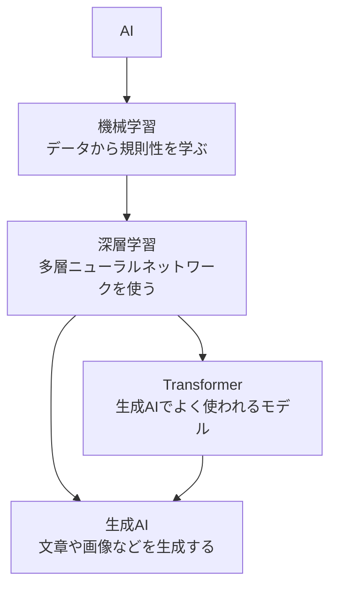

---

## 第2章　教師あり学習の基本

### 2.1　教師あり学習とは何か

教師あり学習とは、入力と正解のペアを使ってモデルを学習する方法です。

```text
入力 x と正解 y のペアをたくさん用意する
モデルに x を入力する
モデルの予測と y を比べる
予測が y に近づくように調整する
```

ここでいう「教師」とは、正解データのことです。人間の先生が毎回教えるという意味ではなく、データの中に正解が含まれているという意味です。

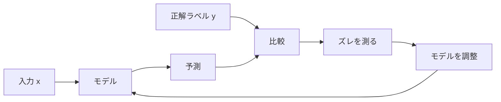

### 2.2　訓練データと正解ラベル

訓練データとは、モデルを学習させるために使うデータです。

正解ラベルとは、それぞれの入力に対応する正しい出力です。

スパム判定なら次のようになります。

```text
入力: メール本文
正解ラベル: スパム / スパムではない
```

画像分類なら次のようになります。

```text
入力: 画像
正解ラベル: 猫 / 犬 / 車 / 花 ...
```

言語モデルでは、文章そのものから正解を作ることができます。たとえば「私は コーヒー を 飲む」という列があるとき、「私は コーヒー を」までを入力にして、次の「飲む」を正解にできます。

### 2.3　分類問題と回帰問題

教師あり学習の代表的な問題に、分類と回帰があります。

分類は、入力を決められたカテゴリのどれかに分ける問題です。

```text
メール: スパム / スパムではない
画像: 猫 / 犬 / 鳥
レビュー: ポジティブ / ネガティブ
```

回帰は、連続的な数値を予測する問題です。

```text
家の価格
明日の気温
商品の売上
```

分類は「どの種類か」を予測し、回帰は「どのくらいの値か」を予測します。

### 2.4　例：メールをスパム判定する

スパム判定では、メール本文を入力し、そのメールがスパムかどうかを出力します。

```text
入力: 「今だけ無料で商品を受け取れます」
出力: スパムである確率 0.92
```

分類モデルは、単に「スパム」とだけ出力することもできますが、多くの場合は確率として出力します。

```text
スパムである確率: 0.92
スパムではない確率: 0.08
```

この確率を見て、たとえば 0.5 以上ならスパムと判断する、と決められます。

### 2.5　例：家の価格を予測する

家の価格予測では、入力は家の特徴量で、出力は価格です。

```text
入力:
  広さ: 70 平方メートル
  駅からの距離: 徒歩 8 分
  築年数: 12 年
  部屋数: 3

出力:
  予測価格: 4300 万円
```

これは回帰問題です。出力はカテゴリではなく、連続的な数値です。

### 2.6　入力特徴量とは何か

特徴量とは、モデルに入力する情報です。

家の価格なら、広さ、駅からの距離、築年数などが特徴量です。スパム判定なら、文章中の単語、リンク数、送信者情報などが特徴量になります。

機械学習では、どの情報を特徴量として与えるかが重要です。よい特徴量は、予測に役立つ情報を含んでいます。

深層学習では、特徴量を人間が細かく設計する代わりに、ニューラルネットワークが内部で有用な表現を学ぶことが多くなります。

### 2.7　正解とのズレを小さくするという考え方

教師あり学習では、モデルの予測と正解のズレを小さくするように学習します。

```text
予測: 4300 万円
正解: 4000 万円
ズレ: 300 万円
```

分類でも同じです。

```text
正解: スパム
モデル出力: スパムである確率 0.60
```

この場合、正解は当たっているかもしれませんが、まだ自信が弱いとも言えます。学習では、正解クラスにもっと高い確率を割り当てられるようにモデルを調整します。

### 2.8　「学習できる」とはどういうことか

「学習できる」とは、データを見てモデルの予測が改善するということです。

ただし、何でも学習できるわけではありません。入力と出力の間に何らかの規則性が必要です。

たとえば、完全にランダムな番号を予測する問題では、いくらデータを見ても未来の番号は予測できません。一方、家の広さと価格の間にはある程度の関係があるので、学習の余地があります。

機械学習で大切なのは、次の問いです。

```text
この入力には、出力を予測するための情報が含まれているか？
```

---

## 第3章　モデルとパラメータ

### 3.1　モデルは「関数」である

モデルは、入力を出力に変換する関数として考えられます。

```text
y = f(x)
```

ここで、x は入力、y は出力、f はモデルです。

たとえば、文章分類なら次のように考えられます。

```text
分類結果 = f(文章)
```

Transformer でも同じです。

```text
次トークンの確率分布 = f(ここまでのトークン列)
```

どれほど複雑に見えても、モデルは基本的には入力を受け取り、出力を返す関数です。

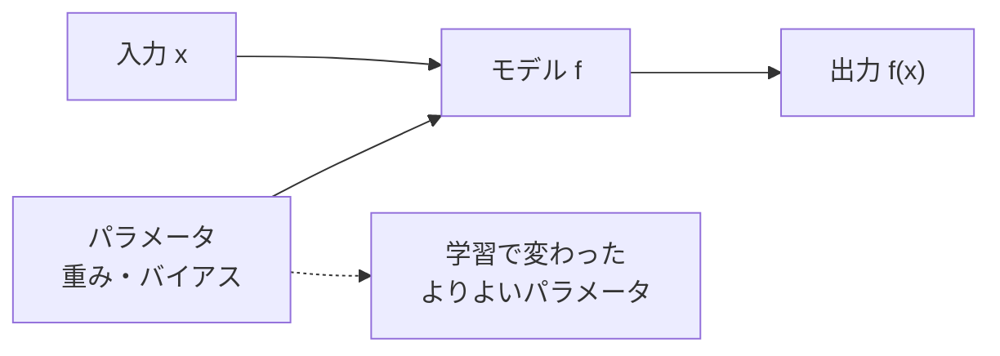

### 3.2　入力を受け取り、出力を返す

モデルの基本動作は単純です。

```text
入力を受け取る
内部で計算する
出力を返す
```

たとえば、線形モデルなら、入力に重みをかけて足し合わせます。

```text
出力 = 入力1 * 重み1 + 入力2 * 重み2 + ... + バイアス
```

ニューラルネットワークでは、このような計算を何層にも重ねます。

### 3.3　パラメータとは何か

パラメータとは、モデル内部にある調整可能な値です。

たとえば、次のようなモデルを考えます。

```text
価格 = 広さ * w + b
```

ここで、w と b がパラメータです。w は重み、b はバイアスと呼ばれます。

学習とは、この w や b の値をデータに合うように調整することです。

### 3.4　パラメータを調整するとは何か

パラメータを調整するとは、予測が正解に近づくように、モデル内部の数値を変えることです。

たとえば、最初のモデルが次のような状態だったとします。

```text
価格 = 広さ * 10 + 100
```

予測が全体的に低すぎるなら、重みやバイアスを大きくする必要があるかもしれません。

```text
価格 = 広さ * 50 + 500
```

実際の機械学習では、この調整を手作業ではなく、損失関数と勾配降下法を使って自動で行います。

### 3.5　手作業で決めるルールと、学習で決まる重み

従来のプログラムでは、人間がルールを決めます。

```text
リンクが 5 個以上ならスパム
「無料」が含まれていたらスパム
```

機械学習では、人間が特徴量やモデルの形を用意し、具体的な重みはデータから学びます。

```text
「無料」という単語の重み
リンク数の重み
送信者情報の重み
```

どの情報をどのくらい重視するかを、学習によって決めるのです。

### 3.6　単純な直線モデル

最も単純なモデルの一つが直線モデルです。

```text
y = wx + b
```

たとえば、勉強時間からテスト点数を予測するとします。

```text
点数 = 勉強時間 * w + b
```

w が大きいほど、勉強時間が 1 時間増えたときの点数の増え方が大きくなります。b は、勉強時間が 0 のときの基準値のようなものです。

### 3.7　重みとバイアス

重みは、入力が出力にどれだけ影響するかを表します。

バイアスは、全体の基準をずらす値です。

```text
y = wx + b
```

この式では、w が傾き、b が切片です。

複数の特徴量がある場合は、次のようになります。

```text
y = w1*x1 + w2*x2 + w3*x3 + b
```

ニューラルネットワークでも、基本的には大量の重みとバイアスを使います。

### 3.8　モデルの表現力

モデルの表現力とは、どれだけ複雑な関係を表せるかという能力です。

直線モデルは単純で理解しやすいですが、曲がった関係や複雑なパターンを表すのは苦手です。

ニューラルネットワークは、多くの層と非線形な変換を使うことで、より複雑な関係を表現できます。

ただし、表現力が高ければ必ずよいわけではありません。表現力が高すぎると、訓練データにだけ過剰に合わせてしまうことがあります。これが過学習です。

---

## 第4章　損失関数

### 4.1　予測がどれくらい間違っているかを測る

モデルを学習するには、予測がどれくらい間違っているかを数値で測る必要があります。

```text
予測が少し外れた: 小さい値
予測が大きく外れた: 大きい値
```

この「間違いの大きさ」を測る関数が損失関数です。

### 4.2　損失関数とは何か

損失関数とは、モデルの予測と正解を受け取り、そのズレを数値として返す関数です。

```text
損失 = L(予測, 正解)
```

損失が小さいほど、予測は正解に近いと考えます。学習では、この損失が小さくなるようにパラメータを調整します。

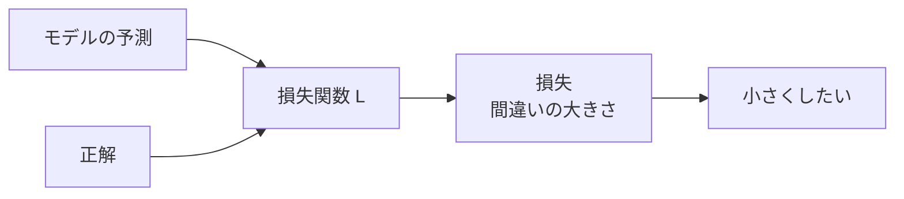

### 4.3　平均二乗誤差

平均二乗誤差は、回帰問題でよく使われる損失関数です。

考え方は単純です。

```text
予測と正解の差を求める
差を二乗する
全データで平均する
```

差を二乗するため、大きな誤差ほど強く罰せられます。

```text
正解: 100
予測: 90
誤差: -10
二乗誤差: 100
```

平均二乗誤差が小さいほど、全体として予測が正解に近いと言えます。

### 4.4　交差エントロピー

交差エントロピーは、分類問題でよく使われる損失関数です。

分類モデルは、各クラスに対する確率を出力します。たとえば、画像分類なら次のようになります。

```text
猫: 0.70
犬: 0.20
鳥: 0.10
```

正解が「猫」なら、猫の確率が高いほど損失は小さくなります。正解クラスに低い確率を割り当てると、損失は大きくなります。

言語モデルでも、次トークンの予測に交差エントロピーがよく使われます。

### 4.5　分類問題における「確率」の出力

分類問題では、モデルが「どのクラスがどれくらいありそうか」を確率として出力することが多いです。

```text
スパム: 0.85
スパムではない: 0.15
```

多クラス分類では、すべてのクラスの確率の合計が 1 になるようにします。

```text
猫: 0.70
犬: 0.20
鳥: 0.10
合計: 1.00
```

このような確率分布を作るために softmax が使われます。

### 4.6　損失が小さいほどよい、とはどういうことか

損失が小さいということは、モデルの予測が正解に近いということです。

ただし、訓練データでの損失が小さいだけでは十分ではありません。未知のデータでもうまく予測できる必要があります。

つまり、目標は次のように整理できます。

```text
訓練データで損失を小さくする
しかし訓練データだけに合わせすぎない
未知のデータでもよい予測をする
```

### 4.7　損失関数を選ぶ意味

損失関数は、モデルに「何をよい予測とみなすか」を教える役割を持ちます。

回帰では、数値の差を小さくしたいので平均二乗誤差が使われます。分類では、正解クラスに高い確率を割り当てたいので交差エントロピーが使われます。

損失関数の選び方を間違えると、モデルは目的と違う方向に学習してしまいます。

### 4.8　学習とは損失を小さくすることである

機械学習の中心的な見方は、次の一文にまとめられます。

```text
学習とは、損失関数の値が小さくなるように、モデルのパラメータを調整することである。
```

Transformer の学習も同じです。次トークン予測の損失が小さくなるように、巨大なニューラルネットワークの重みを少しずつ更新します。

---

## 第5章　最適化と勾配降下法

### 5.1　どうやって損失を小さくするのか

損失を小さくしたいとしても、どのパラメータをどちらに動かせばよいのでしょうか。

パラメータが 1 個だけなら、試しに少し増やしたり減らしたりできます。しかし、ニューラルネットワークには何百万、何十億というパラメータがあります。手作業では不可能です。

そこで使うのが最適化です。

### 5.2　最適化とは何か

最適化とは、ある目的を最もよく満たす値を探すことです。

機械学習では、多くの場合、目的は損失を小さくすることです。

```text
最適化の目的: 損失をできるだけ小さくする
探すもの: モデルのパラメータ
```

つまり、機械学習における最適化とは、よいパラメータを探す作業です。

### 5.3　微分の直感

微分は、「少し動かしたときに、値がどれくらい変わるか」を表します。

たとえば、山道を歩いているとします。足元の傾きがわかれば、どちらに進むと下り坂かがわかります。

損失関数でも同じです。パラメータを少し変えたときに損失が増えるのか減るのかを知りたい。そのために微分を使います。

### 5.4　勾配とは何か

勾配とは、多くの変数に対する微分をまとめたものです。

パラメータが 1 個なら、傾きは 1 つです。パラメータがたくさんある場合は、それぞれのパラメータについて「どちらに動かすと損失が増えるか」を計算します。

勾配は、損失が最も増える方向を指します。損失を小さくしたいなら、その逆方向に進みます。

### 5.5　勾配降下法

勾配降下法は、勾配の逆方向にパラメータを少しずつ動かす方法です。

```text
現在のパラメータを見る
損失の勾配を計算する
勾配と逆方向に少し動かす
これを繰り返す
```

式で書くと、次のようになります。

```text
新しいパラメータ = 古いパラメータ - 学習率 * 勾配
```

この「少しずつ」が重要です。

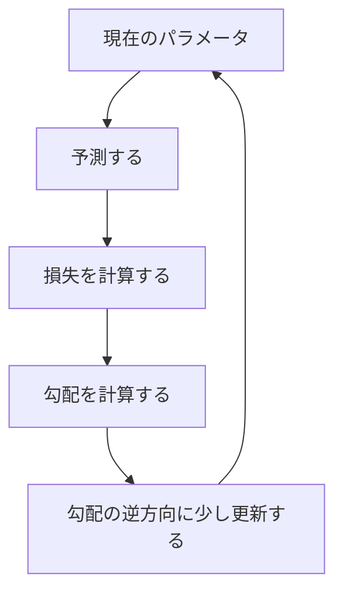

### 5.6　学習率

学習率とは、パラメータを一度にどれくらい動かすかを決める値です。

```text
学習率が大きい: 大きく動く
学習率が小さい: 少しだけ動く
```

学習率は、機械学習の学習の安定性に大きく影響します。

### 5.7　学習率が大きすぎる場合、小さすぎる場合

学習率が大きすぎると、最小値を飛び越えてしまい、損失が安定して下がらないことがあります。

学習率が小さすぎると、学習は安定しますが、とても時間がかかります。

```text
大きすぎる: 暴れる、発散する
小さすぎる: 遅すぎる、なかなか改善しない
ほどよい: 安定して損失が下がる
```

深層学習では、学習率の選び方が非常に重要です。

### 5.8　局所最小と大域最小

大域最小とは、すべての場所の中で損失が最も小さい点です。

局所最小とは、近くの範囲では最も小さいけれど、全体で最も小さいとは限らない点です。

単純な問題なら大域最小を見つけやすいですが、ニューラルネットワークの損失の形は非常に複雑です。そのため、実際には完全な大域最小を探すというより、「十分よい解」を探します。

### 5.9　確率的勾配降下法

全データを使って毎回勾配を計算すると、データが大きい場合に時間がかかります。

確率的勾配降下法では、データの一部を使って勾配を計算します。

厳密には、1 件ずつ使う場合を確率的勾配降下法と呼ぶことがありますが、実務ではミニバッチを使う方法も広い意味で SGD 的に扱われます。

### 5.10　ミニバッチ学習

ミニバッチ学習では、訓練データを小さなまとまりに分けて学習します。

```text
訓練データ全体: 100万件
ミニバッチ: 1回に 256 件ずつ使う
```

ミニバッチを使うと、計算効率がよくなり、勾配の推定もある程度安定します。深層学習では、ミニバッチ学習が標準的に使われます。

---

## 第6章　訓練データ、検証データ、テストデータ

### 6.1　なぜデータを分けるのか

モデルの目的は、訓練データに正解することだけではありません。まだ見たことのないデータに対してもよい予測をすることです。

そのため、データを分けて評価します。

```text
訓練データ: 学習に使う
検証データ: 調整に使う
テストデータ: 最後の評価に使う
```

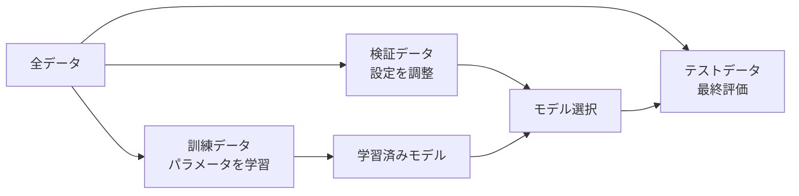

### 6.2　訓練データ

訓練データは、モデルのパラメータを更新するために使うデータです。

モデルは訓練データを何度も見ます。予測し、損失を計算し、勾配を求め、パラメータを更新します。

### 6.3　検証データ

検証データは、モデルの設定を調整するために使います。

たとえば、次のような判断に使います。

- 学習率をどうするか
- モデルの大きさをどうするか
- どの時点で学習を止めるか

検証データはパラメータ更新には直接使いませんが、モデル選択には使います。

### 6.4　テストデータ

テストデータは、最後に一度だけ性能を確認するために使います。

検証データを何度も見ながらモデルを調整すると、検証データに合わせすぎる可能性があります。そのため、最終的な公平な評価用としてテストデータを残しておきます。

### 6.5　未知のデータに強いとは何か

未知のデータに強いとは、訓練中に見ていない入力に対しても、適切な出力を返せることです。

たとえば、スパム判定モデルが訓練データのメールだけを覚えているなら、新しいメールには弱くなります。一方、スパムらしさの一般的なパターンを学べていれば、新しいメールにも対応できます。

### 6.6　汎化性能

汎化性能とは、未知のデータに対する性能です。

機械学習で本当に重要なのは、訓練データでの成績ではなく、汎化性能です。

```text
訓練性能: 見たことがあるデータへの性能
汎化性能: 見たことがないデータへの性能
```

### 6.7　データ漏洩

データ漏洩とは、本来モデルが使ってはいけない情報が学習や評価に混ざってしまうことです。

たとえば、未来の情報を使って過去を予測する、テストデータの情報が訓練データに混ざる、正解ラベルそのものに近い情報を特徴量に入れてしまう、といったケースです。

データ漏洩があると、評価では高性能に見えても、本番ではうまくいきません。

### 6.8　評価の設計

評価の設計では、モデルをどのような状況で使うのかを考える必要があります。

たとえば、医療診断では、単純な正解率だけでは不十分なことがあります。見逃しを減らすことが重要なのか、誤検出を減らすことが重要なのかによって、評価指標が変わります。

機械学習では、評価指標が目的とずれていると、モデル改善の方向もずれてしまいます。

---

## 第7章　過学習と汎化

### 7.1　過学習とは何か

過学習とは、モデルが訓練データに合わせすぎて、未知のデータに弱くなることです。

訓練データでの損失は小さいのに、検証データやテストデータでの性能が悪い場合、過学習が疑われます。

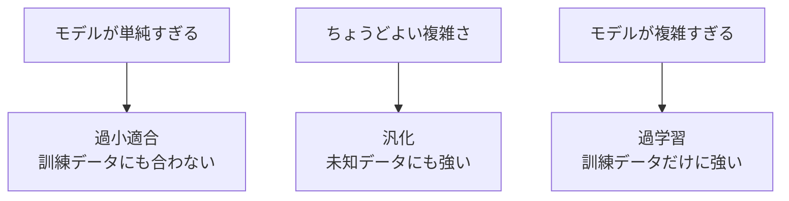

### 7.2　「訓練データでは正解するが、本番では弱い」状態

過学習したモデルは、訓練データではよい成績を出します。しかし、それは本質的な規則性を学んだのではなく、訓練データの細部を覚えてしまっただけかもしれません。

たとえば、テストの過去問の答えだけを丸暗記した人は、同じ問題には答えられますが、少し変えた問題には弱いかもしれません。

機械学習でも同じことが起きます。

### 7.3　モデルが複雑すぎる場合

表現力の高いモデルは、複雑な関係を学べます。しかし、データが少ない場合、訓練データの偶然のパターンまで覚えてしまうことがあります。

モデルが複雑すぎると、訓練データにはぴったり合っても、未知のデータには合わないことがあります。

### 7.4　データが少なすぎる場合

データが少ないと、モデルは一般的な規則性を学びにくくなります。

少数の例だけを見ると、本当は偶然の特徴を重要だと勘違いすることがあります。データが増えるほど、偶然ではなく本質的なパターンを見つけやすくなります。

### 7.5　ノイズまで覚えてしまう問題

訓練データにはノイズが含まれることがあります。

たとえば、ラベルが間違っている、測定値に誤差がある、たまたま変な例が混ざっている、といった場合です。

過学習したモデルは、こうしたノイズまで覚えてしまいます。その結果、未知のデータに対する予測が悪くなります。

### 7.6　正則化

正則化とは、モデルが複雑になりすぎないように制約を加える方法です。

たとえば、重みが大きくなりすぎないように罰則を加える方法があります。これにより、モデルが訓練データに過剰に合わせることを防ぎます。

正則化は、「訓練データへの当てはまり」と「未知データへの強さ」のバランスを取るための考え方です。

### 7.7　Dropout の直感

Dropout は、ニューラルネットワークの学習中に、一部のニューロンをランダムに無効化する方法です。

これにより、特定のニューロンだけに頼りすぎることを防ぎます。毎回少し違うネットワークで学習しているような効果があり、汎化性能の向上に役立つことがあります。

Transformer の原論文でも Dropout が使われています。

### 7.8　早期終了

早期終了は、検証データの性能が悪化し始めたところで学習を止める方法です。

訓練データの損失は下がり続けても、検証データの損失が上がり始めることがあります。これは過学習のサインです。

その前後で学習を止めることで、未知データに対する性能を保ちます。

### 7.9　データ拡張

データ拡張とは、既存のデータを変形して新しい訓練例を作る方法です。

画像なら、少し回転する、切り抜く、明るさを変えるなどが考えられます。文章では、言い換えや一部の単語の置換などが使われることがあります。

データ拡張により、モデルがより多様な入力に対応しやすくなります。

### 7.10　よいモデルとは何か

よいモデルとは、訓練データにただ合うモデルではなく、未知のデータでも役に立つモデルです。

つまり、よいモデルには次の性質が求められます。

- 訓練データから有用な規則性を学ぶ
- ノイズや偶然のパターンに引きずられすぎない
- 新しい入力に対しても安定した予測をする

---

## 第8章　分類問題

### 8.1　分類とは何か

分類とは、入力をあらかじめ決められたクラスのどれかに割り当てる問題です。

```text
入力: 画像
出力: 猫 / 犬 / 車
```

分類は、機械学習で最も基本的な問題設定の一つです。

### 8.2　二値分類

二値分類は、2 つのクラスのどちらかを予測する問題です。

```text
スパム / スパムではない
合格 / 不合格
病気あり / 病気なし
```

出力は、片方のクラスである確率として表せます。

```text
スパムである確率: 0.82
```

### 8.3　多クラス分類

多クラス分類は、3 つ以上のクラスの中から 1 つを選ぶ問題です。

```text
猫 / 犬 / 鳥 / 車 / 船
```

多クラス分類では、それぞれのクラスに対する確率を出力することが多いです。

```text
猫: 0.60
犬: 0.25
鳥: 0.10
車: 0.03
船: 0.02
```

### 8.4　ロジスティック回帰

ロジスティック回帰は、二値分類でよく使われる基本的なモデルです。

名前に「回帰」とありますが、分類に使われます。入力に重みをかけて足し合わせ、その値を sigmoid 関数で 0 から 1 の範囲に変換します。

```text
入力特徴量
  ↓
線形結合
  ↓
sigmoid
  ↓
確率
```

### 8.5　softmax

softmax は、複数のスコアを確率分布に変換する関数です。

モデルは最初に、各クラスに対する生のスコアを出します。このスコアは合計が 1 になるとは限りません。

softmax は、それらを次のような確率に変換します。

```text
生スコア:
猫: 2.0
犬: 1.0
鳥: 0.1

softmax 後:
猫: 0.66
犬: 0.24
鳥: 0.10
```

Transformer の出力でも、語彙全体に対するスコアを softmax で確率分布に変換します。

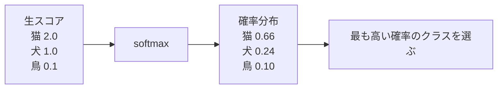

### 8.6　確率として出力する

分類モデルが確率を出力すると、単に答えを出すだけでなく、自信の度合いも扱えます。

```text
猫: 0.51
犬: 0.49
```

この場合、モデルは猫を選ぶかもしれませんが、かなり迷っています。

```text
猫: 0.99
犬: 0.01
```

こちらは、モデルが強く猫だと判断しています。

### 8.7　しきい値

二値分類では、確率をクラスに変換するためにしきい値を使います。

```text
確率 >= 0.5 なら陽性
確率 < 0.5 なら陰性
```

ただし、しきい値は必ず 0.5 とは限りません。見逃しを減らしたい場合は、しきい値を低くすることがあります。誤検出を減らしたい場合は、しきい値を高くすることがあります。

### 8.8　精度、適合率、再現率、F値

分類モデルの評価には、さまざまな指標があります。

精度は、全体のうち正しく分類できた割合です。

```text
精度 = 正解数 / 全体数
```

適合率は、陽性と予測したもののうち、本当に陽性だった割合です。

再現率は、本当に陽性のもののうち、陽性と予測できた割合です。

F値は、適合率と再現率のバランスを見る指標です。

### 8.9　混同行列

混同行列は、分類結果を表にしたものです。

二値分類では、次の 4 種類に分けられます。

```text
真陽性: 陽性を陽性と予測
偽陽性: 陰性を陽性と予測
真陰性: 陰性を陰性と予測
偽陰性: 陽性を陰性と予測
```

混同行列を見ると、モデルがどのような間違いをしているかがわかります。

### 8.10　分類モデルの評価

分類モデルを評価するときは、単に正解率だけを見るのではなく、問題の目的に合った指標を見る必要があります。

たとえば、病気の検査では、病気を見逃すことが大きな問題になる場合があります。この場合、再現率が重要になります。

スパム判定では、普通のメールをスパム扱いすることも問題です。この場合、適合率や偽陽性率も重要です。

---

## 第9章　回帰問題

### 9.1　回帰とは何か

回帰とは、連続的な数値を予測する問題です。

```text
家の価格
気温
売上
滞在時間
```

分類が「どのカテゴリか」を予測するのに対して、回帰は「どのくらいの値か」を予測します。

### 9.2　連続値を予測する

回帰では、出力が連続値になります。

```text
予測価格: 4280 万円
予測気温: 23.7 度
予測売上: 128450 円
```

正確に一致させることは難しいため、どれくらい近いかを評価します。

### 9.3　線形回帰

線形回帰は、回帰問題の基本的なモデルです。

```text
y = w1*x1 + w2*x2 + ... + b
```

入力特徴量に重みをかけて足し合わせ、数値を出力します。

単純ですが、機械学習の多くの考え方を理解するためのよい出発点です。

### 9.4　誤差の測り方

回帰では、予測値と正解値の差を誤差と呼びます。

```text
誤差 = 予測値 - 正解値
```

よく使われる指標には、平均絶対誤差や平均二乗誤差があります。

平均絶対誤差は、誤差の絶対値を平均します。平均二乗誤差は、誤差を二乗して平均します。

### 9.5　外れ値の影響

外れ値とは、他のデータと大きく異なる値です。

平均二乗誤差は誤差を二乗するため、大きな外れ値の影響を強く受けます。一方、平均絶対誤差は比較的外れ値に強いです。

評価指標や損失関数を選ぶときは、外れ値をどのように扱いたいかも考える必要があります。

### 9.6　過小適合と過学習

過小適合とは、モデルが単純すぎて、訓練データの規則性すら十分に学べていない状態です。

過学習は、訓練データに合わせすぎて未知データに弱くなる状態です。

```text
過小適合: 単純すぎる
適切: 本質的な規則性を学んでいる
過学習: 細部まで覚えすぎる
```

### 9.7　回帰モデルの評価

回帰モデルでは、予測と正解の差をもとに評価します。

代表的な指標:

- 平均絶対誤差
- 平均二乗誤差
- 二乗平均平方根誤差

どの指標がよいかは、問題によって変わります。大きな誤差を特に避けたいなら、平均二乗誤差系の指標が向いています。

### 9.8　分類と回帰の違い

分類と回帰の違いは、出力の種類です。

```text
分類: カテゴリを予測する
回帰: 連続値を予測する
```

ただし、どちらも「入力から出力を予測する」という点では同じです。また、どちらも損失関数を使って予測のズレを測り、パラメータを更新します。

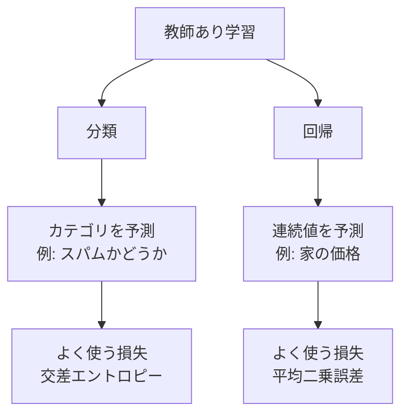

---

## 第10章　特徴量と表現

### 10.1　特徴量とは何か

特徴量とは、モデルに入力する情報です。

家の価格予測なら、広さ、場所、築年数などが特徴量です。文章分類なら、単語や文の情報が特徴量になります。

特徴量は、モデルが判断に使う材料です。

### 10.2　人間が設計する特徴量

従来の機械学習では、人間が特徴量を設計することが重要でした。

たとえば、スパム判定なら次のような特徴量を作れます。

- 特定の単語が含まれるか
- リンクの数
- 件名の長さ
- 送信者のドメイン

よい特徴量を作るには、問題領域への理解が必要です。

### 10.3　特徴量のスケーリング

特徴量の値の範囲が大きく違うと、学習がうまく進みにくいことがあります。

```text
年齢: 0 から 100 程度
年収: 0 から 10000000 程度
```

このような場合、特徴量を同じくらいの範囲にそろえることがあります。これをスケーリングと呼びます。

### 10.4　カテゴリ値の扱い

カテゴリ値とは、数値ではなく種類を表す値です。

```text
色: 赤 / 青 / 緑
地域: 東京 / 大阪 / 福岡
```

モデルは通常、数値を入力として扱うため、カテゴリ値を数値表現に変換する必要があります。

### 10.5　one-hot 表現

one-hot 表現は、カテゴリを 0 と 1 のベクトルで表す方法です。

たとえば、色が赤、青、緑の 3 種類なら、次のように表せます。

```text
赤: [1, 0, 0]
青: [0, 1, 0]
緑: [0, 0, 1]
```

言語モデルでも、単語やトークンを語彙の中の ID として扱い、その後ベクトル表現に変換します。

### 10.6　特徴量の組み合わせ

単独の特徴量では弱くても、組み合わせると有用になることがあります。

たとえば、家の価格では、広さだけでなく、広さと場所の組み合わせが重要です。同じ広さでも、地域によって価格は大きく変わります。

モデルが十分な表現力を持っていれば、こうした組み合わせの効果を学習できます。

### 10.7　よい特徴量とは何か

よい特徴量とは、予測したい出力に関係があり、未知のデータでも役に立つ情報です。

一方で、偶然の相関やデータ漏洩を含む特徴量は危険です。評価では高く見えても、本番では役に立たないことがあります。

### 10.8　深層学習における特徴量の自動獲得

深層学習では、特徴量を人間が細かく設計する代わりに、ニューラルネットワークが内部で有用な表現を学びます。

画像なら、初期の層がエッジや模様を学び、深い層が物体の部分や全体を表すことがあります。

文章なら、単語や文脈の意味をベクトルとして表すことがあります。

### 10.9　表現学習への入口

表現学習とは、データをモデルが扱いやすい形に変換する方法を、モデル自身が学ぶことです。

Transformer では、トークンを embedding というベクトルに変換し、さらに層を通して文脈に応じた表現へ変えていきます。

つまり、Transformer は単に次の単語を当てているだけでなく、その過程で言語の有用な表現を学んでいると考えられます。

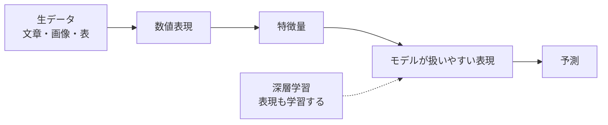

---

## 第11章　確率として見る機械学習

### 11.1　なぜ確率が出てくるのか

現実の問題には不確実性があります。

同じような入力でも、必ず同じ出力になるとは限りません。また、データが不足していたり、ノイズが含まれていたりすることもあります。

そのため、機械学習では「どれくらいありそうか」を確率として扱うことが多いです。

### 11.2　不確実性を扱う

確率を使うと、モデルの不確実性を表現できます。

```text
猫: 0.51
犬: 0.49
```

これは、モデルがかなり迷っている状態です。

```text
猫: 0.99
犬: 0.01
```

これは、モデルが強く猫だと判断している状態です。

### 11.3　確率分布

確率分布とは、可能な結果それぞれに確率を割り当てたものです。

サイコロなら次のようになります。

```text
1: 1/6
2: 1/6
3: 1/6
4: 1/6
5: 1/6
6: 1/6
```

言語モデルでは、語彙全体に対して確率分布を出力します。

```text
「です」: 0.20
「ます」: 0.15
「。」: 0.10
...
```

### 11.4　尤度

尤度とは、あるモデルのもとで、観測されたデータがどれくらい起こりやすいかを表す値です。

直感的には、「このモデルは、実際に観測されたデータをどれくらいもっともらしく説明できるか」です。

### 11.5　最大尤度推定

最大尤度推定とは、観測データが最も起こりやすくなるようにモデルのパラメータを選ぶ方法です。

```text
観測データを最もよく説明するパラメータを探す
```

分類問題で交差エントロピーを最小化することは、見方を変えると、正解ラベルの尤度を最大化することと深く関係しています。

### 11.6　交差エントロピーとの関係

正解クラスに高い確率を割り当てると、交差エントロピーは小さくなります。

これは、観測された正解がモデルのもとで起こりやすい、つまり尤度が高い状態です。

逆に、正解クラスに低い確率を割り当てると、交差エントロピーは大きくなります。

### 11.7　「もっともらしさ」を最大化する

言語モデルでは、実際の文章に出てきたトークン列が、モデルのもとで高い確率になるように学習します。

つまり、学習の目的は次のように言えます。

```text
実際の文章を、モデルがもっともらしいと判断するようにする
```

これは、次トークン予測と交差エントロピーによって実現されます。

### 11.8　言語モデルへのつながり

言語モデルは、単語やトークンの列に確率を割り当てるモデルです。

実際には、文章全体の確率を一度に直接扱うのではなく、次のように分解して考えます。

```text
P(文章) = P(最初のトークン) *
          P(次のトークン | これまでのトークン) *
          P(次のトークン | これまでのトークン) *
          ...
```

Transformer は、この「これまでのトークンから次のトークンを予測する」ための強力なモデルです。


---

## 第12章　ニューラルネットワークへの橋渡し

### 12.1　線形モデルの限界

線形モデルは、入力と出力の関係を直線的に表します。

しかし、現実のデータには複雑な関係が多くあります。画像、音声、文章などでは、単純な直線では表せないパターンがたくさんあります。

そこで、非線形なモデルが必要になります。

### 12.2　非線形性が必要になる理由

線形変換を何回重ねても、全体としては線形変換のままです。

ニューラルネットワークが複雑な関係を学べるのは、層と層の間に活性化関数という非線形な変換を入れるからです。

非線形性によって、曲がった境界や複雑なパターンを表現できるようになります。

### 12.3　ニューラルネットワークの基本構造

ニューラルネットワークは、複数の層からなるモデルです。

```text
入力層
  ↓
隠れ層
  ↓
隠れ層
  ↓
出力層
```

各層では、入力に重みをかけて足し合わせ、活性化関数を通します。

### 12.4　層を重ねるという考え方

層を重ねることで、単純な特徴から複雑な特徴へと段階的に変換できます。

画像なら、低い層で線や模様、高い層で部品や物体を表すことがあります。

文章なら、トークンの表現が文脈を反映した表現へと変わっていきます。

### 12.5　活性化関数

活性化関数は、ニューラルネットワークに非線形性を与える関数です。

代表例には ReLU、sigmoid、tanh などがあります。

ReLU は次のような関数です。

```text
x が 0 より大きければ x
x が 0 以下なら 0
```

単純ですが、深層学習で広く使われています。

### 12.6　重み行列

ニューラルネットワークでは、多くの入力と多くの出力をまとめて扱うために、重みを行列として表します。

```text
出力ベクトル = 入力ベクトル * 重み行列 + バイアス
```

Transformer でも、クエリ、キー、バリューなどを作るために重み行列が使われます。

### 12.7　順伝播

順伝播とは、入力から出力まで計算を進めることです。

```text
入力
  ↓
各層で計算
  ↓
予測
  ↓
損失
```

学習時には、まず順伝播で予測と損失を計算します。

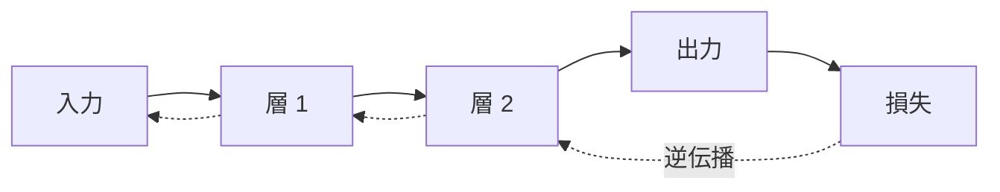

### 12.8　逆伝播の直感

逆伝播とは、損失を小さくするために、各パラメータをどちらにどれだけ動かせばよいかを計算する方法です。

出力側で生じた誤差を、ネットワークの後ろから前へ伝えていくように考えると直感的です。

逆伝播により、大量の重みについて効率よく勾配を計算できます。

### 12.9　ニューラルネットワークも損失を小さくしているだけ

ニューラルネットワークは複雑に見えますが、学習の基本は同じです。

```text
入力を入れる
予測を出す
正解と比べて損失を計算する
逆伝播で勾配を求める
勾配降下法で重みを更新する
```

Transformer もこの枠組みの中にあります。

### 12.10　深層学習への入口

深層学習とは、多層のニューラルネットワークを使う機械学習です。

深い層を持つことで、複雑な表現を学べます。Transformer は深層学習モデルの一種であり、大量のデータと大量のパラメータを使って学習します。

---

## 第13章　機械学習の全体像

### 13.1　問題を定義する

機械学習を始める前に、まず何を予測したいのかを定義します。

```text
入力は何か
出力は何か
正解は何か
どのように評価するか
```

問題定義が曖昧だと、データ集めもモデル選択も評価も曖昧になります。

### 13.2　データを集める

機械学習にはデータが必要です。

データは量だけでなく質も重要です。偏ったデータ、間違ったラベル、現実と違う分布のデータで学習すると、モデルの性能は下がります。

### 13.3　データを前処理する

前処理とは、データをモデルが扱いやすい形に整えることです。

例:

- 欠損値を処理する
- 数値をスケーリングする
- カテゴリ値を one-hot 表現にする
- 文章をトークン化する

Transformer では、文章をトークンに分割し、トークン ID に変換する処理が重要です。

### 13.4　モデルを選ぶ

問題に応じてモデルを選びます。

単純な表形式データなら線形モデルや決定木系モデルが有効なことがあります。画像や文章のような複雑なデータでは、ニューラルネットワークがよく使われます。

言語処理では、Transformer が非常に強力なモデルとして広く使われています。

### 13.5　学習する

学習では、訓練データを使ってモデルのパラメータを更新します。

```text
予測
損失計算
勾配計算
パラメータ更新
```

この流れを何度も繰り返します。

### 13.6　評価する

学習したモデルを評価します。

評価では、訓練データだけでなく、検証データやテストデータを使います。目的に合った評価指標を選ぶことが重要です。

### 13.7　改善する

評価結果を見て、モデルやデータを改善します。

改善の例:

- データを増やす
- 特徴量を見直す
- モデルを変更する
- 学習率を調整する
- 正則化を加える

機械学習は、一度で完成するというより、評価と改善を繰り返す作業です。

### 13.8　本番環境で使う

モデルを実際のサービスや業務で使うには、本番環境に組み込む必要があります。

このとき、予測速度、安定性、監視、エラー処理、データの更新なども考える必要があります。

### 13.9　モデルの劣化と再学習

本番環境では、時間が経つとデータの傾向が変わることがあります。

たとえば、スパムメールの手口は変化します。昔のデータで学習したモデルは、新しいスパムに弱くなるかもしれません。

このような場合、モデルを再学習する必要があります。

### 13.10　機械学習システムとして考える

実用的な機械学習では、モデルだけでなく、データ収集、前処理、学習、評価、デプロイ、監視までを含めて考える必要があります。

モデルはシステムの一部です。よい機械学習システムを作るには、モデル以外の部分も丁寧に設計する必要があります。

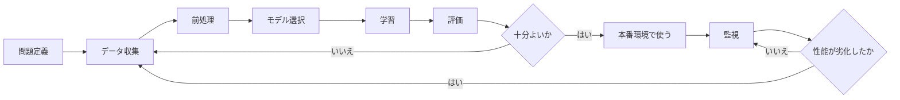

---

## 第14章　Transformer を読むために必要な機械学習知識

### 14.1　Transformer も教師あり学習で訓練できる

Transformer はニューラルネットワークの一種です。学習の基本は、ここまで見てきた教師あり学習の枠組みで理解できます。

入力を与え、正解と比べ、損失を計算し、勾配降下法で重みを更新します。

言語モデルでは、文章そのものから入力と正解のペアを作れるため、大量のテキストを使って学習できます。

### 14.2　次の単語を予測するというタスク

言語モデルの基本タスクは、ここまでの文脈から次のトークンを予測することです。

```text
入力: 私は 朝 コーヒー を
正解: 飲む
```

このタスクを大量に繰り返すことで、モデルは言語のパターンを学びます。

### 14.3　トークンを入力、次トークンを正解と見る

Transformer は、文章をそのまま文字列として扱うのではなく、トークンという単位に分割して扱います。

```text
文章: 私はコーヒーを飲む
トークン: 私 / は / コーヒー / を / 飲む
```

実際のトークナイザでは、単語より細かいサブワード単位になることも多いです。

学習では、ある位置までのトークンを入力し、次のトークンを正解として扱います。

### 14.4　出力は語彙全体に対する確率分布

次トークン予測では、モデルは語彙全体に対する確率分布を出力します。

```text
「飲む」: 0.40
「買う」: 0.10
「淹れる」: 0.08
「食べる」: 0.01
...
```

語彙が 5 万種類あれば、出力は 5 万個の確率になります。

### 14.5　softmax と交差エントロピー

Transformer の最後の層は、各トークンに対するスコアを出します。このスコアを softmax に通すと、語彙全体に対する確率分布になります。

正解トークンに高い確率を割り当てれば、交差エントロピー損失は小さくなります。正解トークンに低い確率を割り当てれば、損失は大きくなります。

つまり、言語モデルの学習は次のように見られます。

```text
正解の次トークンに高い確率を割り当てるように学習する
```

### 14.6　勾配降下法で重みを更新する

損失が計算できたら、逆伝播によって各重みの勾配を求めます。

そして、勾配降下法の考え方に基づいて重みを更新します。

```text
重み = 重み - 学習率 * 勾配
```

実際の Transformer 学習では、Adam などの発展的な最適化手法が使われることが多いですが、基本の考え方は「損失が小さくなる方向に重みを動かす」です。

### 14.7　巨大な関数としてのニューラルネットワーク

Transformer は、巨大な関数として見られます。

```text
次トークンの確率分布 = f(トークン列)
```

この関数の内部には、embedding、attention、feed-forward network、layer normalization など多くの部品があります。

しかし、機械学習の基本としては、次の見方を忘れないことが重要です。

```text
入力を受け取る
出力を返す
正解と比べる
損失を小さくするようにパラメータを更新する
```

### 14.8　機械学習の基本から Transformer への接続

ここまでの内容は、Transformer を読むために次のようにつながります。

```text
モデルとは関数である
  → Transformer も入力列から出力分布を返す関数である

パラメータとは調整可能な値である
  → Transformer の重み行列も学習されるパラメータである

損失関数は間違いを測る
  → 次トークン予測では交差エントロピーを使う

勾配降下法は損失を小さくする
  → Transformer も逆伝播で重みを更新する

分類では確率分布を出す
  → 言語モデルは語彙全体への多クラス分類を各位置で行う

表現学習では有用なベクトル表現を学ぶ
  → Transformer はトークンを文脈に応じた表現へ変換する
```

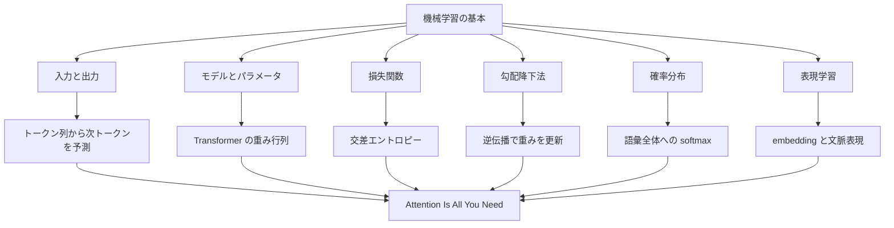

「Attention Is All You Need」を読むときは、attention の仕組みに目が行きがちです。しかし、その前に Transformer は機械学習モデルであり、ニューラルネットワークであり、損失を小さくするように訓練される関数だと理解しておくことが大切です。

この土台があれば、次に学ぶべき内容は次のようになります。

- ベクトルと行列の基本
- embedding
- sequence-to-sequence
- attention
- self-attention
- positional encoding
- multi-head attention
- feed-forward network
- residual connection
- layer normalization

本書で学んだ機械学習の基本は、それらを理解するための地面になります。
